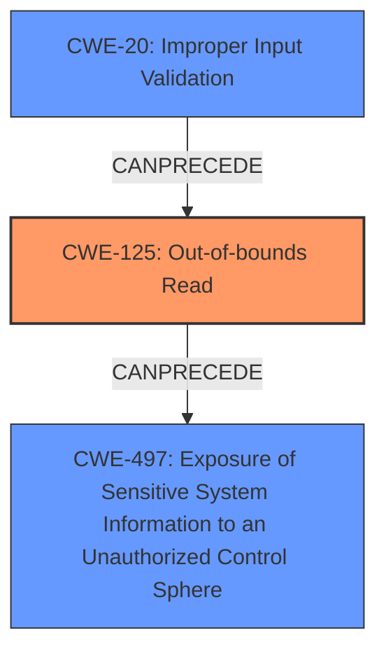

# Analysis Report for CVE-2025-0909

# Vulnerability Analysis Report: CVE-2025-0909

## Description

PDF-XChange Editor XPS File Parsing **Out-Of-Bounds Read** **Information Disclosure Vulnerability**. This vulnerability allows remote attackers to disclose sensitive information on affected installations of PDF-XChange Editor. User interaction is required to exploit this vulnerability in that the target must visit a malicious page or open a malicious file. The specific flaw exists within the parsing of XPS files. The issue results from the **lack of proper validation of user-supplied data**, which can result in a read past the end of an allocated object. An attacker can leverage this in conjunction with other vulnerabilities to execute arbitrary code in the context of the current process. Was ZDI-CAN-25678.

## Vulnerability Description Key Phrases

- **Rootcause:** lack of proper validation of user-supplied data
- **Weakness:** ['Information Disclosure Vulnerability', 'Out-Of-Bounds Read']
- **Impact:** ['disclose sensitive information', 'execute arbitrary code', 'information disclosure']
- **Vector:** malicious page or file
- **Attacker:** remote attackers
- **Product:** PDF-XChange Editor
- **Component:** XPS File Parsing

## Analysis (with Relationship Data)

# Summary

| CWE ID  | CWE Name                                                                           | Confidence | CWE Abstraction Level | CWE Vulnerability Mapping Label | CWE-Vulnerability Mapping Notes |
| :-------- | :----------------------------------------------------------------------------------- | :---------- | :---------------------- | :------------------------------ | :------------------------------ |
| CWE-125   | Out-of-bounds Read                                                                 | 0.95       | Base                    | Primary                         | Allowed                       |
| CWE-20    | Improper Input Validation                                                            | 0.75       | Class                     | Secondary                       | Allowed                       |

## Evidence and Confidence

*   **Confidence Score:** 0.85
*   **Evidence Strength:** HIGH

## Relationship Analysis

The primary weakness is CWE-125, which is a base-level CWE detailing **Out-of-bounds Read**. The root cause is **lack of proper validation of user-supplied data**, which maps to CWE-20 (**Improper Input Validation**). CWE-125 is often a consequence of CWE-20. The chain shows that **Improper Input Validation** can lead to an **Out-of-bounds Read**, resulting in **Information Disclosure**.



## Vulnerability Chain

The vulnerability chain starts with **Improper Input Validation** (CWE-20) because of the **lack of proper validation of user-supplied data**, leading to an **Out-of-bounds Read** (CWE-125) during XPS file parsing, and ultimately resulting in **Information Disclosure**. The chain highlights how **insufficient input validation** can directly lead to memory access errors, exposing sensitive data.

## Summary of Analysis

The initial assessment pointed towards both CWE-20 and CWE-125. The vulnerability description clearly states that the issue is due to the **lack of proper validation of user-supplied data**, which directly leads to an **out-of-bounds read**. The evidence from the vulnerability description: "The issue results from the **lack of proper validation of user-supplied data**, which can result in a read past the end of an allocated object," strongly supports this. The relationships between CWEs, particularly how **Improper Input Validation** can lead to **Out-of-bounds Read**, further solidify this classification.

The final decision is based on identifying the root cause and the direct consequence. CWE-20 represents the root cause (**lack of proper validation**), and CWE-125 is the direct result of this **lack of validation**. Other CWEs like CWE-787 (**Out-of-bounds Write**) and CWE-122 (**Heap-based Buffer Overflow**) were considered but not chosen because the vulnerability explicitly mentions a read operation, not a write.

The selected CWEs are at the optimal level of specificity because they accurately describe the **root cause** and the **direct consequence** of the vulnerability, providing a clear and concise understanding of the issue.


## CWE Relationship Analysis

Current CWEs represent these abstraction levels: .


### Vulnerability Chain Analysis

**Chain starting from CWE-125:**
- 125 (Out-of-bounds Read) - ROOT


**Chain starting from CWE-787:**
- 787 (Out-of-bounds Write) - ROOT


### CWE Relationship Diagram

```mermaid
graph TD
    classDef primary fill:#f96,stroke:#333,stroke-width:2px
    classDef secondary fill:#69f,stroke:#333
    classDef tertiary fill:#9e9,stroke:#333
```


*Report generated on 2025-07-14 06:36:28*
