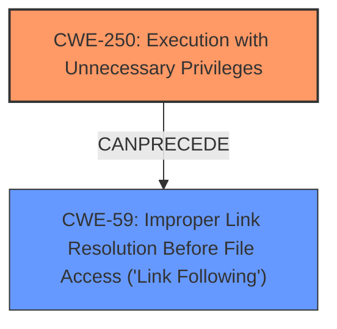

# Analysis for CVE-2025-0921

# Summary
| CWE ID | CWE Name | Confidence | CWE Abstraction Level | CWE Vulnerability Mapping Label | CWE-Vulnerability Mapping Notes |
|---|---|---|---|---|---|
| CWE-250 | Execution with Unnecessary Privileges | 1.0 | Base | Primary CWE | Allowed |
| CWE-59 | Improper Link Resolution Before File Access ('Link Following') | 0.7 | Base | Secondary Candidate | Allowed |

## Evidence and Confidence

*   **Confidence Score:** 0.9
*   **Evidence Strength:** HIGH

## Relationship Analysis
The primary relationship identified is that **CWE-250** Execution with Unnecessary Privileges allows for the exploitation of **CWE-59** Improper Link Resolution Before File Access ('Link Following'). The program running with elevated privileges is a prerequisite for the symbolic link attack to be successful. The abstraction levels are both base, which means they are more specific and accurately represent the weakness.

## Vulnerability Chain
The vulnerability chain starts with **CWE-250** Execution with Unnecessary Privileges, where the Pager agent runs with elevated privileges. This leads to the attacker being able to exploit **CWE-59** Improper Link Resolution Before File Access ('Link Following') by creating a symbolic link to an arbitrary file. The final impact is a denial-of-service (DoS) condition if the destroyed file is necessary for the operation of the PC.

## Summary of Analysis
The initial analysis correctly identifies **CWE-250** Execution with Unnecessary Privileges as the primary root cause, supported by the vulnerability description and CVE reference links. The program is running with higher privileges than necessary, which allows an attacker to perform actions they should not be able to perform. The attacker's creation of a symbolic link to an arbitrary file, made possible by the unnecessary privileges, is best described by **CWE-59** Improper Link Resolution Before File Access ('Link Following').

The evidence supporting **CWE-250** is:
*   "**weakness:** **execution with unnecessary privileges**" from the Vulnerability Description Key Phrases.
*   "**Root cause of vulnerability:** The multi-agent notification feature of GENESIS64 and MC Works64 is executed with higher privileges than necessary." from the CVE Reference Links Content Summary.
*   "**Weaknesses/vulnerabilities present:** The vulnerability is described as "Execution with Unnecessary Privileges" (CWE-250)" from the CVE Reference Links Content Summary.

**CWE-59** is a secondary weakness because the symbolic link attack is only possible due to the elevated privileges.

The graph relationships influenced the final selection by highlighting how **CWE-250** can precede **CWE-59**, creating a vulnerability chain. Both CWEs are at the optimal level of specificity (Base).

Relevant CWE Information:

# Enhanced Context (25 CWEs)
The following CWEs were identified as potentially relevant to this vulnerability:

## CWE-266: Incorrect Privilege Assignment
**Abstraction Level**: Base
**Similarity Score**: 0.80
**Source**: dense

**Description**:
A product incorrectly assigns a privilege to a particular actor, creating an unintended sphere of control for that actor.

**Mapping Guidance**:
- Usage: Allowed
- Rationale: This CWE entry is at the Base level of abstraction, which is a preferred level of abstraction for mapping to the root causes of vulnerabilities.

*Not Selected:* **CWE-266** Incorrect Privilege Assignment was not selected because the issue is not with the assignment of privileges, but with the execution of code with unnecessary privileges.

## CWE-267: Privilege Defined With Unsafe Actions
**Abstraction Level**: Base
**Similarity Score**: 0.80
**Source**: dense

**Description**:
A particular privilege, role, capability, or right can be used to perform unsafe actions that were not intended, even when it is assigned to the correct entity.

**Mapping Guidance**:
- Usage: Allowed
- Rationale: This CWE entry is at the Base level of abstraction, which is a preferred level of abstraction for mapping to the root causes of vulnerabilities.

*Not Selected:* **CWE-267** Privilege Defined With Unsafe Actions was not selected because the privileges themselves are not unsafe, but the way the code executes with those privileges creates the vulnerability.

## CWE-668: Exposure of Resource to Wrong Sphere
**Abstraction Level**: Class
**Similarity Score**: 0.79
**Source**: dense

**Description**:
The product exposes a resource to the wrong control sphere, providing unintended actors with inappropriate access to the resource.

**Mapping Guidance**:
- Usage: Discouraged
- Rationale: CWE-668 is high-level and is often misused as a catch-all when lower-level CWE IDs might be applicable. It is sometimes used for low-information vulnerability reports [REF-1287]. It is a level-1 Class (i.e., a child of a Pillar). It is not useful for trend analysis.

*Not Selected:* **CWE-668** Exposure of Resource to Wrong Sphere was not selected because it is too high-level and there are more specific CWEs that apply.

## CWE-280: Improper Handling of Insufficient Permissions or Privileges
**Abstraction Level**: Base
**Similarity Score**: 0.79
**Source**: dense

**Description**:
The product does not handle or incorrectly handles when it has insufficient privileges to access resources or functionality as specified by their permissions. This may cause it to follow unexpected code paths that may leave the product in an invalid state.

**Mapping Guidance**:
- Usage: Allowed
- Rationale: This CWE entry is at the Base level of abstraction, which is a preferred level of abstraction for mapping to the root causes of vulnerabilities.

*Not Selected:* **CWE-280** Improper Handling of Insufficient Permissions or Privileges was not selected because the issue is with excessive privileges, not insufficient privileges.

## CWE-41: Improper Resolution of Path Equivalence
**Abstraction Level**: Base
**Similarity Score**: 0.79
**Source**: dense

**Description**:
The product is vulnerable to file system contents disclosure through path equivalence. Path equivalence involves the use of special characters in file and directory names. The associated manipulations are intended to generate multiple names for the same object.

**Mapping Guidance**:
- Usage: Allowed
- Rationale: This CWE entry is at the Base level of abstraction, which is a preferred level of abstraction for mapping to the root causes of vulnerabilities.

*Not Selected:* **CWE-41** Improper Resolution of Path Equivalence was not selected because the vulnerability is not related to file system contents disclosure through path equivalence.

## CWE-274: Improper Handling of Insufficient Privileges
**Abstraction Level**: Base
**Similarity Score**: 0.78
**Source**: dense

**Description**:
The product does not handle or incorrectly handles when it has insufficient privileges to perform an operation, leading to resultant weaknesses.

**Mapping Guidance**:
- Usage: Discouraged
- Rationale: This CWE entry could be deprecated in a future version of CWE.

*Not Selected:* **CWE-274** Improper Handling of Insufficient Privileges was not selected because the issue is with excessive privileges, not insufficient privileges.

## CWE-59: Improper Link Resolution Before File Access ('Link Following')
**Abstraction Level**: Base
**Similarity Score**: 0.78
**Source**: dense

**Description**:
The product attempts to access a file based on the filename, but it does not properly prevent that filename from identifying a link or shortcut that resolves to an unintended resource.

**Mapping Guidance**:
- Usage: Allowed
- Rationale: This CWE entry is at the Base level of abstraction, which is a preferred level of abstraction for mapping to the root causes of vulnerabilities.

*Selected:* **CWE-59** Improper Link Resolution Before File Access ('Link Following') was selected as a secondary weakness because the attacker is exploiting the improper handling of symbolic links to write to arbitrary files.

## CWE-807: Reliance on Untrusted Inputs in a Security Decision
**Abstraction Level**: Base
**Similarity Score**: 0.78
**Source**: dense

**Description**:
The product uses a protection mechanism that relies on the existence or values of an input, but the input can be modified by an untrusted actor in a way that bypasses the protection mechanism.

**Mapping Guidance**:
- Usage: Allowed
- Rationale: This CWE entry is at the Base level of abstraction, which is a preferred level of abstraction for mapping to the root causes of vulnerabilities.

*Not Selected:* **CWE-807** Reliance on Untrusted Inputs in a Security Decision was not selected because the vulnerability is not directly related to relying on untrusted inputs in a security decision.

## CWE-184: Incomplete List of Disallowed Inputs
**