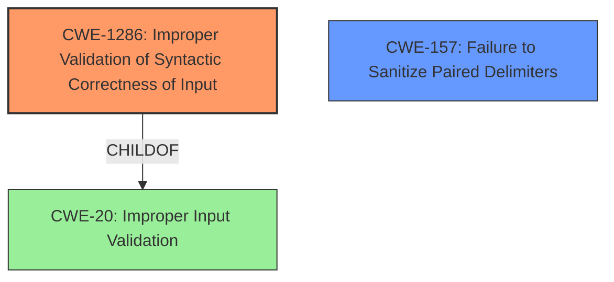

# Enhanced Analysis for CVE-2025-0938

# Summary

| CWE ID    | CWE Name                                                                                    | Confidence | CWE Abstraction Level | CWE Vulnerability Mapping Label | CWE-Vulnerability Mapping Notes |
| :--------- | :------------------------------------------------------------------------------------------ | :--------- | :---------------------- | :------------------------------ | :------------------------------ |
| CWE-1286 | Improper Validation of Syntactic Correctness of Input                                       | 0.85      | Base                    | Primary                         | Allowed                         |
| CWE-157 | Failure to Sanitize Paired Delimiters | 0.65      | Variant                    | Secondary                         | Allowed                         |

## Evidence and Confidence

*   **Confidence Score:** 0.80
*   **Evidence Strength:** HIGH

## Relationship Analysis

The primary relationship that influenced the selection was the parent-child relationship between CWE-20 (Improper Input Validation) and CWE-1286 (Improper Validation of Syntactic Correctness of Input). CWE-1286 is more specific and directly addresses the vulnerability described.



## Vulnerability Chain

The vulnerability chain starts with the **improper validation** of the input URL, specifically the domain name. This leads to the acceptance of invalid characters (square brackets), which results in differential parsing.

Improper Input Validation (CWE-1286) -> Differential Parsing (Impact)

## Summary of Analysis

The initial analysis pointed towards input validation issues, which aligned well with CWE-1286 (Improper Validation of Syntactic Correctness of Input). The vulnerability description and CVE summary explicitly state that the `urllib.parse.urlsplit` and `urlparse` functions **accepted domain names with square brackets**, which is invalid. The evidence clearly supports this classification.

The retriever results also suggested CWE-1286, further strengthening the confidence in this selection. The relationship analysis confirmed that CWE-1286 is a more specific instance of CWE-20 (Improper Input Validation), making it the preferred choice.

The final decision is based on the provided evidence, the retriever results, and the relationship analysis. CWE-1286 is at the optimal level of specificity because it directly addresses the syntactic validation issue.

Relevant CWE Information:

# Enhanced Context (25 CWEs)
The following CWEs were identified as potentially relevant to this vulnerability:

## CWE-1286: Improper Validation of Syntactic Correctness of Input
**Abstraction Level**: Base
**Similarity Score**: 0.72
**Source**: dense

**Description**:
The product receives input that is expected to be well-formed - i.e., to comply with a certain syntax - but it does not validate or incorrectly validates that the input complies with the syntax.

**Mapping Guidance**:
- Usage: Allowed
- Rationale: This CWE entry is at the Base level of abstraction, which is a preferred level of abstraction for mapping to the root causes of vulnerabilities.

## CWE-157: Failure to Sanitize Paired Delimiters
**Abstraction Level**: Variant
**Similarity Score**: 0.72
**Source**: dense

**Description**: The software does not remove or encode paired delimiters, which could allow an attacker to bypass security checks.

**Mapping Guidance**:
- Usage: Allowed
- Rationale: This CWE entry is at the Base level of abstraction, which is a preferred level of abstraction for mapping to the root causes of vulnerabilities.

## CWE-1286: Improper Validation of Syntactic Correctness of Input

*   **CWE-1286 (Improper Validation of Syntactic Correctness of Input):** This CWE is highly relevant because the vulnerability specifically involves the failure to validate the syntactic correctness of domain names in URLs. The description states that the functions **accepted domain names with square brackets**, which are syntactically invalid according to RFC 3986.
    *   **How it matches:** The vulnerability description aligns perfectly with the CWE's description: "The product receives input that is expected to be well-formed - i.e., to comply with a certain syntax - but it does not validate or incorrectly validates that the input complies with the syntax."
    *   **Security implications:** This can lead to differential parsing, where different systems interpret the URL differently, potentially leading to security vulnerabilities.
    *   **Relationships:** CWE-1286 is a child of CWE-20 (Improper Input Validation), making it a more specific and appropriate choice.
    *   **Mapping Guidance:** The usage is "Allowed," and the rationale states that it's at the Base level of abstraction, which is preferred.

*   **CWE-157 (Failure to Sanitize Paired Delimiters):** This CWE could be considered as square brackets act as delimiters. The vulnerability description mentions that the Python URL parser accepted domain names that included square brackets which is not valid according to RFC 3986. This matches the description of CWE-157.
    *   **How it matches:** The vulnerability aligns with "The software does not remove or encode paired delimiters, which could allow an attacker to bypass security checks."
    *   **Security implications:** This can lead to differential parsing, where different systems interpret the URL differently, potentially leading to security vulnerabilities.
    *   **Mapping Guidance:** The usage is "Allowed," and the rationale states that it's at the Base level of abstraction, which is preferred.

*   **CWE-407 (Inefficient Algorithmic Complexity) and CWE-1333 (Inefficient Regular Expression Complexity):** These are not relevant as there's no indication of algorithmic inefficiency or regular expression issues in the vulnerability description.

*   **CWE-201 (Insertion of Sensitive Information Into Sent Data), CWE-212 (Improper Removal of Sensitive Information Before Storage or Transfer), and CWE-226 (Sensitive Information in Resource Not Removed Before Reuse):** These are not relevant because the vulnerability doesn't involve sensitive information being inserted or improperly handled.

*   **CWE-73 (External Control of File Name or Path):** Not relevant as the vulnerability doesn't involve file names or paths.

*   **CWE-117 (Improper Output Neutralization for Logs) and CWE-79 (Improper Neutralization of Input During Web Page Generation ('Cross-site Scripting')):** These are not relevant because the vulnerability doesn't involve output neutralization or web page generation.

*   **CWE-123 (Write-what-where Condition):** This is not relevant as it deals with memory corruption, which is not indicated in the vulnerability description.


## CWE Relationship Analysis

Current CWEs represent these abstraction levels: .


### Vulnerability Chain Analysis

**Chain starting from CWE-123:**
- 123 (Write-what-where Condition) - ROOT


**Chain starting from CWE-407:**
- 407 (Inefficient Algorithmic Complexity) - ROOT


### CWE Relationship Diagram

```mermaid
graph TD
    classDef primary fill:#f96,stroke:#333,stroke-width:2px
    classDef secondary fill:#69f,stroke:#333
    classDef tertiary fill:#9e9,stroke:#333
```