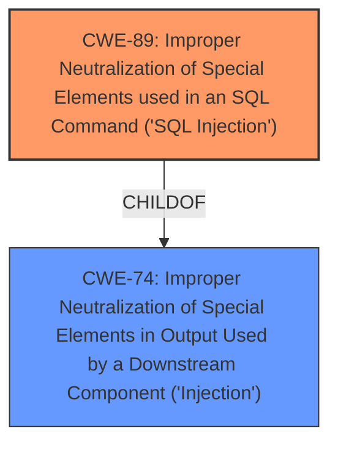

# Analysis for CVE-2025-0944

# Summary

| CWE ID | CWE Name | Confidence | CWE Abstraction Level | CWE Vulnerability Mapping Label | CWE-Vulnerability Mapping Notes |
|---|---|---|---|---|---|
| CWE-89 | Improper Neutralization of Special Elements used in an SQL Command ('SQL Injection') | 1.0 | Base | Allowed | Primary CWE |

## Evidence and Confidence

*   **Confidence Score:** 1.0
*   **Evidence Strength:** HIGH

## Relationship Analysis

The primary relationship influencing the decision is that CWE-89 is a Base level CWE, which is the preferred level for root cause analysis. The retriever results also listed CWE-89 as the top candidate. Other CWEs like CWE-74 (Improper Neutralization of Special Elements in Output Used by a Downstream Component ('Injection')) are higher-level classes and are therefore less specific.

## Vulnerability Chain

The vulnerability chain is straightforward:

1.  **Root Cause:** **Improper Neutralization of Special Elements used in an SQL Command ('SQL Injection')** (CWE-89) due to direct use of parameters in SQL queries without sanitization.
2.  Impact: Unauthorized database access, sensitive data leakage, data tampering, comprehensive system control, and service interruption.

## Summary of Analysis

The analysis indicates a clear case of **SQL injection** (CWE-89) in the Tailoring Management System. The vulnerability description explicitly mentions **SQL injection** due to the manipulation of the 'id' argument in the customerview.php file. The CVE Reference Links Content Summary confirms this by stating that the root cause is a GET **SQL injection** vulnerability due to the direct use of parameters without proper sanitization. The retriever results also strongly support CWE-89 as the primary weakness. The confidence level is high (1.0) due to the explicit mention of **SQL injection** and the supporting evidence from the CVE summary. CWE-89 is at the optimal level of specificity because it is a base-level CWE that directly addresses the root cause of the vulnerability.

Relevant CWE Information:

# Enhanced Context (25 CWEs)

## CWE-89: Improper Neutralization of Special Elements used in an SQL Command ('SQL Injection')
**Abstraction Level**: Base
**Similarity Score**: 0.79
**Source**: dense

**Description**:
The product constructs all or part of an SQL command using externally-influenced input from an upstream component, but it does not neutralize or incorrectly neutralizes special elements that could modify the intended SQL command when it is sent to a downstream component. Without sufficient removal or quoting of SQL syntax in user-controllable inputs, the generated SQL query can cause those inputs to be interpreted as SQL instead of ordinary user data.

**Mapping Guidance**:
- Usage: Allowed
- Rationale: This CWE entry is at the Base level of abstraction, which is a preferred level of abstraction for mapping to the root causes of vulnerabilities.