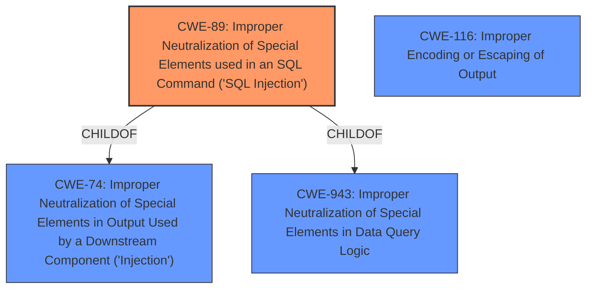

# Enhanced Analysis for CVE-2025-0959

# Summary
| CWE ID | CWE Name | Confidence | CWE Abstraction Level | CWE Vulnerability Mapping Label | CWE-Vulnerability Mapping Notes |
|---|---|---|---|---|---|
| CWE-89 | Improper Neutralization of Special Elements used in an SQL Command ('SQL Injection') | 1.0 | Base | Primary | Allowed |
| CWE-116 | Improper Encoding or Escaping of Output | 0.7 | Class | Secondary | Allowed-with-Review |

## Evidence and Confidence

*   **Confidence Score:** 0.9
*   **Evidence Strength:** HIGH

## Relationship Analysis
The primary weakness is CWE-89, which is a Base level CWE and a child of CWE-74 (Improper Neutralization of Special Elements in Output Used by a Downstream Component ('Injection')). CWE-89 is also related to CWE-943 (Improper Neutralization of Special Elements in Data Query Logic) through a child-of relationship. CWE-116, a Class-level CWE, is included as a secondary weakness due to the **insufficient escaping** aspect mentioned in the description.



## Vulnerability Chain
The vulnerability chain starts with **insufficient escaping** and **lack of sufficient preparation** in the SQL query, leading to the **SQL injection** vulnerability. This allows attackers to **append additional SQL queries** and **extract sensitive information from the database**.

Root Cause: **Insufficient escaping** and **lack of sufficient preparation** -> Weakness: **SQL injection** -> Impact: **append additional SQL queries** -> Impact: **extract sensitive information from the database**.

## Summary of Analysis
The primary CWE, CWE-89 (Improper Neutralization of Special Elements used in an SQL Command ('SQL Injection')), directly addresses the core issue described in the vulnerability: the plugin does not properly neutralize special elements in the user-supplied `reg_id` parameter before using it in an SQL command. This **lack of neutralization** allows attackers to inject malicious SQL code.

The secondary CWE, CWE-116 (Improper Encoding or Escaping of Output), accounts for the **insufficient escaping** aspect of the vulnerability, as it relates to the preparation of structured messages.

The vulnerability description explicitly states "**insufficient escaping on the user supplied parameter and lack of sufficient preparation on the existing SQL query**". This statement provides strong evidence for both CWE-89 and CWE-116.

The graph relationships confirm that CWE-89 is a specific type of injection (child of CWE-74), making it more precise than a general injection CWE.

CWE-89 is at the optimal level of specificity (Base) because it directly describes the SQL injection vulnerability.
CWE-116 is a Class because the context is specifically about SQL.

Other CWEs Considered:

*   CWE-74 (Improper Neutralization of Special Elements in Output Used by a Downstream Component ('Injection')): This is a parent of CWE-89 but is too general. The specific vulnerability is SQL injection, so CWE-89 is more appropriate.
*   CWE-90 (Improper Neutralization of Special Elements used in an LDAP Query ('LDAP Injection')): This is similar to CWE-89, but specific to LDAP queries. It's not relevant because the vulnerability involves SQL queries.
*   CWE-352 (Cross-Site Request Forgery (CSRF)): This is not applicable because the vulnerability is related to SQL injection, not CSRF.
*   CWE-790 (Improper Filtering of Special Elements): This is too general and does not specifically address SQL injection.
*   CWE-862 (Missing Authorization): While the attacker needs to be authenticated, the core issue is the SQL injection, not a missing authorization check.
*   CWE-502 (Deserialization of Untrusted Data): This is not applicable as the vulnerability is related to SQL injection, not deserialization.
*   CWE-943 (Improper Neutralization of Special Elements in Data Query Logic): Similar to CWE-89 but focuses on the logic of the query. Since the vulnerability involves injecting SQL commands, CWE-89 is a better fit.
*   CWE-863 (Incorrect Authorization): Similar to CWE-862. Not a fit because the core issue is related to SQL injection.


## CWE Relationship Analysis

Current CWEs represent these abstraction levels: .


### Vulnerability Chain Analysis

**Chain starting from CWE-90:**
- 90 (Improper Neutralization of Special Elements used in an LDAP Query ('LDAP Injection')) - ROOT


**Chain starting from CWE-89:**
- 89 (Improper Neutralization of Special Elements used in an SQL Command ('SQL Injection')) - ROOT


### CWE Relationship Diagram

```mermaid
graph TD
    classDef primary fill:#f96,stroke:#333,stroke-width:2px
    classDef secondary fill:#69f,stroke:#333
    classDef tertiary fill:#9e9,stroke:#333
```