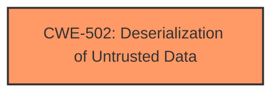

# Enhanced Analysis for CVE-2025-0974

# Summary
| CWE ID | CWE Name | Confidence | CWE Abstraction Level | CWE Vulnerability Mapping Label | CWE-Vulnerability Mapping Notes |
|---|---|---|---|---|---|
| CWE-502 | Deserialization of Untrusted Data | 1.0 | Base | Primary | Allowed |

## Evidence and Confidence

*   **Confidence Score:** 1.0
*   **Evidence Strength:** HIGH

## Relationship Analysis
The primary CWE identified is CWE-502, which stands alone as the core weakness. There are no direct parent-child or chain relationships that strongly influence this specific mapping, as the vulnerability is fundamentally about the **deserialization** process itself. While CWE-502 could potentially lead to other weaknesses (e.g., code execution), those are impacts, not preconditions or related weaknesses in this specific context. The abstraction level of Base is appropriate as it directly describes the vulnerability.



## Vulnerability Chain
The vulnerability chain is straightforward:

1.  **Root Cause:** CWE-502 (**Deserialization of Untrusted Data**) - The application **deserializes** untrusted data without proper validation.
2.  **Impact:** Potential for arbitrary code execution or other security compromises due to the nature of **deserialization** vulnerabilities.

## Summary of Analysis
The analysis is strongly based on the provided evidence. The vulnerability description and, more importantly, the CVE reference summary explicitly state that the vulnerability involves **deserialization** of untrusted data via the `unserialize()` function.

Evidence:

*   "The manipulation of the argument li_op/md leads to **deserialization**."
*   "**Root cause of vulnerability:** Deserialization of Untrusted Data. The OpenCart Lightning module uses `unserialize()` on data received in a GET parameter (`$_GET['md']`) without proper validation, allowing for PHP Object Injection."
*   "**Weaknesses/vulnerabilities present:** CWE-502: Deserialization of Untrusted Data"

CWE-502 directly addresses this weakness. The retriever results also list CWE-502 as a strong candidate.

Other CWEs considered:

*   CWE-89 (SQL Injection), CWE-79 (Cross-site Scripting), CWE-95 (Eval Injection), and CWE-1336 (Improper Neutralization of Special Elements Used in a Template Engine) were considered due to their presence in the retriever results. However, these are not applicable because the core issue is specifically about **deserialization** and not about injecting code or manipulating SQL queries or templates.
*   CWE-434 (Unrestricted Upload of File with Dangerous Type) was also considered but is not relevant as the vulnerability does not involve file uploads.

The selection of CWE-502 is at the optimal level of specificity because it directly describes the **deserialization** weakness, which is the root cause of the vulnerability.


## CWE Relationship Analysis

Current CWEs represent these abstraction levels: .


### Vulnerability Chain Analysis

**Chain starting from CWE-502:**
- 502 (Deserialization of Untrusted Data) - ROOT


**Chain starting from CWE-89:**
- 89 (Improper Neutralization of Special Elements used in an SQL Command ('SQL Injection')) - ROOT


### CWE Relationship Diagram

```mermaid
graph TD
    classDef primary fill:#f96,stroke:#333,stroke-width:2px
    classDef secondary fill:#69f,stroke:#333
    classDef tertiary fill:#9e9,stroke:#333
```