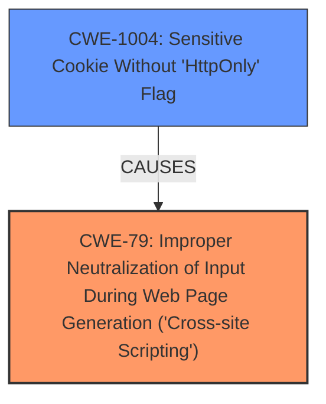

# Analysis for CVE-2025-0981

# Summary
| CWE ID | CWE Name | Confidence | CWE Abstraction Level | CWE Vulnerability Mapping Label | CWE-Vulnerability Mapping Notes |
|---|---|---|---|---|---|
| CWE-79 | Improper Neutralization of Input During Web Page Generation ('Cross-site Scripting') | 1.0 | Base | Allowed | Primary CWE. The application **does not neutralize or incorrectly neutralizes** user-controllable input before it is placed in output that is used as a web page that is served to other users. |
| CWE-1004 | Sensitive Cookie Without 'HttpOnly' Flag | 0.7 | Variant | Allowed | Secondary Candidate. The product uses a cookie to store sensitive information, but the cookie is not marked with the HttpOnly flag. |

## Evidence and Confidence

*   **Confidence Score:** 0.9
*   **Evidence Strength:** HIGH

## Relationship Analysis
The primary relationship is that CWE-79 is the root cause, where user-controlled input is not properly neutralized, leading to the possibility of injecting malicious scripts into web pages. CWE-1004 is included because the vulnerability description and the CVE reference summary mentioned the ability of the attacker to steal the session cookie which is missing the HttpOnly flag. CWE-79 is a base level CWE, which is the preferred level of abstraction. CWE-1004 is a variant, which is also a preferred level of abstraction.

## Vulnerability Chain
The vulnerability chain starts with a **Stored Cross-Site Scripting** (XSS) vulnerability (CWE-79) in the Group Editor page. An attacker injects malicious JavaScript into the description field. When a user views the group details, the script executes, allowing the attacker to capture the user's session cookie. The session cookie is vulnerable because it is a Sensitive Cookie Without 'HttpOnly' Flag (CWE-1004). This enables session hijacking and information disclosure.

## Summary of Analysis
The initial assessment correctly identified CWE-79 as the primary weakness, as the root cause of the vulnerability is the **improper neutralization of input** leading to XSS. The CVE reference summary supports this, stating "Stored Cross-Site Scripting (XSS) vulnerability in the Group Editor page of ChurchCRM."
The retriever results also strongly support CWE-79, with a high similarity score.

CWE-1004 (Sensitive Cookie Without 'HttpOnly' Flag) is added as a secondary concern because the stolen cookie lacks the HttpOnly flag, making session hijacking easier. The CVE reference summary mentioned the need to "Set the `HttpOnly` and `Secure` flags on session cookies," pointing to this weakness.

Other CWEs considered but not used:

*   CWE-352 (Cross-Site Request Forgery (CSRF)): While CSRF is a web application vulnerability, it does not directly relate to the **stored XSS** issue described.
*   CWE-434 (Unrestricted Upload of File with Dangerous Type): This CWE is not relevant as the vulnerability does not involve file uploads.
*   CWE-116 (Improper Encoding or Escaping of Output): While related to XSS, CWE-79 is more specific as it directly addresses the **improper neutralization of input during web page generation**.
*   CWE-425 (Direct Request ('Forced Browsing')): This is not relevant as it is related to authorization issues.