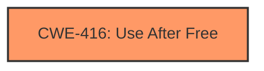

# Analysis Report for CVE-2025-0995

# Vulnerability Analysis Report: CVE-2025-0995

## Description

Use after free in V8 in Google Chrome prior to 133.0.6943.98 allowed a remote attacker to potentially exploit heap corruption via a crafted HTML page. (Chromium security severity High)

## Vulnerability Description Key Phrases

- **Rootcause:** use after free
- **Impact:** potentially exploit heap corruption
- **Vector:** crafted HTML page
- **Attacker:** remote attacker
- **Product:** Google Chrome
- **Version:** prior to 133.0.6943.98

## Analysis (with Relationship Data)

# Summary
| CWE ID | CWE Name | Confidence | CWE Abstraction Level | CWE Vulnerability Mapping Label | CWE-Vulnerability Mapping Notes |
|---|---|---|---|---|---|
| CWE-416 | Use After Free | 1.0 | Variant | Primary | Allowed |

## Evidence and Confidence

*   **Confidence Score:** 1.0
*   **Evidence Strength:** HIGH

## Relationship Analysis
The primary relationship to consider is that CWE-416 is a Variant. This means it is a specific type of weakness. In this case, it directly reflects the **rootcause** of the vulnerability, which is a **use-after-free**. There are no other relationships that strongly influence the selection since the description is direct and clear.



## Vulnerability Chain
The vulnerability chain is straightforward:

1.  **Root Cause:** **Use After Free (CWE-416)**. The program attempts to use memory after it has been freed.
2.  **Impact:** Heap corruption, potentially leading to remote code execution.

## Summary of Analysis
The analysis is based heavily on the provided evidence which states the **rootcause** as a **use after free** vulnerability. The vulnerability description explicitly mentions "Use after free in V8". The "Vulnerability Description Key Phrases" section also identifies "**use after free**" as the **rootcause**. The "CVE Reference Links Content Summary" confirms the **root cause** is **Use after free** in V8. The retriever results also list CWE-416 as the top result.

The selection of CWE-416 is at the optimal level of specificity because it directly describes the **rootcause** of the vulnerability. Other CWEs like CWE-119 (Improper Restriction of Operations within a Memory Buffer) are more general and do not accurately describe the specific weakness.

Relevant CWE Information:

# Enhanced Context (25 CWEs)
The following CWEs were identified as potentially relevant to this vulnerability:

## CWE-416: Use After Free
**Abstraction Level**: Variant
**Similarity Score**: 0.80
**Source**: dense

**Description**:
The product reuses or references memory after it has been freed. At some point afterward, the memory may be allocated again and saved in another pointer, while the original pointer references a location somewhere within the new allocation. Any operations using the original pointer are no longer valid because the memory "belongs" to the code that operates on the new pointer.

**Mapping Guidance**:
- Usage: Allowed
- Rationale: This CWE entry is at the Variant level of abstraction, which is a preferred level of abstraction for mapping to the root causes of vulnerabilities.


## CWE Relationship Analysis

Current CWEs represent these abstraction levels: .


### Vulnerability Chain Analysis

**Chain starting from CWE-119:**
- 119 (Improper Restriction of Operations within the Bounds of a Memory Buffer) - ROOT


**Chain starting from CWE-416:**
- 416 (Use After Free) - ROOT


### CWE Relationship Diagram

```mermaid
graph TD
    classDef primary fill:#f96,stroke:#333,stroke-width:2px
    classDef secondary fill:#69f,stroke:#333
    classDef tertiary fill:#9e9,stroke:#333
```


*Report generated on 2025-07-14 06:42:46*
