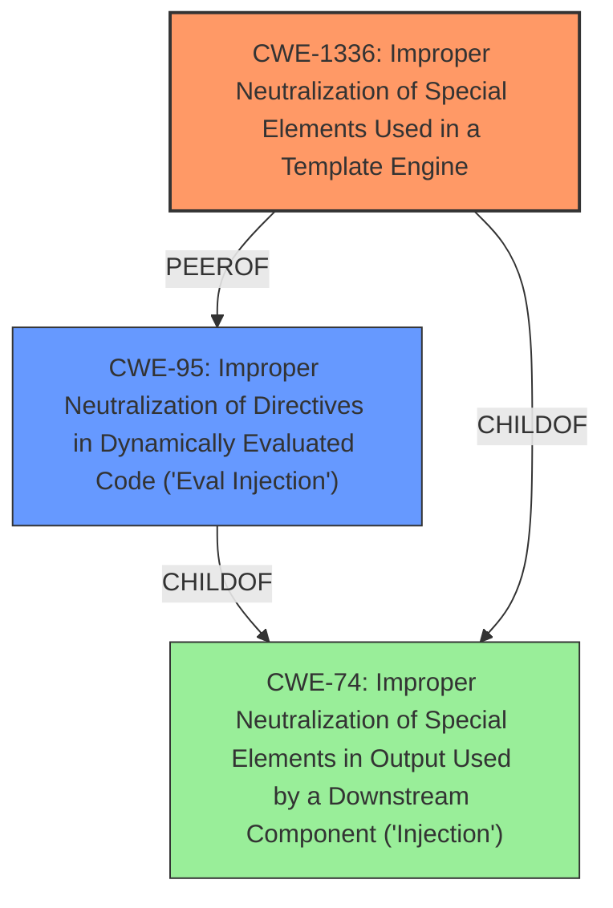

# Analysis Report for CVE-2025-1040

# Vulnerability Analysis Report: CVE-2025-1040

## Description

AutoGPT versions 0.3.4 and earlier are vulnerable to a **Server-Side Template Injection (SSTI)** that could lead to Remote Code Execution (RCE). The vulnerability arises from the **improper handling of user-supplied format strings** in the `AgentOutputBlock` implementation, where malicious input is passed to the Jinja2 templating engine without adequate security measures. Attackers can exploit this flaw to execute arbitrary commands on the host system. The issue is fixed in version 0.4.0.

## Vulnerability Description Key Phrases

- **Rootcause:** improper handling of user-supplied format strings
- **Weakness:** Server-Side Template Injection (SSTI)
- **Impact:** ['execute arbitrary commands on the host system', 'Remote Code Execution']
- **Vector:** malicious input
- **Product:** AutoGPT
- **Version:** versions 0.3.4 and earlier

## Analysis (with Relationship Data)

# Summary
| CWE ID | CWE Name | Confidence | CWE Abstraction Level | CWE Vulnerability Mapping Label | CWE-Vulnerability Mapping Notes |
|---|---|---|---|---|---|
| CWE-1336 | Improper Neutralization of Special Elements Used in a Template Engine | 1.0 | Base | Allowed | Primary CWE: The **rootcause** is the **improper handling of user-supplied format strings** in the Jinja2 templating engine, which directly aligns with the description of CWE-1336. |
| CWE-95 | Improper Neutralization of Directives in Dynamically Evaluated Code ('Eval Injection') | 0.7 | Variant | Allowed | Secondary: While SSTI can lead to dynamic code evaluation, the primary issue is the template engine's vulnerability, making CWE-95 a related but less direct fit. |
| CWE-74 | Improper Neutralization of Special Elements in Output Used by a Downstream Component ('Injection') | 0.5 | Class | Discouraged | Secondary: High-level injection weakness that applies, but CWE-1336 is more specific. |

## Evidence and Confidence

*   **Confidence Score:** 0.9
*   **Evidence Strength:** HIGH

## Relationship Analysis
The primary relationship influencing the selection is that CWE-1336 directly addresses the use of template engines and the **improper neutralization** of special elements within them. CWE-95 is a related variant focusing on dynamic code evaluation, which can be a consequence of SSTI but isn't the root cause. CWE-74 is a higher-level "Injection" class that is too generic, whereas CWE-1336 is a base level weakness that more accurately describes the vulnerability.



## Vulnerability Chain
The vulnerability chain starts with **improper handling of user-supplied format strings** (CWE-1336), leading to potential dynamic code evaluation (CWE-95) and ultimately resulting in Remote Code Execution (RCE).

## Summary of Analysis
The analysis focuses on the provided vulnerability description and the fix details, which clearly indicate a **Server-Side Template Injection (SSTI)** due to **improper handling of user-supplied format strings**. The core issue stems from the use of an unsandboxed Jinja2 templating engine, allowing attackers to inject malicious code through crafted format strings.

The selection of CWE-1336 is strongly supported by the evidence, as it directly addresses the **improper neutralization** of special elements used in a template engine, which is the root cause of the vulnerability. The vulnerability description explicitly mentions the use of the Jinja2 templating engine and the **improper handling** of user-supplied format strings, aligning perfectly with CWE-1336. The fix involved implementing a sandboxed Jinja2 environment, further reinforcing the relevance of this CWE.

CWE-95 is considered as a secondary CWE because the SSTI can lead to dynamic code evaluation, but the primary issue remains the template engine vulnerability. CWE-74 is a more general injection weakness and is therefore not as precise as CWE-1336.

The high confidence in the mapping is based on the direct evidence from the vulnerability description, the fix details, and the relevance of CWE-1336 to the specific context of template injection vulnerabilities. The retriever scores also support the selection of CWE-1336 as a highly relevant CWE for this vulnerability.

CWE-20 was considered, but it was determined to be too high-level.
CWE-78, CWE-88, and CWE-89 were considered but found to be related to OS Command Injection and SQL Injection respectively, and were therefore not relevant.
CWE-120 and CWE-787 were considered but found to be related to Buffer Overflow and Out-of-bounds Write respectively, and were therefore not relevant.


## CWE Relationship Analysis

Current CWEs represent these abstraction levels: .


### Vulnerability Chain Analysis

**Chain starting from CWE-89:**
- 89 (Improper Neutralization of Special Elements used in an SQL Command ('SQL Injection')) - ROOT


**Chain starting from CWE-88:**
- 88 (Improper Neutralization of Argument Delimiters in a Command ('Argument Injection')) - ROOT


### CWE Relationship Diagram

```mermaid
graph TD
    classDef primary fill:#f96,stroke:#333,stroke-width:2px
    classDef secondary fill:#69f,stroke:#333
    classDef tertiary fill:#9e9,stroke:#333
```


*Report generated on 2025-07-14 06:45:41*
