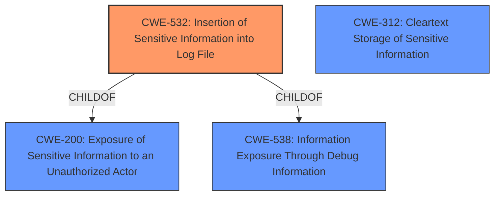

# Raw Analyzer Response for CVE-2025-1053

# Summary

| CWE ID  | CWE Name                                      | Confidence | CWE Abstraction Level | CWE Vulnerability Mapping Label | CWE-Vulnerability Mapping Notes |
| ------- | --------------------------------------------- | ---------- | --------------------- | ------------------------------- | ----------------------------- |
| CWE-532 | Insertion of Sensitive Information into Log File | 0.9        | Base                  | Primary                         | Allowed                      |
| CWE-312 | Cleartext Storage of Sensitive Information     | 0.6        | Base                  | Secondary                       | Allowed                      |

## Evidence and Confidence

*   **Confidence Score:** 0.8
*   **Evidence Strength:** HIGH

## Relationship Analysis

The primary CWE is CWE-532, which is a Base level weakness describing the insertion of sensitive information into log files. CWE-532 is a child of CWE-200 (Exposure of Sensitive Information to an Unauthorized Actor) and CWE-538 (Information Exposure Through Debug Information). This indicates that the vulnerability involves the unintentional disclosure of sensitive data via logging mechanisms. The secondary CWE is CWE-312, which involves storing sensitive data in cleartext. While there is no direct relationship between CWE-532 and CWE-312, they are conceptually related in that both deal with the exposure of sensitive information. In this case, the encryption key is written to the supportsave file in cleartext, which is a form of storage, albeit temporary.

## Vulnerability Chain

The vulnerability chain starts with the **incorrect writing of the encryption key into a Brocade SANnav supportsave file** under certain error conditions (CWE-532, **Insertion of Sensitive Information into Log File** and CWE-312, **Cleartext Storage of Sensitive Information**). An attacker with privileged access to the Brocade SANnav database can then obtain the encryption key from the supportsave file. Finally, the attacker can use the encryption key to obtain passwords used by Brocade SANnav.

## Summary of Analysis

The initial assessment focused on identifying the root cause of the vulnerability, which is the **writing of the encryption key to the supportsave file**. The evidence for this is clear in the "CVE Reference Links Content Summary" section, which states: "Under certain error conditions during Brocade SANnav installation or upgrade, the encryption key is written into a Brocade SANnav supportsave file." This directly supports CWE-532 (**Insertion of Sensitive Information into Log File**) as the primary weakness. The key is also written in cleartext, which allows us to consider CWE-312 (**Cleartext Storage of Sensitive Information**) as an additional weakness.

The relationship analysis highlights that CWE-532 is a specific instance of information exposure, further solidifying its relevance. The retriever results also support this conclusion, with CWE-532 being a highly ranked candidate. The final decision is based on the evidence provided and the CWE specifications. CWE-532 accurately represents the weakness, and its Base level of abstraction is appropriate.

Relevant CWE Information:

# Enhanced Context (25 CWEs)
The following CWEs were identified as potentially relevant to this vulnerability:

## CWE-311: Missing Encryption of Sensitive Data
**Abstraction Level**: Class
**Similarity Score**: 0.74
**Source**: dense

**Description**:
The product does not encrypt sensitive or critical information before storage or transmission.

**Mapping Guidance**:
- Usage: Discouraged
- Rationale: CWE-311 is high-level with more precise children available. It is a level-1 Class (i.e., a child of a Pillar).

*Not Used:* Though encryption is mentioned, the core issue is the key's unintended inclusion in the log file.

## CWE-1391: Use of Weak Credentials
**Abstraction Level**: Class
**Similarity Score**: 0.73
**Source**: dense

**Description**:
The product uses weak credentials (such as a default key or hard-coded password) that can be calculated, derived, reused, or guessed by an attacker.

**Mapping Guidance**:
- Usage: Allowed-with-Review
- Rationale: This CWE entry is a Class and might have Base-level children that would be more appropriate

*Not Used:* The credentials themselves are not inherently weak, but their exposure is the vulnerability.

## CWE-916: Use of Password Hash With Insufficient Computational Effort
**Abstraction Level**: Base
**Similarity Score**: 0.72
**Source**: dense

**Description**:
The product generates a hash for a password, but it uses a scheme that does not provide a sufficient level of computational effort that would make password cracking attacks infeasible or expensive.

**Mapping Guidance**:
- Usage: Allowed
- Rationale: This CWE entry is at the Base level of abstraction, which is a preferred level of abstraction for mapping to the root causes of vulnerabilities.

*Not Used:* The hashing algorithm isn't the problem; the key's exposure is.

## CWE-321: Use of Hard-coded Cryptographic Key
**Abstraction Level**: Variant
**Similarity Score**: 0.72
**Source**: dense

**Description**:
The use of a hard-coded cryptographic key significantly increases the possibility that encrypted data may be recovered.

**Mapping Guidance**:
- Usage: Allowed
- Rationale: This CWE entry is at the Variant level of abstraction, which is a preferred level of abstraction for mapping to the root causes of vulnerabilities.

*Not Used:* While a hardcoded key *could* be in use, it is not mentioned in the description.

## CWE-312: Cleartext Storage of Sensitive Information
**Abstraction Level**: Base
**Similarity Score**: 0.71
**Source**: dense

**Description**:
The product stores sensitive information in cleartext within a resource that might be accessible to another control sphere.

**Mapping Guidance**:
- Usage: Allowed
- Rationale: This CWE entry is at the Base level of abstraction, which is a preferred level of abstraction for mapping to the root causes of vulnerabilities.

*Used as Secondary:* The encryption key is written to the supportsave file in cleartext.

## CWE-303: Incorrect Implementation of Authentication Algorithm
**Abstraction Level**: Base
**Similarity Score**: 0.71
**Source**: dense

**Description**:
The requirements for the product dictate the use of an established authentication algorithm, but the implementation of the algorithm is incorrect.

**Mapping Guidance**:
- Usage: Allowed
- Rationale: This CWE entry is at the Base level of abstraction, which is a preferred level of abstraction for mapping to the root causes of vulnerabilities.

*Not Used:* The problem isn't with the authentication algorithm itself, but the exposure of the encryption key.

## CWE-798: Use of Hard-coded Credentials
**Abstraction Level**: Base
**Similarity Score**: 0.71
**Source**: dense

**Description**:
The product contains hard-coded credentials, such as a password or cryptographic key.

**Mapping Guidance**:
- Usage: Allowed
- Rationale: This CWE entry is at the Base level of abstraction, which is a preferred level of abstraction for mapping to the root causes of vulnerabilities.

*Not Used:* While a hardcoded key *could* be in use, it is not mentioned in the description.

## CWE-288: Authentication Bypass Using an Alternate Path or Channel
**Abstraction Level**: Base
**Similarity Score**: 0.71
**Source**: dense

**Description**:
The product requires authentication, but the product has an alternate path or channel that does not require authentication.

**Mapping Guidance**:
- Usage: Allowed
- Rationale: This CWE entry is at the Base level of abstraction, which is a preferred level of abstraction for mapping to the root causes of vulnerabilities.

*Not Used:* Authentication bypass is not involved in this vulnerability.

## CWE-345: Insufficient Verification of Data Authenticity
**Abstraction Level**: Class
**Similarity Score**: 0.70
**Source**: dense

**Description**:
The product does not sufficiently verify the origin or authenticity of data, in a way that causes it to accept invalid data.

**Mapping Guidance**:
- Usage: Discouraged
- Rationale: This CWE entry is a level-1 Class (i.e., a child of a Pillar). It might have lower-level children that would be more appropriate

*Not Used:* Data authenticity is not directly relevant to this vulnerability.

## CWE-522: Insufficiently Protected Credentials
**Abstraction Level**: Class
**Similarity Score**: 0.70
**Source**: dense

**Description