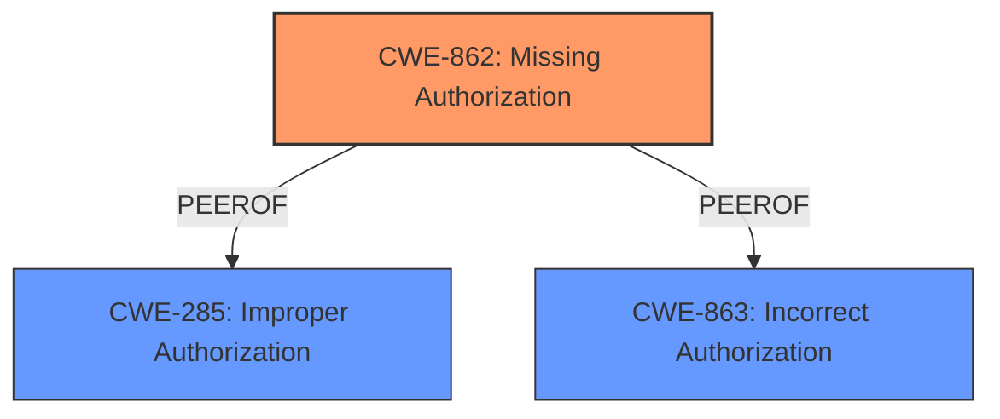

# Analysis for CVE-2025-1091

# Summary
| CWE ID | CWE Name | Confidence | CWE Abstraction Level | CWE Vulnerability Mapping Label | CWE-Vulnerability Mapping Notes |
|---|---|---|---|---|---|
| CWE-862 | Missing Authorization | 1.0 | Class |  Primary CWE | Allowed-with-Review |

## Evidence and Confidence

*   **Confidence Score:** 1.0
*   **Evidence Strength:** HIGH

## Relationship Analysis
The primary CWE is CWE-862 (Missing Authorization), which is a Class-level CWE. It indicates that the application does not perform an authorization check before granting access to a resource. The analysis considered CWE-285 (Improper Authorization), but CWE-862 was more appropriate because it directly addresses the absence of an authorization check, which is the root cause described in the vulnerability. The retriever results also listed other authorization-related CWEs such as CWE-863, CWE-639, and CWE-425, but CWE-862 aligns most closely with the provided description stating a **"Broken Authorization schema"** exists.

## Vulnerability Chain
The vulnerability chain starts with the **missing authorization** check (CWE-862). An authenticated user can download IOA scripts and configuration files because there is no proper authorization in place to prevent this action. The impact is information disclosure of IOA script and configuration files.

## Summary of Analysis
The analysis is based on the provided evidence, which indicates a **"Broken Authorization schema"**. The vulnerability allows authenticated users to download IOA scripts and configuration files if they know the URL. This clearly indicates a **missing authorization** check, making CWE-862 the most appropriate classification.

The CWE-862 description, "The product does not perform an authorization check before allowing an actor to access a resource or perform an action," aligns perfectly with the vulnerability description.

The retriever results also support this decision, with CWE-862 being a strong candidate. While other CWEs like CWE-863 (Incorrect Authorization) and CWE-285 (Improper Authorization) were considered, they were not as fitting because the core issue is the absence of an authorization check, rather than an incorrect or improper one.

The chosen CWE is at the optimal level of specificity, as it accurately represents the root cause of the vulnerability. Other more general CWEs, like CWE-284 (Improper Access Control), were considered but deemed less specific and therefore less appropriate.