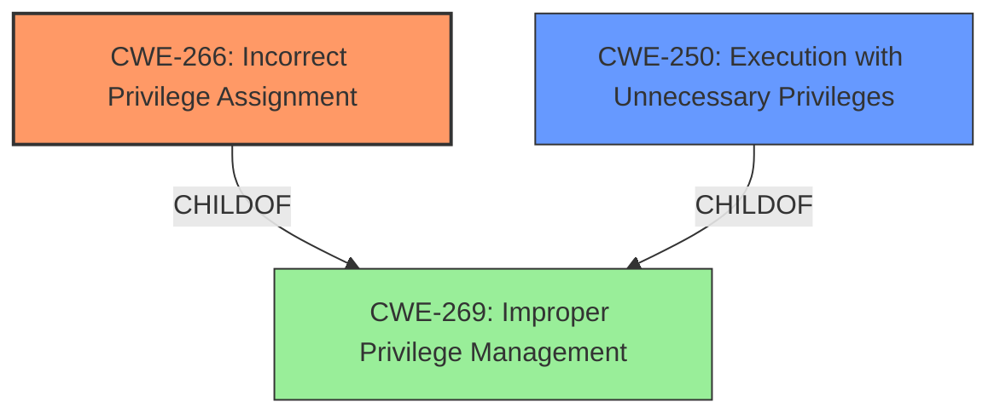

# Analysis for CVE-2025-1095

# Summary
| CWE ID | CWE Name | Confidence | CWE Abstraction Level | CWE Vulnerability Mapping Label | CWE-Vulnerability Mapping Notes |
|---|---|---|---|---|---|
| CWE-266 | Incorrect Privilege Assignment | 0.85 | Base | Allowed | Primary CWE. The **root cause** is the **incorrect privilege assignment** to the service, allowing local users to escalate privileges. |
| CWE-250 | Execution with Unnecessary Privileges | 0.75 | Base | Allowed | Secondary candidate. The service may be running with higher privileges than necessary, which amplifies the impact of the **incorrect privilege assignment**. |
| CWE-269 | Improper Privilege Management | 0.65 | Class | Discouraged | Secondary candidate. More general than CWE-266, but reflects overall **improper handling of privileges**. |

## Evidence and Confidence

*   **Confidence Score:** 0.80
*   **Evidence Strength:** MEDIUM

## Relationship Analysis

The primary relationship is between CWE-266, CWE-250, and CWE-269. CWE-266 (Incorrect Privilege Assignment) is chosen as the primary because it directly addresses the **root cause** of the vulnerability where the service is granted excessive privileges. CWE-250 (Execution with Unnecessary Privileges) is a related weakness, where the service runs with higher privileges than required, amplifying the impact. CWE-269 (Improper Privilege Management) is a more general class that encompasses both.

## Vulnerability Chain

The vulnerability chain starts with the **incorrect privilege assignment** (CWE-266) in the Windows service. This allows an attacker to execute code with elevated privileges (NT AUTHORITY\SYSTEM), leading to local privilege escalation. The service potentially running with **unnecessary privileges** (CWE-250) exacerbates the issue.
1.  **Incorrect Privilege Assignment (CWE-266):** The root cause. The service is assigned privileges it should not have.
2.  **Execution with Unnecessary Privileges (CWE-250):** The service runs with elevated privileges, amplifying the impact.
3.  **Local Privilege Escalation (Impact):** Attackers exploit the misconfigured service to gain system-level privileges.

## Summary of Analysis

The initial analysis focused on the **incomplete fix** aspect, but the analysis of CVE-2025-1095 shows the weakness relates to how the Personal Communications handles MSI package deployment. The key evidence for the primary CWE is the vulnerability description stating that the vulnerability allows interactively logged-in users to run commands with full privileges, indicating an **incorrect privilege assignment**. The decision to choose CWE-266 is based on the fact that the **root cause** involves the product assigning incorrect privileges to an actor, as highlighted in the CWE description. CWE-250 is included because the service might be running with elevated privileges, which is unnecessary.

Relevant CWE Information:

# Enhanced Context (25 CWEs)
The following CWEs were identified as potentially relevant to this vulnerability:

## CWE-266: Incorrect Privilege Assignment
**Abstraction Level**: Base
**Similarity Score**: 0.80
**Source**: dense

**Description**:
A product incorrectly assigns a privilege to a particular actor, creating an unintended sphere of control for that actor.

**Mapping Guidance**:
- Usage: Allowed
- Rationale: This CWE entry is at the Base level of abstraction, which is a preferred level of abstraction for mapping to the root causes of vulnerabilities.
## CWE-250: Execution with Unnecessary Privileges
**Abstraction Level**: Base
**Similarity Score**: 0.76
**Source**: dense

**Description**:
The product performs an operation at a privilege level that is higher than the minimum level required, which creates new weaknesses or amplifies the consequences of other weaknesses.

**Mapping Guidance**:
- Usage: Allowed
- Rationale: This CWE entry is at the Base level of abstraction, which is a preferred level of abstraction for mapping to the root causes of vulnerabilities.

The retriever scores, vulnerability description, and the guidance on privileges vs. permissions all support this mapping. CWE-285 was considered, but it relates to improper authorization checks, which is not the **root cause** here. The issue is that the privileges were assigned incorrectly in the first place (CWE-266). CWE-863 was considered as a potential mapping since it relates to incorrect authorization. However, it's more appropriate when there's a flawed authorization check. In this case, the vulnerability stems from the initial incorrect assignment of privileges.