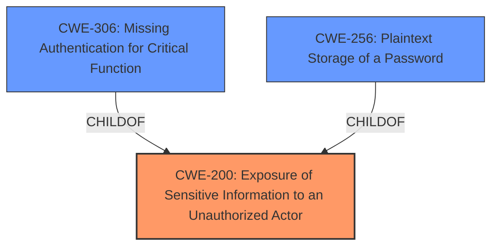

# Raw Analyzer Response for CVE-2025-1144

# Summary

| CWE ID | CWE Name | Confidence | CWE Abstraction Level | CWE Vulnerability Mapping Label | CWE-Vulnerability Mapping Notes |
|---|---|---|---|---|---|
| CWE-200 | Exposure of Sensitive Information to an Unauthorized Actor | 0.9 | Class | Primary CWE | Discouraged, but chosen as the best fit given the high-level description. |
| CWE-306 | Missing Authentication for Critical Function | 0.7 | Base | Secondary Candidate | Allowed |
| CWE-256 | Plaintext Storage of a Password | 0.6 | Base | Secondary Candidate | Allowed |

## Evidence and Confidence

*   **Confidence Score:** 0.8
*   **Evidence Strength:** MEDIUM

## Relationship Analysis
The primary relationship is that CWE-200 [Exposure of Sensitive Information to an Unauthorized Actor] is a broad category. The more specific weaknesses, **Missing Authentication** CWE-306 and **Plaintext Storage of a Password** CWE-256, contribute to this exposure. Although CWE-200 is discouraged, it is suitable given the high-level information available in the description.

## Vulnerability Chain
The vulnerability chain starts with **missing authentication** (CWE-306) allowing access to specific pages and database information. Then, **plaintext storage of credentials** (CWE-256) allows unauthenticated attackers to obtain administrator credentials. Both lead to **Exposure of Sensitive Information** (CWE-200).

## Summary of Analysis
The initial assessment was based on the **weakness** described as "**Exposure of Sensitive Information**." The retriever results pointed to CWE-200 [Exposure of Sensitive Information to an Unauthorized Actor], CWE-532 [Insertion of Sensitive Information into Log File], CWE-425 [Direct Request ('Forced Browsing')], and CWE-497 [Exposure of Sensitive System Information to an Unauthorized Control Sphere].

CWE-200 [Exposure of Sensitive Information to an Unauthorized Actor] is the most appropriate high-level classification, as the vulnerability description explicitly states "**Exposure of Sensitive Information**." The description also mentions "**unauthenticated attackers to view specific pages and obtain database information as well as plaintext administrator credentials**," supporting CWE-306 [Missing Authentication for Critical Function] and CWE-256 [Plaintext Storage of a Password] as contributing factors.

The graph relationships highlight that CWE-306 [Missing Authentication for Critical Function] and CWE-256 [Plaintext Storage of a Password] are children of CWE-200 [Exposure of Sensitive Information to an Unauthorized Actor], indicating a hierarchical relationship where the specific weaknesses contribute to the broader exposure issue.

The selected CWEs are at a reasonable level of specificity, given the information provided. Although CWE-200 [Exposure of Sensitive Information to an Unauthorized Actor] is discouraged, it aligns with the explicit "**weakness**" mentioned in the description.

Relevant CWE Information:
- "School Affairs System from Quanxun has an **Exposure of Sensitive Information**, allowing unauthenticated attackers to view specific pages and obtain database information as well as plaintext administrator credentials."

I am overriding the discouragement for CWE-200 [Exposure of Sensitive Information to an Unauthorized Actor] because the vulnerability is explicitly described as "**Exposure of Sensitive Information**".