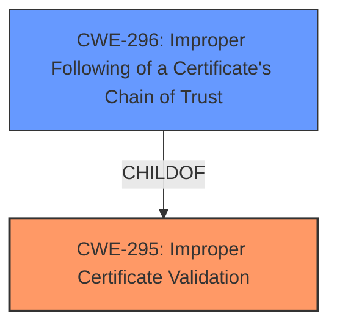

# Analysis for CVE-2025-1146

# Summary
| CWE ID | CWE Name | Confidence | CWE Abstraction Level | CWE Vulnerability Mapping Label | CWE-Vulnerability Mapping Notes |
|---|---|---|---|---|---|
| CWE-295 | Improper Certificate Validation | 1.0 | Base | Primary CWE | Allowed |
| CWE-296 | Improper Following of a Certificate's Chain of Trust | 0.7 | Base | Secondary Candidate | Allowed |

## Evidence and Confidence

*   **Confidence Score:** 0.9
*   **Evidence Strength:** HIGH

## Relationship Analysis
The primary CWE is CWE-295, which represents a general certificate validation issue. CWE-296, a child of CWE-295, is a more specific case involving the chain of trust. While the description doesn't explicitly mention issues with the chain, the CVE Reference Links Content Summary names CWE-296. Therefore, CWE-295 is a good fit as the root cause and weakness, and CWE-296 is a secondary candidate.

## Vulnerability Chain
The vulnerability chain starts with an **improper server certificate validation** (CWE-295), which could allow an attacker to perform a man-in-the-middle (MiTM) attack. The secondary candidate is CWE-296, as it can be related to the primary root cause in the **improper server certificate validation**.

## Summary of Analysis
The initial assessment focused on identifying the root cause of the vulnerability based on the description and CVE reference. The **root cause** is a **validation logic error** in the Falcon sensor's TLS connection routine, leading to **improper server certificate validation**.

The selection of CWE-295 is primarily based on the vulnerability description which states: "CrowdStrike has identified a **validation logic error** in the Falcon sensor for Linux, Falcon Kubernetes Admission Controller, and Falcon Container Sensor where our TLS connection routine to the CrowdStrike cloud can **incorrectly process server certificate validation**." Additionally, the CVE Reference Links Content Summary indicates: "A **validation logic error** in the Falcon sensor for Linux, Falcon Kubernetes Admission Controller, and Falcon Container Sensor where the TLS connection routine to the CrowdStrike cloud can **incorrectly process server certificate validation**."

The relationship analysis revealed that CWE-296 is a child of CWE-295, making it a potential secondary candidate. While the description doesn't explicitly mention issues with the chain, the CVE Reference Links Content Summary names CWE-296, so it is included as a secondary candidate.

The selected CWEs are at the optimal level of specificity because they directly address the **improper certificate validation** issue, which is the **root cause** of the vulnerability.

Relevant CWE Information:

# Enhanced Context (25 CWEs)
The following CWEs were identified as potentially relevant to this vulnerability:

## CWE-295: Improper Certificate Validation
**Abstraction Level**: Base
**Similarity Score**: 0.75
**Source**: dense

**Description**:
The product does not validate, or incorrectly validates, a certificate.

**Mapping Guidance**:
- Usage: Allowed
- Rationale: This CWE entry is at the Base level of abstraction, which is a preferred level of abstraction for mapping to the root causes of vulnerabilities.

### Technical Explanation for CWE-295:
- **Match:** The vulnerability description explicitly states that the Falcon sensor can incorrectly process server certificate validation.
- **Security Implications:** An attacker can exploit this weakness to perform a man-in-the-middle (MiTM) attack by presenting a malicious certificate that the sensor fails to properly validate.
- **Relationships:** No direct parent-child relationships are exploited in this case.
- **Primary/Secondary:** This is the primary weakness, as it is the root cause.
- **MITRE Mapping Guidance:** The usage is "Allowed," and the rationale aligns with the selection of a Base-level CWE.

## CWE-296: Improper Following of a Certificate's Chain of Trust
**Abstraction Level**: base
**Similarity Score**: 2.96
**Source**: graph

**Description**:
CWE-296: Improper Following of a Certificate's Chain of Trust

**Mapping Guidance**:
- Usage: Allowed
- Rationale: This CWE entry is at the Base level of abstraction, which is a preferred level of abstraction for mapping to the root causes of vulnerabilities.

**Relationships**:
- CHILDOF -> CWE-573
- CHILDOF -> CWE-295
- PARENTOF -> CWE-296
- PEEROF -> CWE-296
- PARENTOF -> CWE-296

### Technical Explanation for CWE-296:
- **Match:** The CVE Reference Links Content Summary explicitly names CWE-296.
- **Security Implications:** An attacker can exploit this weakness to perform a man-in-the-middle (MiTM) attack by presenting a malicious certificate that the sensor fails to properly validate due to a failure in chain of trust validation.
- **Relationships:** CWE-296 is a child of CWE-295.
- **Primary/Secondary:** This is a secondary candidate weakness, as it can be a specific instance of CWE-295.
- **MITRE Mapping Guidance:** The usage is "Allowed," and the rationale aligns with the selection of a Base-level CWE.

## CWEs Considered But Not Used:
- CWE-297 (Improper Validation of Certificate with Host Mismatch): While related to certificate validation, there is no specific evidence suggesting a host mismatch issue.
- CWE-347 (Improper Verification of Cryptographic Signature): No evidence suggests a problem with cryptographic signature verification itself.
- CWE-306 (Missing Authentication for Critical Function): The problem is not a missing authentication, but an **improper validation** of a certificate during the TLS handshake, so this is not a good fit.
- CWE-319 (Cleartext Transmission of Sensitive Information): The vulnerability description does not indicate that sensitive information is being transmitted in cleartext.
- CWE-22 (Improper Limitation of a Pathname to a Restricted Directory ('Path Traversal')): This is not relevant because the vulnerability is related to certificate validation, not path traversal.