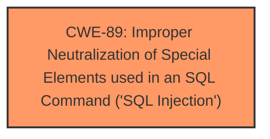

# Analysis Report for CVE-2025-1183

# Vulnerability Analysis Report: CVE-2025-1183

## Description

A vulnerability has been found in CodeZips Gym Management System 1.0 and classified as critical. Affected by this vulnerability is an unknown functionality of the file /dashboard/admin/more-userprofile.php. The manipulation of the argument login_id leads to **sql injection**. The attack can be launched remotely. The exploit has been disclosed to the public and may be used.

## Vulnerability Description Key Phrases

- **Weakness:** sql injection
- **Vector:** argument manipulation
- **Product:** CodeZips Gym Management System
- **Version:** 1
- **Component:** /dashboard/admin/more-userprofile.php

## Analysis (with Relationship Data)

# Summary
| CWE ID | CWE Name | Confidence | CWE Abstraction Level | CWE Vulnerability Mapping Label | CWE-Vulnerability Mapping Notes |
|---|---|---|---|---|---|
| CWE-89 | Improper Neutralization of Special Elements used in an SQL Command ('SQL Injection') | 1.0 | Base | Primary | Allowed |

## Evidence and Confidence

*   **Confidence Score:** 1.0
*   **Evidence Strength:** HIGH

## Relationship Analysis
The primary relationship identified is that CWE-89 is a base-level weakness. No other relationships are applicable based on the provided information. The abstraction level of Base is appropriate given the direct nature of the **SQL injection**.



## Vulnerability Chain
The vulnerability chain consists of:
1.  **Improper Neutralization of Special Elements used in an SQL Command ('SQL Injection')** (CWE-89): The **weakness** is the **improper neutralization** that allows **SQL injection**.

## Summary of Analysis
The primary assessment is strongly based on the provided evidence. The vulnerability description explicitly states that manipulating the `login_id` argument leads to **SQL injection** in the `/dashboard/admin/more-userprofile.php` file. This aligns directly with the definition of CWE-89, which involves **improper neutralization** of special elements used in an SQL command.

The Retriever Results also strongly support CWE-89 as the primary candidate, with a score of 1.0. The description of CWE-89 in "Complete CWE Specifications" confirms that it involves constructing SQL commands using externally-influenced input without proper neutralization.

CWE-79 (Improper Neutralization of Input During Web Page Generation ('Cross-site Scripting')) was considered but is not applicable because the vulnerability involves **SQL injection**, not cross-site scripting. Similarly, CWE-434 (Unrestricted Upload of File with Dangerous Type) is irrelevant because the vulnerability is not related to file uploads.

The selection of CWE-89 is at the optimal level of specificity because it directly describes the root cause of the vulnerability: **improper neutralization** leading to **SQL injection**.

Relevant CWE Information:

# Enhanced Context (25 CWEs)

## CWE-89: Improper Neutralization of Special Elements used in an SQL Command ('SQL Injection')
**Abstraction Level**: Base
**Similarity Score**: 0.76
**Source**: dense

**Description**:
The product constructs all or part of an SQL command using externally-influenced input from an upstream component, but it does not neutralize or incorrectly neutralizes special elements that could modify the intended SQL command when it is sent to a downstream component. Without sufficient removal or quoting of SQL syntax in user-controllable inputs, the generated SQL query can cause those inputs to be interpreted as SQL instead of ordinary user data.

**Mapping Guidance**:
- Usage: Allowed
- Rationale: This CWE entry is at the Base level of abstraction, which is a preferred level of abstraction for mapping to the root causes of vulnerabilities.


## CWE Relationship Analysis

Current CWEs represent these abstraction levels: .


### Vulnerability Chain Analysis

**Chain starting from CWE-89:**
- 89 (Improper Neutralization of Special Elements used in an SQL Command ('SQL Injection')) - ROOT


**Chain starting from CWE-79:**
- 79 (Improper Neutralization of Input During Web Page Generation ('Cross-site Scripting')) - ROOT


### CWE Relationship Diagram

```mermaid
graph TD
    classDef primary fill:#f96,stroke:#333,stroke-width:2px
    classDef secondary fill:#69f,stroke:#333
    classDef tertiary fill:#9e9,stroke:#333
```


*Report generated on 2025-07-14 07:00:34*
