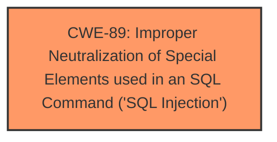

# Analysis Report for CVE-2025-1188

# Vulnerability Analysis Report: CVE-2025-1188

## Description

A vulnerability, which was classified as critical, has been found in Codezips Gym Management System 1.0. Affected by this issue is some unknown functionality of the file /dashboard/admin/updateroutine.php. The manipulation of the argument tid leads to **sql injection**. The attack may be launched remotely. The exploit has been disclosed to the public and may be used.

## Vulnerability Description Key Phrases

- **Weakness:** sql injection
- **Product:** Codezips Gym Management System
- **Version:** 1
- **Component:** /dashboard/admin/updateroutine.php

## Analysis (with Relationship Data)

# Summary

| CWE ID  | CWE Name                                                                 | Confidence | CWE Abstraction Level | CWE Vulnerability Mapping Label | CWE-Vulnerability Mapping Notes |
| ------- | ------------------------------------------------------------------------ | ---------- | --------------------- | ------------------------------- | ------------------------------- |
| CWE-89  | Improper Neutralization of Special Elements used in an SQL Command ('SQL Injection') | 1.0        | Base                  | Primary                         | Allowed                         |

## Evidence and Confidence

*   **Confidence Score:** 1.0
*   **Evidence Strength:** HIGH

## Relationship Analysis

The primary relationship is that CWE-89 is a Base level CWE, which is appropriate for root cause analysis. No other hierarchical or chain relationships appear immediately relevant based on the provided information.



## Vulnerability Chain

The vulnerability chain is simple:

1.  **Root Cause:** **SQL injection** due to improper neutralization of input.
2.  **Impact:** Remote attack is possible

## Summary of Analysis

The vulnerability description clearly states that the **weakness** is **SQL injection** via manipulation of the `tid` argument in `/dashboard/admin/updateroutine.php`. The retriever results confirm that CWE-89 is the top match with a score of 1.0.

*   The evidence is strong because the description explicitly identifies **SQL injection** as the vulnerability.
*   CWE-89 is the optimal level of specificity because it directly addresses the root cause: "Improper Neutralization of Special Elements used in an SQL Command."
*   The description says "The manipulation of the argument tid leads to **sql injection**".

Relevant CWE Information:

# Enhanced Context (25 CWEs)

## CWE-89: Improper Neutralization of Special Elements used in an SQL Command ('SQL Injection')
**Abstraction Level**: Base
**Similarity Score**: 0.75
**Source**: dense

**Description**:
The product constructs all or part of an SQL command using externally-influenced input from an upstream component, but it does not neutralize or incorrectly neutralizes special elements that could modify the intended SQL command when it is sent to a downstream component. Without sufficient removal or quoting of SQL syntax in user-controllable inputs, the generated SQL query can cause those inputs to be interpreted as SQL instead of ordinary user data.

**Mapping Guidance**:
- Usage: Allowed
- Rationale: This CWE entry is at the Base level of abstraction, which is a preferred level of abstraction for mapping to the root causes of vulnerabilities.

## CWE-79: Improper Neutralization of Input During Web Page Generation ('Cross-site Scripting')
**Abstraction Level**: Base
**Similarity Score**: 0.72
**Source**: dense

**Description**:
The product does not neutralize or incorrectly neutralizes user-controllable input before it is placed in output that is used as a web page that is served to other users.

**Mapping Guidance**:
- Usage: Allowed
- Rationale: This CWE entry is at the Base level of abstraction, which is a preferred level of abstraction for mapping to the root causes of vulnerabilities.

### Alternative CWE Considerations:

*   CWE-79: Considered but not selected because the vulnerability is specifically **SQL injection**, not Cross-Site Scripting.
*   CWE-434: Considered but not selected because the vulnerability is related to **SQL injection**, not unrestricted file upload.
*   CWE-1336: Considered but not selected because the vulnerability is related to **SQL injection**, not template injection.
*   CWE-117: Considered but not selected because the vulnerability is related to **SQL injection**, not improper output neutralization for logs.
*   CWE-306: Considered but not selected because the vulnerability is related to **SQL injection**, not missing authentication.
*   CWE-96: Considered but not selected because the vulnerability is related to **SQL injection**, not static code injection.


## CWE Relationship Analysis

Current CWEs represent these abstraction levels: .


### Vulnerability Chain Analysis

**Chain starting from CWE-89:**
- 89 (Improper Neutralization of Special Elements used in an SQL Command ('SQL Injection')) - ROOT


**Chain starting from CWE-79:**
- 79 (Improper Neutralization of Input During Web Page Generation ('Cross-site Scripting')) - ROOT


### CWE Relationship Diagram

```mermaid
graph TD
    classDef primary fill:#f96,stroke:#333,stroke-width:2px
    classDef secondary fill:#69f,stroke:#333
    classDef tertiary fill:#9e9,stroke:#333
```


*Report generated on 2025-07-14 07:02:01*
