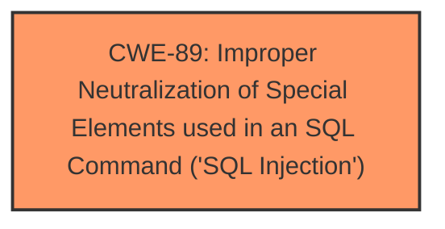

# Raw Analyzer Response for CVE-2025-1202

# Summary
| CWE ID | CWE Name | Confidence | CWE Abstraction Level | CWE Vulnerability Mapping Label | CWE-Vulnerability Mapping Notes |
|---|---|---|---|---|---|
| CWE-89 | Improper Neutralization of Special Elements used in an SQL Command ('SQL Injection') | 1.0 | Base | Allowed | Primary CWE |

## Evidence and Confidence

*   **Confidence Score:** 1.0
*   **Evidence Strength:** HIGH

## Relationship Analysis
The primary relationship considered was the direct match of the vulnerability description to the CWE-89 definition. The vulnerability description explicitly mentions "sql injection", which aligns perfectly with the description of CWE-89. There are no relevant parent-child, chain, or peer relationships that would influence the selection of a more specific or alternative CWE. The base level of abstraction is appropriate as it directly reflects the **root cause**.

## Vulnerability Chain
The vulnerability chain is straightforward:
1.  **Root Cause:** **SQL Injection** vulnerability due to **improper neutralization** of input.
2.  Impact: Remote attacker can manipulate SQL queries, potentially leading to data breaches, modification, or deletion.

## Summary of Analysis
The analysis is based on the explicit mention of "**sql injection**" in the vulnerability description. The description states that manipulation of the argument `id` leads to **sql injection** in the `/admin/edit_slider.php` file. This directly corresponds to CWE-89, which describes the **improper neutralization** of special elements used in an SQL command.

The retriever results also strongly support this classification, with CWE-89 having the highest score. The CWE-89 is at the Base level of abstraction, which is the preferred level.

Relevant CWE Information:

# Enhanced Context (25 CWEs)
The following CWEs were identified as potentially relevant to this vulnerability:

## CWE-89: Improper Neutralization of Special Elements used in an SQL Command ('SQL Injection')
**Abstraction Level**: Base
**Similarity Score**: 0.77
**Source**: dense

**Description**:
The product constructs all or part of an SQL command using externally-influenced input from an upstream component, but it does not neutralize or incorrectly neutralizes special elements that could modify the intended SQL command when it is sent to a downstream component. Without sufficient removal or quoting of SQL syntax in user-controllable inputs, the generated SQL query can cause those inputs to be interpreted as SQL instead of ordinary user data.

**Mapping Guidance**:
- Usage: Allowed
- Rationale: This CWE entry is at the Base level of abstraction, which is a preferred level of abstraction for mapping to the root causes of vulnerabilities.