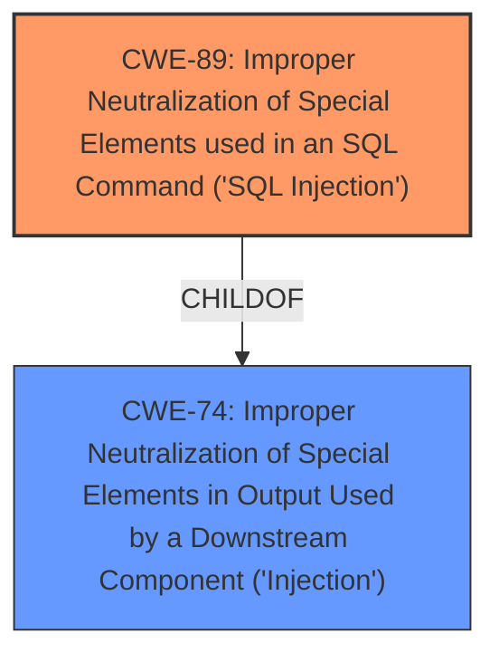

# Raw Analyzer Response for CVE-2025-1206

# Summary
| CWE ID | CWE Name | Confidence | CWE Abstraction Level | CWE Vulnerability Mapping Label | CWE-Vulnerability Mapping Notes |
|---|---|---|---|---|---|
| CWE-89 | Improper Neutralization of Special Elements used in an SQL Command ('SQL Injection') | 1.0 | Base | Allowed | Primary CWE. The vulnerability description explicitly mentions **sql injection** due to manipulation of the 'id' argument. |

## Evidence and Confidence

*   **Confidence Score:** 1.0
*   **Evidence Strength:** HIGH

## Relationship Analysis
The primary relationship considered was the parent-child relationship within the CWE hierarchy. While CWE-74 (Improper Neutralization of Special Elements in Output Used by a Downstream Component ('Injection')) is a parent of CWE-89 (Improper Neutralization of Special Elements used in an SQL Command ('SQL Injection')), the vulnerability description explicitly states "sql injection," making CWE-89 the more specific and appropriate choice.

## Vulnerability Chain
The vulnerability chain is straightforward:

1.  **Root Cause:** **Improper Neutralization of Special Elements used in an SQL Command ('SQL Injection')** (CWE-89) due to manipulation of the argument 'id'.
2.  Impact: Allows an attacker to modify SQL queries, potentially leading to data breaches or unauthorized access.

## Summary of Analysis
The vulnerability description clearly indicates an **sql injection** vulnerability. The manipulation of the argument 'id' is the attack vector. The retriever results strongly suggest CWE-89 (Improper Neutralization of Special Elements used in an SQL Command ('SQL Injection')), with a score of 1.0. The evidence is strong: "The manipulation of the argument id leads to **sql injection**." While other CWEs were considered, such as CWE-79 (Improper Neutralization of Input During Web Page Generation ('Cross-site Scripting')) and CWE-434 (Unrestricted Upload of File with Dangerous Type), they do not accurately represent the specific **weakness** described. The selection of CWE-89 is at the optimal level of specificity, as it directly addresses the identified **sql injection** vulnerability.

Relevant CWE Information:
*   **CWE-89**: The product constructs all or part of an SQL command using externally-influenced input from an upstream component, but it does not neutralize or incorrectly neutralizes special elements that could modify the intended SQL command when it is sent to a downstream component. This aligns perfectly with the description.