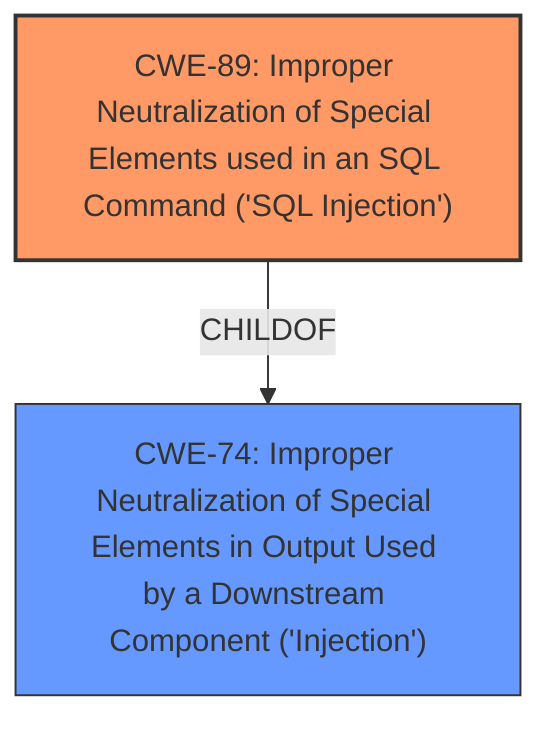

# Enhanced Analysis for CVE-2025-1227

# Summary
| CWE ID | CWE Name | Confidence | CWE Abstraction Level | CWE Vulnerability Mapping Label | CWE-Vulnerability Mapping Notes |
|---|---|---|---|---|---|
| CWE-89 | Improper Neutralization of Special Elements used in an SQL Command ('SQL Injection') | 1.0 | Base | Allowed | Primary CWE. The vulnerability stems from unsanitized user input being directly concatenated into a SQL query string. |

## Evidence and Confidence

*   **Confidence Score:** 1.0
*   **Evidence Strength:** HIGH

## Relationship Analysis
The primary relationship considered was the parent-child relationship, ensuring the selected CWE was the most specific and accurate representation of the vulnerability. CWE-89 is a base level CWE, which is preferred. Other CWEs like CWE-74 (Improper Neutralization of Special Elements in Output Used by a Downstream Component ('Injection')) are higher-level classes and less specific.



## Vulnerability Chain
The vulnerability chain starts with the **lack of input validation** for the `orderBy` parameter. This leads to **improper neutralization of special elements** within the SQL query, resulting in **SQL injection**. Successful exploitation allows attackers to read and modify sensitive data and potentially gain control of the database server.

## Summary of Analysis
The analysis strongly supports classifying this vulnerability as CWE-89 (Improper Neutralization of Special Elements used in an SQL Command ('SQL Injection')). The vulnerability description explicitly mentions "sql injection," and the provided CVE reference content confirms that unsanitized user input is directly concatenated into a SQL query string. The `orderBy` parameter is not filtered, allowing malicious SQL code to be injected. This directly aligns with the characteristics of CWE-89. The retriever results also list CWE-89 as the top candidate with a score of 1.0.

Relevant CWE Information:

# Enhanced Context (25 CWEs)
The following CWEs were identified as potentially relevant to this vulnerability:

## CWE-74: Improper Neutralization of Special Elements in Output Used by a Downstream Component ('Injection')
**Abstraction Level**: Class
**Similarity Score**: 0.71
**Source**: dense

**Description**:
The product constructs all or part of a command, data structure, or record using externally-influenced input from an upstream component, but it does not neutralize or incorrectly neutralizes special elements that could modify how it is parsed or interpreted when it is sent to a downstream component.

**Mapping Guidance**:
- Usage: Discouraged
- Rationale: CWE-74 is high-level and often misused when lower-level weaknesses are more appropriate.

## CWE-89: Improper Neutralization of Special Elements used in an SQL Command ('SQL Injection')
**Abstraction Level**: Base
**Similarity Score**: 1407.03
**Source**: sparse

**Description**:
The product constructs all or part of an SQL command using externally-influenced input from an upstream component, but it does not neutralize or incorrectly neutralizes special elements that could modify the intended SQL command when it is sent to a downstream component. Without sufficient removal or quoting of SQL syntax in user-controllable inputs, the generated SQL query can cause those inputs to be interpreted as SQL instead of ordinary user data.

**Mapping Guidance**:
- Usage: Allowed
- Rationale: This CWE entry is at the Base level of abstraction, which is a preferred level of abstraction for mapping to the root causes of vulnerabilities.

Other CWEs considered but not used:

*   CWE-74 (Improper Neutralization of Special Elements in Output Used by a Downstream Component ('Injection')): This is a broader class of injection vulnerabilities. While applicable, CWE-89 is a more specific and accurate representation of the SQL injection vulnerability. The mapping guidance also discourages the usage of CWE-74 when lower-level weaknesses are more appropriate.
*   CWE-79 (Improper Neutralization of Input During Web Page Generation ('Cross-site Scripting')): This is related to cross-site scripting vulnerabilities, which are not the focus of this vulnerability.
*   CWE-1336 (Improper Neutralization of Special Elements Used in a Template Engine): This is related to template injection, which is not the focus of this vulnerability.


## CWE Relationship Analysis

Current CWEs represent these abstraction levels: .


### Vulnerability Chain Analysis

**Chain starting from CWE-89:**
- 89 (Improper Neutralization of Special Elements used in an SQL Command ('SQL Injection')) - ROOT


**Chain starting from CWE-79:**
- 79 (Improper Neutralization of Input During Web Page Generation ('Cross-site Scripting')) - ROOT


### CWE Relationship Diagram

```mermaid
graph TD
    classDef primary fill:#f96,stroke:#333,stroke-width:2px
    classDef secondary fill:#69f,stroke:#333
    classDef tertiary fill:#9e9,stroke:#333
```