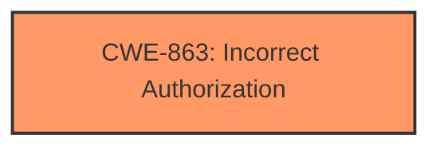

# Raw Analyzer Response for CVE-2025-1259

# Summary
| CWE ID | CWE Name | Confidence | CWE Abstraction Level | CWE Vulnerability Mapping Label | CWE-Vulnerability Mapping Notes |
|---|---|---|---|---|---|
| CWE-863 | Incorrect Authorization | 0.9 | Class | Allowed-with-Review | Primary CWE |

## Evidence and Confidence

*   **Confidence Score:** 0.9
*   **Evidence Strength:** LOW

## Relationship Analysis
The primary relationship considered was the hierarchical one. CWE-863 is a Class, which means there might be more specific Base-level children. However, without further information, CWE-863 is the most appropriate.

## Vulnerability Chain
The chain of events is:
1.  **Incorrect Authorization (CWE-863)**: A gNOI request is run when it should have been rejected, indicating a failure in the authorization mechanism.
2.  **Impact**: Users retrieve data that should not have been available, which is the result of the failed authorization.

## Summary of Analysis
The initial assessment focuses on the **incorrect authorization** that leads to unauthorized data retrieval. The vulnerability description states that "a gNOI request can be run when it should have been rejected," which directly points to an authorization issue. The weakness is that the system **does not properly** check whether the user has permission to run the request. This leads to the **impact** of users retrieving data they shouldn't have access to.

The retriever results list CWE-863 (Incorrect Authorization) as the top candidate. Given the description of the vulnerability, this CWE accurately captures the root cause of the problem.

The confidence in this assessment is high (0.9) because the vulnerability description explicitly mentions that a request is run when it should have been rejected, directly indicating an authorization failure. However, the evidence strength is LOW because the description lacks technical details about how the authorization failure occurs.

Relevant CWE Information:
*   **CWE-863: Incorrect Authorization** - The product does not correctly perform authorization checks, which allows unauthorized actors to bypass access controls.
    *   This CWE matches the vulnerability description, as the gNOI request is run despite it "should have been rejected". This means authorization checks were not correctly performed, or were bypassed somehow.
    *   The security implication is unauthorized access to sensitive data.
    *   The suggested Usage is "Allowed-with-Review" since CWE-863 is a Class and might have Base-level children that would be more appropriate. However, no further information is provided to allow us to select a child CWE.

Other CWEs Considered:
*   CWE-212, CWE-201, CWE-917, CWE-367, CWE-532, CWE-770, CWE-941, CWE-226: These were considered, but they relate more to information exposure, injection, race conditions, or resource management. They do not directly address the core issue of **incorrect authorization**, which is the primary cause of the vulnerability.