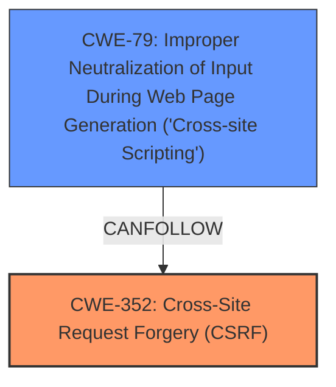

# Analysis for CVE-2025-1288

# Summary
| CWE ID  | CWE Name                                                                                  | Confidence | CWE Abstraction Level | CWE Vulnerability Mapping Label | CWE-Vulnerability Mapping Notes |
| :-------- | :------------------------------------------------------------------------------------------ | :---------- | :---------------------- | :------------------------------ | :------------------------------ |
| CWE-352   | Cross-Site Request Forgery (CSRF)                                                           | 1.0         | Compound                | Primary                         | Allowed                         |
| CWE-79    | Improper Neutralization of Input During Web Page Generation ('Cross-site Scripting')        | 0.9         | Base                    | Secondary                       | Allowed                         |

## Evidence and Confidence

*   **Confidence Score:** 0.95
*   **Evidence Strength:** HIGH

## Relationship Analysis
The primary weakness is **CWE-352** Cross-Site Request Forgery (CSRF). This is because the vulnerability description explicitly states that the plugin **does not have CSRF check**. The secondary weakness is **CWE-79** Improper Neutralization of Input During Web Page Generation ('Cross-site Scripting'), which is due to **missing sanitisation** and escaping. **CWE-352** can lead to actions performed on behalf of the user without their consent, and **CWE-79** allows for the injection of malicious scripts into web pages viewed by other users.

## Vulnerability Chain
The vulnerability chain starts with the **missing CSRF check** (**CWE-352**), which allows an attacker to craft malicious requests. Because of the **missing sanitisation** and escaping (**CWE-79**), these requests can inject malicious scripts, leading to reflected XSS.

## Summary of Analysis
The primary root cause is the **missing CSRF check** (**CWE-352**), as highlighted in the vulnerability description. The lack of **sanitisation** and escaping (**CWE-79**) exacerbates the issue, allowing for reflected XSS. Both weaknesses are explicitly mentioned in the description, providing a strong basis for their classification. The relationship analysis supports the selection of these CWEs, with **CWE-352** being the primary weakness that enables the reflected XSS attack.

The vulnerability description states, "The WOOEXIM WordPress plugin through 5.0.0 **does not have CSRF check** in some places, and is **missing sanitisation** as well as escaping, which could allow attackers to make an unauthenticated user vulnerable to reflected XSS via a CSRF attack."

The selected CWEs are at the optimal level of specificity, with **CWE-352** being a Compound weakness that accurately represents the **missing CSRF check**, and **CWE-79** being a Base weakness that describes the **improper neutralization** of input. Other CWEs were considered, such as **CWE-862**, but they were not as directly supported by the evidence in the description as **CWE-352** and **CWE-79**.