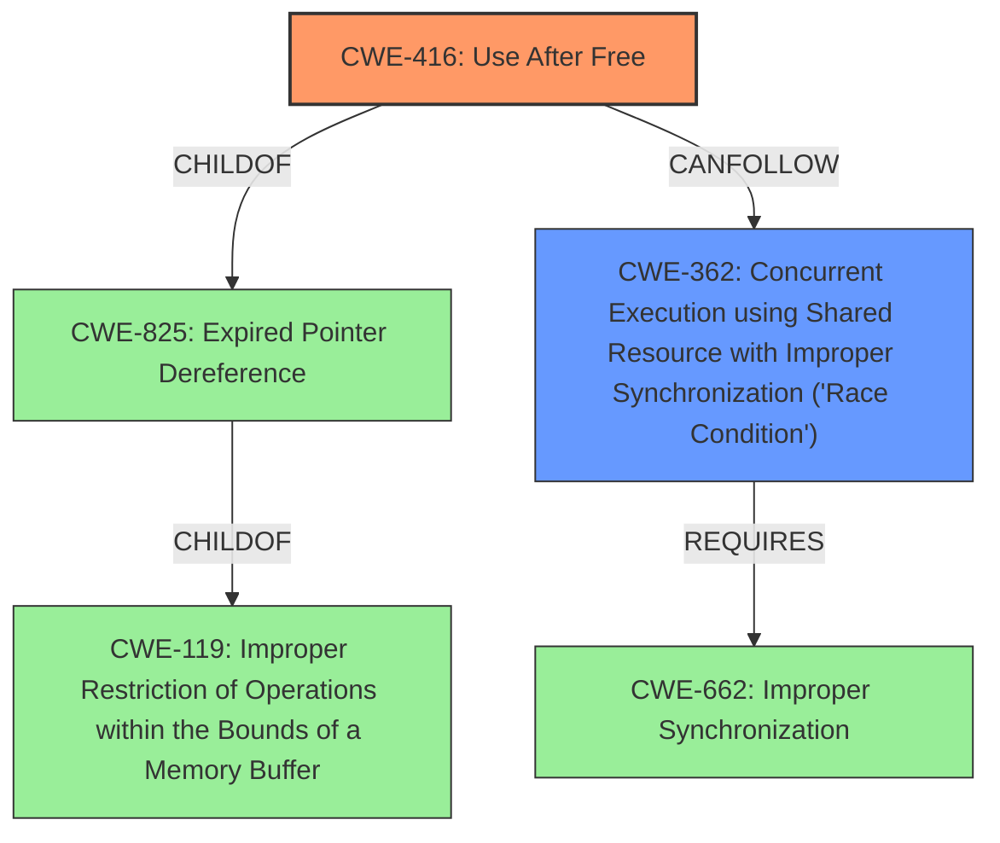

# Analysis Report for CVE-2025-1290

# Vulnerability Analysis Report: CVE-2025-1290

## Description

A **race condition** **Use-After-Free vulnerability** exists in the virtio_transport_space_update function within the Kernel 5.4 on ChromeOS. Concurrent allocation and freeing of the virtio_vsock_sock structure during an AF_VSOCK connect syscall can occur before a worker thread accesses it resulting in a dangling pointer and potential kernel code execution.

## Vulnerability Description Key Phrases

- **Rootcause:** ['Use-After-Free vulnerability', 'race condition']
- **Impact:** ['kernel code execution', 'dangling pointer']
- **Product:** ChromeOS
- **Version:** Kernel 5.4
- **Component:** virtio_transport_space_update function

## Analysis (with Relationship Data)

# Summary
| CWE ID  | CWE Name                                                                                      | Confidence | CWE Abstraction Level | CWE Vulnerability Mapping Label | CWE-Vulnerability Mapping Notes |
| :-------- | :--------------------------------------------------------------------------------------------- | :---------- | :---------------------- | :------------------------------ | :------------------------------- |
| CWE-416   | Use After Free                                                                                 | 1.0         | Variant                 | Primary CWE                   | Allowed                          |
| CWE-362   | Concurrent Execution using Shared Resource with Improper Synchronization ('Race Condition') | 0.9         | Class                   | Secondary CWE                 | Allowed-with-Review            |

## Evidence and Confidence

*   **Confidence Score:** 0.95
*   **Evidence Strength:** HIGH

## Relationship Analysis
The primary weakness is CWE-416, which is a Variant of CWE-825 (Expired Pointer Dereference) and CWE-119 (Improper Restriction of Operations within the Bounds of a Memory Buffer). CWE-416 occurs because of a **race condition**, CWE-362, where concurrent execution and **improper synchronization** allows a resource to be freed while another thread is still using it. Thus, the **race condition** allows for the **use-after-free** condition to occur.



## Vulnerability Chain
The vulnerability chain starts with a **race condition** (CWE-362) due to **improper synchronization**. This leads to a **use-after-free** vulnerability (CWE-416), where memory is accessed after it has been freed. This can lead to a dangling pointer and potential kernel code execution.

## Summary of Analysis
The vulnerability description clearly states a **"race condition Use-After-Free vulnerability exists"**. The primary weakness is CWE-416 (Use After Free), as the vulnerability allows for memory to be accessed after it has been freed, leading to a dangling pointer. This is caused by a **race condition** (CWE-362), where concurrent allocation and freeing of the `virtio_vsock_sock` structure occurs before a worker thread accesses it.

CWE-415 (Double Free) was considered but not selected as the vulnerability description doesn't mention the same memory address being freed twice.

CWE-364 (Signal Handler Race Condition) was considered, but the description does not mention a signal handler.

CWE-667 (Improper Locking) was considered, but it is a Class-level CWE and CWE-362 is more specific to the **race condition** described.

The final decision is based on the evidence in the vulnerability description, which clearly states a **race condition** leading to a **use-after-free** vulnerability. The CWEs selected are at the optimal level of specificity, with CWE-416 being a Variant and CWE-362 being a Class.


## CWE Relationship Analysis

Current CWEs represent these abstraction levels: .


### Vulnerability Chain Analysis

**Chain starting from CWE-662:**
- 662 (Improper Synchronization) - ROOT


**Chain starting from CWE-416:**
- 416 (Use After Free) - ROOT


### CWE Relationship Diagram

```mermaid
graph TD
    classDef primary fill:#f96,stroke:#333,stroke-width:2px
    classDef secondary fill:#69f,stroke:#333
    classDef tertiary fill:#9e9,stroke:#333
```


*Report generated on 2025-07-14 07:09:54*
