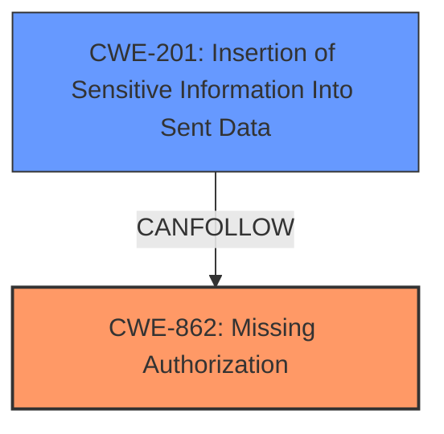

# Raw Analyzer Response for CVE-2025-1322

# Summary

| CWE ID  | CWE Name                                                                   | Confidence | CWE Abstraction Level | CWE Vulnerability Mapping Label | CWE-Vulnerability Mapping Notes |
| :-------- | :------------------------------------------------------------------------- | :--------- | :-------------------- | :------------------------------ | :------------------------------ |
| CWE-862 | **CWE-862: Missing Authorization**                                           | 0.9        | Class                 | Primary                         | Allowed-with-Review             |
| CWE-201 | **CWE-201: Insertion of Sensitive Information Into Sent Data**               | 0.7        | Base                  | Secondary                       | Allowed                         |

## Evidence and Confidence

*   **Confidence Score:** 0.8
*   **Evidence Strength:** MEDIUM

## Relationship Analysis

The primary relationship is that **CWE-862: Missing Authorization** is a class-level CWE. While it could have more specific children, the provided information does not go into the specifics of the authorization mechanism that is missing. **CWE-201: Insertion of Sensitive Information Into Sent Data** follows as an impact of the missing authorization, revealing sensitive information that should have been protected.

## Vulnerability Chain

The vulnerability chain starts with **CWE-862: Missing Authorization** because there are **insufficient restrictions on which posts can be included**. The impact of this missing authorization is **CWE-201: Insertion of Sensitive Information Into Sent Data**, allowing unauthenticated attackers to view data from password-protected, private, or draft posts.

## Summary of Analysis

The initial analysis focused on identifying the root cause of the vulnerability. The key phrase "**insufficient restrictions on which posts can be included**" clearly indicates a **missing authorization** check. The impact, "Information Exposure," led to considering **CWE-201: Insertion of Sensitive Information Into Sent Data**.

The retriever results and complete CWE specifications supported this analysis. **CWE-862: Missing Authorization** and **CWE-201: Insertion of Sensitive Information Into Sent Data** were strong candidates, with **CWE-862: Missing Authorization** being the primary root cause and **CWE-201: Insertion of Sensitive Information Into Sent Data** being the direct impact of the missing authorization.

The selection of **CWE-862: Missing Authorization** is at the class level, since the description does not specify a more specific type of authorization failure.
**CWE-201: Insertion of Sensitive Information Into Sent Data** is included because the **insufficient restrictions on which posts can be included** causes sensitive information to be exposed.

Relevant CWE Information:

# Enhanced Context (25 CWEs)

## CWE-352: Cross-Site Request Forgery (CSRF)
**Abstraction Level**: Compound
**Similarity Score**: 0.76
**Source**: dense

**Description**:
The web application does not, or can not, sufficiently verify whether a well-formed, valid, consistent request was intentionally provided by the user who submitted the request.

**Mapping Guidance**:
- Usage: Allowed
- Rationale: This is a well-known Composite of multiple weaknesses that must all occur simultaneously, although it is attack-oriented in nature.

*Not Used:* This vulnerability doesn't involve request forgery, so this CWE is not applicable.

## CWE-472: External Control of Assumed-Immutable Web Parameter
**Abstraction Level**: Base
**Similarity Score**: 0.74
**Source**: dense

**Description**:
The web application does not sufficiently verify inputs that are assumed to be immutable but are actually externally controllable, such as hidden form fields.

**Mapping Guidance**:
- Usage: Allowed
- Rationale: This CWE entry is at the Base level of abstraction, which is a preferred level of abstraction for mapping to the root causes of vulnerabilities.

*Not Used:* This vulnerability doesn't involve externally controlled immutable parameters, so this CWE is not applicable.

## CWE-425: Direct Request ('Forced Browsing')
**Abstraction Level**: Base
**Similarity Score**: 0.74
**Source**: dense

**Description**:
The web application does not adequately enforce appropriate authorization on all restricted URLs, scripts, or files.

**Mapping Guidance**:
- Usage: Allowed
- Rationale: This CWE entry is at the Base level of abstraction, which is a preferred level of abstraction for mapping to the root causes of vulnerabilities.

*Not Used:* **CWE-862: Missing Authorization** is a more general case of missing authorization than **CWE-425: Direct Request ('Forced Browsing')**. **CWE-862: Missing Authorization** is preferred.

## CWE-639: Authorization Bypass Through User-Controlled Key
**Abstraction Level**: Base
**Similarity Score**: 0.73
**Source**: dense

**Description**:
The system's authorization functionality does not prevent one user from gaining access to another user's data or record by modifying the key value identifying the data.

**Mapping Guidance**:
- Usage: Allowed
- Rationale: This CWE entry is at the Base level of abstraction, which is a preferred level of abstraction for mapping to the root causes of vulnerabilities.

*Not Used:* This vulnerability doesn't involve user-controlled keys, so this CWE is not applicable.

## CWE-434: Unrestricted Upload of File with Dangerous Type
**Abstraction Level**: Base
**Similarity Score**: 0.72
**Source**: dense

**Description**:
The product allows the upload or transfer of dangerous file types that are automatically processed within its environment.

**Mapping Guidance**:
- Usage: Allowed
- Rationale: This CWE entry is at the Base level of abstraction, which is a preferred level of abstraction for mapping to the root causes of vulnerabilities.

*Not Used:* This vulnerability doesn't involve unrestricted upload of files, so this CWE is not applicable.

## CWE-201: Insertion of Sensitive Information Into Sent Data
**Abstraction Level**: Base
**Similarity Score**: 0.71
**Source**: dense

**Description**:
The code transmits data to another actor, but a portion of the data includes sensitive information that should not be accessible to that actor.

**Mapping Guidance**:
- Usage: Allowed
- Rationale: This CWE entry is at the Base level of abstraction, which is a preferred level of abstraction for mapping to the root causes of vulnerabilities.

*Used:* This is the secondary CWE, as the **insufficient restrictions on which posts can be included** causes sensitive information to be exposed.

## CWE-359: Exposure of Private Personal Information to an Unauthorized Actor
**Abstraction Level**: Base
**Similarity Score**: 0.71
**Source**: dense

**Description**:
The product does not properly prevent a person's private, personal information from being accessed by actors who either (1) are not explicitly authorized to access the information or (2) do not have the implicit consent of the person about whom the information is collected.

**Mapping Guidance**:
- Usage: Allowed
- Rationale: This CWE entry is at the Base level of abstraction, which is a preferred level of abstraction for mapping to the root causes of vulnerabilities.

*Not Used:* While this is similar to the impact, **CWE-201: Insertion of Sensitive Information Into Sent Data** is more general and accurately describes the vulnerability, so it is preferred.

## CWE-538: Insertion of Sensitive Information into Externally-Accessible File or Directory
**Abstraction Level**: Base
**Similarity Score**: 0.71
**Source**: dense

**Description**:
The product places sensitive information into files or directories that are accessible to actors who are allowed to have access to the files, but not to the sensitive information.

**Mapping Guidance**:
- Usage: Allowed
- Rationale: This CWE entry is at the Base level of abstraction, which is a preferred level of abstraction for mapping to the root causes of vulnerabilities.

*Not Used:* This vulnerability doesn't involve insertion of sensitive information into externally accessible files or directories, so this CWE is not applicable.

## CWE-862: Missing Authorization
**Abstraction Level**: Class
**Similarity Score**: 0.70
**Source**: dense

**Description**:
The product does not perform an authorization check when an actor attempts to access a resource or perform an action.

**Mapping Guidance**:
- Usage: Allowed-with-Review
- Rationale: This CWE entry is a Class and might have Base-level children that would be more appropriate

*Used:* The root cause is **CWE-862: Missing Authorization** because there are **insufficient restrictions on which posts can be included**.

## CWE-116: Improper Encoding or Escaping of Output
**Abstraction Level**: Class
**Similarity Score**: 0.70
**Source**: dense

**Description**:
The product prepares a structured message for communication with another component, but encoding