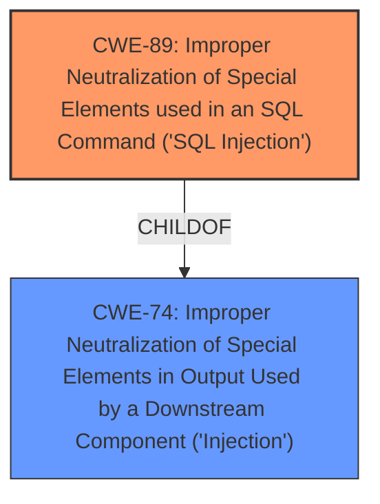

# Analysis Report for CVE-2025-1323

# Vulnerability Analysis Report: CVE-2025-1323

## Description

The WP-Recall Registration, Profile, Commerce & More plugin for WordPress is vulnerable to SQL Injection via the databeat parameter in all versions up to, and including, 16.26.10 due to **insufficient escaping on the user supplied parameter and lack of sufficient preparation on the existing SQL query**. This makes it possible for unauthenticated attackers to append additional SQL queries into already existing queries that can be used to extract sensitive information from the database.

## Vulnerability Description Key Phrases

- **Rootcause:** ['insufficient escaping on the user supplied parameter and lack of sufficient preparation on the existing SQL query', 'insufficient escaping on user supplied parameter and lack of sufficient preparation on existing SQL query']
- **Weakness:** SQL injection
- **Impact:** ['extract sensitive information from the database', 'extract sensitive information from database']
- **Vector:** databeat parameter
- **Attacker:** unauthenticated attackers
- **Product:** ['Commerce & More plugin for WordPress', 'WP-Recall Registration', 'Profile']
- **Version:** up to and including 16.26.10

## Analysis (with Relationship Data)

# Summary
| CWE ID   | CWE Name                                                                 | Confidence | CWE Abstraction Level | CWE Vulnerability Mapping Label | CWE-Vulnerability Mapping Notes |
| -------- | ------------------------------------------------------------------------ | ---------- | --------------------- | ----------------------------- | ----------------------------- |
| CWE-89   | Improper Neutralization of Special Elements used in an SQL Command ('SQL Injection') | 1.0        | Base                  | Primary                       | Allowed                       |

## Evidence and Confidence

*   **Confidence Score:** 1.0
*   **Evidence Strength:** HIGH

## Relationship Analysis
The primary weakness is CWE-89, which falls under the class CWE-74 (Improper Neutralization of Special Elements in Output Used by a Downstream Component ('Injection')). The vulnerability description clearly indicates **insufficient escaping** and **lack of sufficient preparation** of the SQL query, leading directly to SQL injection. The relationship here is hierarchical, with CWE-89 being a specific type of injection.



## Vulnerability Chain
The chain of events is as follows:
1.  **Root Cause:** **Insufficient escaping** on the user-supplied parameter and **lack of sufficient preparation** on the existing SQL query (CWE-89).
2.  **Weakness:** SQL injection vulnerability due to the above root cause.
3.  **Impact:** Unauthenticated attackers can **extract sensitive information from the database**.

## Summary of Analysis
The analysis is heavily based on the provided evidence, which clearly points to SQL injection. The vulnerability description explicitly mentions **insufficient escaping** and **lack of sufficient preparation** on the SQL query, leading to the ability to inject SQL commands.

The key evidence is: "The WP-Recall Registration, Profile, Commerce & More plugin for WordPress is vulnerable to SQL Injection via the databeat parameter in all versions up to, and including, 16.26.10 due to **insufficient escaping on the user supplied parameter and lack of sufficient preparation on the existing SQL query**. This makes it possible for unauthenticated attackers to append additional SQL queries into already existing queries that can be used to extract sensitive information from the database."

CWE-89 is the optimal level of specificity because it directly addresses the **improper neutralization** of special elements used in an SQL command.

Relevant CWE Information:

# Enhanced Context (25 CWEs)
The following CWEs were identified as potentially relevant to this vulnerability:

## CWE-74: Improper Neutralization of Special Elements in Output Used by a Downstream Component ('Injection')
**Abstraction Level**: Class
**Similarity Score**: 0.75

This is the parent of CWE-89 but less specific.

## CWE-425: Direct Request ('Forced Browsing')
**Abstraction Level**: Base
**Similarity Score**: 0.74

This is not related to the vulnerability as it deals with authorization.

## CWE-472: External Control of Assumed-Immutable Web Parameter
**Abstraction Level**: Base
**Similarity Score**: 0.74

This is not related to the vulnerability.

## CWE-303: Incorrect Implementation of Authentication Algorithm
**Abstraction Level**: Base
**Similarity Score**: 0.74

This is not related to the vulnerability as it deals with authentication.

## CWE-138: Improper Neutralization of Special Elements
**Abstraction Level**: Class
**Similarity Score**: 0.74

This is a higher level of abstraction than CWE-89.

## CWE-668: Exposure of Resource to Wrong Sphere
**Abstraction Level**: Class
**Similarity Score**: 0.74

This is not related to the vulnerability.

## CWE-345: Insufficient Verification of Data Authenticity
**Abstraction Level**: Class
**Similarity Score**: 0.73

This is not related to the vulnerability.

## CWE-212: Improper Removal of Sensitive Information Before Storage or Transfer
**Abstraction Level**: Base
**Similarity Score**: 0.73

This is not related to the vulnerability.

## CWE-116: Improper Encoding or Escaping of Output
**Abstraction Level**: Class
**Similarity Score**: 0.73

While **insufficient escaping** is mentioned, CWE-89 is a more precise classification.

## CWE-184: Incomplete List of Disallowed Inputs
**Abstraction Level**: Base
**Similarity Score**: 0.73

This is not related to the vulnerability.

## CWE-116: Improper Encoding or Escaping of Output
**Abstraction Level**: Class
**Similarity Score**: 5679.64

While **insufficient escaping** is mentioned, CWE-89 is a more precise classification.

## CWE-90: Improper Neutralization of Special Elements used in an LDAP Query ('LDAP Injection')
**Abstraction Level**: Base
**Similarity Score**: 5635.67

This is not related to the vulnerability as it deals with LDAP injection.

## CWE-89: Improper Neutralization of Special Elements used in an SQL Command ('SQL Injection')
**Abstraction Level**: Base
**Similarity Score**: 5439.22

This is the correct CWE.

## CWE-707: Improper Neutralization
**Abstraction Level**: Pillar
**Similarity Score**: 5098.99

This is too high level.

## CWE-917: Improper Neutralization of Special Elements used in an Expression Language Statement ('Expression Language Injection')
**Abstraction Level**: Base
**Similarity Score**: 5053.24

This is not related to the vulnerability.

## CWE-89: Improper Neutralization of Special Elements used in an SQL Command ('SQL Injection')
**Abstraction Level**: base
**Similarity Score**: 4.02

This is the correct CWE.

## CWE-434: Unrestricted Upload of File with Dangerous Type
**Abstraction Level**: base
**Similarity Score**: 3.49

This is not related to the vulnerability.

## CWE-79: Improper Neutralization of Input During Web Page Generation ('Cross-site Scripting')
**Abstraction Level**: base
**Similarity Score**: 3.13

This is not related to the vulnerability.

## CWE-73: External Control of File Name or Path
**Abstraction Level**: base
**Similarity Score**: 2.87

This is not related to the vulnerability.

## CWE-471: Modification of Assumed-Immutable Data (MAID)
**Abstraction Level**: base
**Similarity Score**: 2.72

This is not related to the vulnerability.

## CWE-20: Improper Input Validation
**Abstraction Level**: class
**Similarity Score**: 2.55

CWE-20 is too general and discouraged.

## CWE-917: Improper Neutralization of Special Elements used in an Expression Language Statement ('Expression Language Injection')
**Abstraction Level**: base
**Similarity Score**: 2.47

This is not related to the vulnerability.

## CWE-90: Improper Neutralization of Special Elements used in an LDAP Query ('LDAP Injection')
**Abstraction Level**: base
**Similarity Score**: 2.47

This is not related to the vulnerability.

## CWE-94: Improper Control of Generation of Code ('Code Injection')
**Abstraction Level**: base
**Similarity Score**: 2.42

This is not related to the vulnerability.

## CWE-78: Improper Neutralization of Special Elements used in an OS Command ('OS Command Injection')
**Abstraction Level**: base
**Similarity Score**: 2.42

This is not related to the vulnerability.


## CWE Relationship Analysis

Current CWEs represent these abstraction levels: .


### Vulnerability Chain Analysis

**Chain starting from CWE-471:**
- 471 (Modification of Assumed-Immutable Data (MAID)) - ROOT


**Chain starting from CWE-94:**
- 94 (Improper Control of Generation of Code ('Code Injection')) - ROOT


### CWE Relationship Diagram

```mermaid
graph TD
    classDef primary fill:#f96,stroke:#333,stroke-width:2px
    classDef secondary fill:#69f,stroke:#333
    classDef tertiary fill:#9e9,stroke:#333
```


*Report generated on 2025-07-14 07:11:46*
