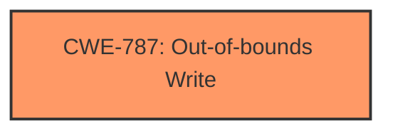

# Enhanced Analysis for CVE-2025-1352

# Summary
| CWE ID | CWE Name | Confidence | CWE Abstraction Level | CWE Vulnerability Mapping Label | CWE-Vulnerability Mapping Notes |
|---|---|---|---|---|---|
| CWE-787 | Out-of-bounds Write | 1.0 | Base | Allowed | Primary CWE |

## Evidence and Confidence

*   **Confidence Score:** 1.0
*   **Evidence Strength:** LOW

## Relationship Analysis
The primary relationship that influenced the decision was the direct match of the vulnerability description to CWE-787, indicating a fundamental flaw leading to memory corruption. While other CWEs like those related to integer overflows (CWE-190) or incorrect buffer size calculations (CWE-131) could potentially precede an out-of-bounds write, there isn't sufficient information to confirm those relationships in this case. Therefore, focusing on the direct evidence, CWE-787 provides the most accurate and specific classification.



## Vulnerability Chain
The vulnerability chain appears to be:

1.  Manipulation of argument 'w'
2.  Leads to **memory corruption** via out-of-bounds write (CWE-787)

The provided information only indicates the final step, which is the **memory corruption** due to the out-of-bounds write. The specific manipulation and its preceding steps are not detailed.

## Summary of Analysis
The analysis is based on the provided vulnerability description, which indicates that the manipulation of the argument 'w' leads to **memory corruption** in GNU elfutils 0.192. The most relevant CWE, based on the description and retriever results, is CWE-787 (Out-of-bounds Write). This CWE accurately reflects the **memory corruption** resulting from writing data outside the intended buffer.

The retriever results listed several potential CWEs. CWE-79 (Improper Neutralization of Input During Web Page Generation ('Cross-site Scripting')) and CWE-89 (Improper Neutralization of Special Elements used in an SQL Command ('SQL Injection')) are not relevant because the vulnerability is not related to web applications or SQL databases. CWE-704 (Incorrect Type Conversion or Cast) is a possibility, but there isn't enough evidence in the description to confirm that a type conversion error is the root cause. CWE-125 (Out-of-bounds Read) is also plausible, but the description specifically mentions **memory corruption**, which is more commonly associated with writes rather than reads. CWE-190 (Integer Overflow or Wraparound) and CWE-131 (Incorrect Calculation of Buffer Size) could be potential root causes *leading* to the out-of-bounds write, but without more context, it is safest to assume that the **memory corruption** is a direct result of writing outside buffer boundaries.

The selection of CWE-787 is at the optimal level of specificity, as it directly describes the observed weakness.


## CWE Relationship Analysis

Current CWEs represent these abstraction levels: .


### Vulnerability Chain Analysis

**Chain starting from CWE-89:**
- 89 (Improper Neutralization of Special Elements used in an SQL Command ('SQL Injection')) - ROOT


**Chain starting from CWE-125:**
- 125 (Out-of-bounds Read) - ROOT


### CWE Relationship Diagram

```mermaid
graph TD
    classDef primary fill:#f96,stroke:#333,stroke-width:2px
    classDef secondary fill:#69f,stroke:#333
    classDef tertiary fill:#9e9,stroke:#333
```