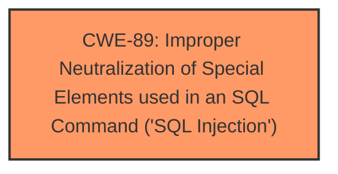

# Analysis for CVE-2025-1380

# Summary

| CWE ID  | CWE Name                                                                   | Confidence | CWE Abstraction Level | CWE Vulnerability Mapping Label | CWE-Vulnerability Mapping Notes |
| :------- | :------------------------------------------------------------------------- | :--------- | :---------------------- | :------------------------------ | :------------------------------ |
| CWE-89  | Improper Neutralization of Special Elements used in an SQL Command ('SQL Injection') | 1.0        | Base                    | Primary CWE                     | Allowed                       |

## Evidence and Confidence

*   **Confidence Score:** 1.0
*   **Evidence Strength:** HIGH

## Relationship Analysis

The primary relationship is the direct mapping of **SQL Injection** to CWE-89, which is a base-level CWE designed to capture this type of vulnerability. No parent or child relationships influenced the selection in this case, as the description clearly points to SQL injection.

## Vulnerability Chain

The vulnerability chain is simple:

1.  **Root Cause:** Improper handling of input leading to **SQL Injection** (CWE-89).
2.  **Impact:** Remote code execution (in the form of arbitrary SQL commands).

## Summary of Analysis

The analysis is based on the vulnerability description stating that manipulation of the `name` argument leads to **SQL injection** in `/dashboard/admin/del_plan.php`. The direct mention of "**sql injection**" in the vulnerability description maps directly to CWE-89.

The retriever results also strongly support this, with CWE-89 having a score of 1.0. The evidence is strong because the vulnerability description explicitly mentions the weakness. CWE-89 is at the optimal level of specificity (Base) for this vulnerability.

Relevant CWE Information:

# Enhanced Context (25 CWEs)

## CWE-89: Improper Neutralization of Special Elements used in an SQL Command ('SQL Injection')
**Abstraction Level**: Base
**Similarity Score**: 0.76
**Source**: dense

**Description**:
The product constructs all or part of an SQL command using externally-influenced input from an upstream component, but it does not neutralize or incorrectly neutralizes special elements that could modify the intended SQL command when it is sent to a downstream component. Without sufficient removal or quoting of SQL syntax in user-controllable inputs, the generated SQL query can cause those inputs to be interpreted as SQL instead of ordinary user data.

**Mapping Guidance**:
- Usage: Allowed
- Rationale: This CWE entry is at the Base level of abstraction, which is a preferred level of abstraction for mapping to the root causes of vulnerabilities.

## CWE-79: Improper Neutralization of Input During Web Page Generation ('Cross-site Scripting')
**Abstraction Level**: Base
**Similarity Score**: 0.428
The product does not neutralize or incorrectly neutralizes user-controllable input before it is placed in output that is used as a web page that is served to other users.

CWE-79 was considered but not selected because the vulnerability description mentions "**sql injection**," making CWE-89 a more direct and accurate fit.

## CWE-434: Unrestricted Upload of File with Dangerous Type
**Abstraction Level**: Base
**Similarity Score**: 0.362
The product allows the upload or transfer of dangerous file types that are automatically processed within its environment.

CWE-434 was considered but is not relevant because the vulnerability is related to **SQL Injection**, not file uploads.

## CWE-1336: Improper Neutralization of Special Elements Used in a Template Engine
**Abstraction Level**: Base
**Similarity Score**: 0.355
The product uses a template engine to insert or process externally-influenced input, but it does not neutralize or incorrectly neutralizes special elements or syntax that can be interpreted as template expressions or other code directives when processed by the engine.

CWE-1336 was considered but is not relevant because the vulnerability is related to **SQL Injection**, not template engine usage.