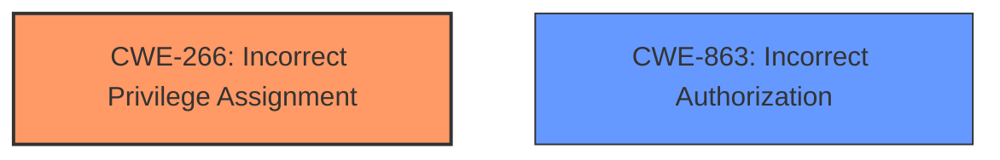

# Analysis Report for CVE-2025-1391

# Vulnerability Analysis Report: CVE-2025-1391

## Description

A flaw was found in the Keycloak organization feature, which allows the incorrect assignment of an organization to a user if their username or email matches the organizations domain pattern. This issue occurs at the mapper level, leading to misrepresentation in tokens. If an application relies on these claims for authorization, it may incorrectly assume a user belongs to an organization they are not a member of, potentially granting unauthorized access or privileges.

## Vulnerability Description Key Phrases

- **Component:** organization feature
- **Rootcause:** incorrect assignment of organization to user if their username or email matches the organizations domain pattern
- **Product:** Keycloak
- **Impact:** ['misrepresentation in tokens', 'unauthorized access or privileges']

## Analysis (with Relationship Data)

# Summary
| CWE ID | CWE Name | Confidence | CWE Abstraction Level | CWE Vulnerability Mapping Label | CWE-Vulnerability Mapping Notes |
|---|---|---|---|---|---|
| CWE-266 | Incorrect Privilege Assignment | 0.9 | Base | Primary | Allowed |
| CWE-863 | Incorrect Authorization | 0.6 | Class | Secondary Candidate | Allowed-with-Review |

## Evidence and Confidence

*   **Confidence Score:** 0.8
*   **Evidence Strength:** HIGH

## Relationship Analysis
The primary CWE is CWE-266 (Incorrect Privilege Assignment), a Base-level CWE. While CWE-863 (Incorrect Authorization) is a Class-level CWE and a potential secondary classification, the root cause lies in the initial assignment of the organization to the user. Thus, a ChildOf relationship is not present here. There aren't any clear chain relationships (CanPrecede, CanFollow) directly applicable in this case.



## Vulnerability Chain
The vulnerability chain starts with the **incorrect assignment of an organization to a user** (CWE-266). This leads to **misrepresentation in tokens** and, ultimately, **unauthorized access or privileges**.

## Summary of Analysis
The initial analysis identified the **incorrect assignment of an organization to a user** as the root cause. The evidence from the vulnerability description and the Bugzilla entry confirms this. The retriever results also suggest CWE-863 (Incorrect Authorization) as a potential match, but the root cause is more accurately represented by CWE-266. CWE-266 (Incorrect Privilege Assignment) is chosen as the primary CWE because it directly addresses the root cause of the vulnerability, where a user is incorrectly assigned to an organization, leading to further authorization issues. The selection of CWE-266 is at the optimal level of specificity (Base), as it precisely describes the **incorrect assignment** aspect.

Relevant CWE Information:

# Enhanced Context (25 CWEs)
The following CWEs were identified as potentially relevant to this vulnerability:

## CWE-266: Incorrect Privilege Assignment
**Abstraction Level**: Base
**Similarity Score**: 0.74
**Source**: dense

**Description**:
A product incorrectly assigns a privilege to a particular actor, creating an unintended sphere of control for that actor.

**Mapping Guidance**:
- Usage: Allowed
- Rationale: This CWE entry is at the Base level of abstraction, which is a preferred level of abstraction for mapping to the root causes of vulnerabilities.

## Vulnerability Description
A flaw was found in the Keycloak organization feature, which allows the **incorrect assignment of an organization to a user if their username or email matches the organizations domain pattern**. This issue occurs at the mapper level, leading to misrepresentation in tokens. If an application relies on these claims for authorization, it may incorrectly assume a user belongs to an organization they are not a member of, potentially granting unauthorized access or privileges.

### Vulnerability Description Key Phrases
- **component:** organization feature
- **rootcause:** **incorrect assignment of organization to user if their username or email matches the organizations domain pattern**
- **product:** Keycloak
- **impact:** ['misrepresentation in tokens', 'unauthorized access or privileges']

## CVE Reference Links Content Summary
**3. bugzilla.redhat.com_06e1e8ba_20250624_203645.html:**

*   **Relevance:** Relevant. This is the Bugzilla entry for CVE-2025-1391.
*   **Information:**
    *   **Vulnerability:** Improper Authorization in Keycloak Organization Mapper Allows Unauthorized Organization Claims
    *   **Root Cause:** The vulnerability is caused by the **improper mapping of users to organizations based solely on email/username patterns**.
    *   **Impact:** The issue is limited to the token claim level, meaning the user is not truly added to the organization but may appear as such in applications relying on these claims.

## Retriever Results

### Top Combined Results

| Rank | CWE ID | Name | Abstraction | Usage  | Retrievers | Individual Scores |
|------|--------|------|-------------|-------|------------|-------------------|
| 1 | 863 | Incorrect Authorization | Class | Allowed-with-Review | sparse | 0.495 |
| 9 | 842 | Placement of User into Incorrect Group | Base | Allowed | dense | 0.555 |
| 10 | 613 | Insufficient Session Expiration | Base | Allowed | graph | 0.002 |

---

**CWE-266: Incorrect Privilege Assignment**
The vulnerability description states that the issue involves the **incorrect assignment of an organization to a user**. This directly matches the description of CWE-266, where a product incorrectly assigns a privilege to an actor. In this case, the "privilege" is membership within an organization. The impact includes misrepresentation in tokens and potential unauthorized access, highlighting the security implications of the incorrect assignment.

**CWE-863: Incorrect Authorization**
While the vulnerability ultimately leads to authorization issues, the root cause is the initial incorrect assignment. CWE-863 (Incorrect Authorization) could be considered a secondary weakness, as the system relies on the incorrect assignment for authorization decisions. However, it's not the primary flaw.


## CWE Relationship Analysis

Current CWEs represent these abstraction levels: .


### Vulnerability Chain Analysis

**Chain starting from CWE-266:**
- 266 (Incorrect Privilege Assignment) - ROOT


**Chain starting from CWE-863:**
- 863 (Incorrect Authorization) - ROOT


### CWE Relationship Diagram

```mermaid
graph TD
    classDef primary fill:#f96,stroke:#333,stroke-width:2px
    classDef secondary fill:#69f,stroke:#333
    classDef tertiary fill:#9e9,stroke:#333
```


*Report generated on 2025-07-14 07:19:03*
