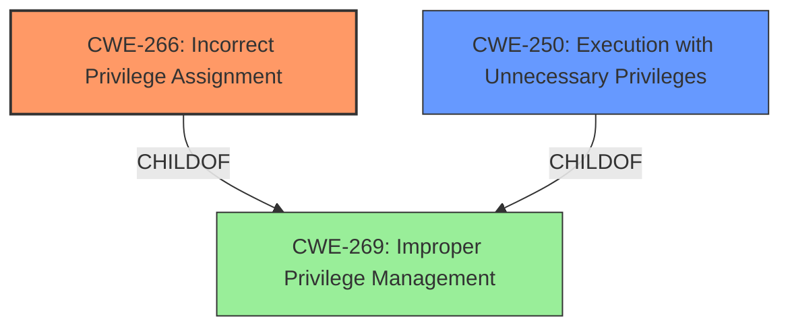

# Enhanced Analysis for CVE-2025-1424

# Summary
| CWE ID | CWE Name | Confidence | CWE Abstraction Level | CWE Vulnerability Mapping Label | CWE-Vulnerability Mapping Notes |
|---|---|---|---|---|---|
| CWE-266 | Incorrect Privilege Assignment | 0.9 | Base | Primary CWE | Allowed |
| CWE-250 | Execution with Unnecessary Privileges | 0.7 | Base | Secondary Candidate | Allowed |
| CWE-269 | Improper Privilege Management | 0.5 | Class | Secondary Candidate | Discouraged |

## Evidence and Confidence

*   **Confidence Score:** 0.8
*   **Evidence Strength:** HIGH

## Relationship Analysis
The primary CWE selected is CWE-266, which is at the Base level of abstraction and directly addresses the **incorrect privilege assignment** that leads to **privilege escalation**. CWE-250, Execution with Unnecessary Privileges, is considered as a secondary candidate because the vulnerability involves SUID binaries running with `sreader` privileges, indicating potentially **unnecessary privileges** being granted. CWE-269 is a Class-level CWE, and therefore less specific than CWE-266, so it is not selected. The relationship between these CWEs is that CWE-266 can be a more specific cause of the general problem described by CWE-269.



## Vulnerability Chain
The vulnerability chain starts with an **incorrect privilege assignment**, where SUID binaries are running with the `sreader` user's privileges. This allows the creation of files, specifically `/mnt/secure/developer_mode`, due to **improper permissions**. The existence of this file triggers developer mode, leading to USB tethering and a Dropbear SSH server running with root privileges, ultimately resulting in **privilege escalation** to root.

CWE-266 (Incorrect Privilege Assignment) -> Improper Permissions -> Privilege Escalation (Root Access)

## Summary of Analysis
The primary focus of this analysis is to identify the root cause of the **privilege escalation vulnerability**. The evidence clearly points to an **incorrect privilege assignment** as the core issue, aligning with CWE-266. The CVE Reference Links Content Summary provides substantial evidence supporting this classification, highlighting the **misuse of SUID binaries** and the ability to create files with `sreader` privileges. This, coupled with the presence of `/mnt/secure/developer_mode`, ultimately leads to root access.

The MITRE mapping guidance reinforces this decision, emphasizing the importance of mapping privilege issues to specific root causes rather than high-level impacts. The guidance specifically discourages using CWE-269 and suggests using CWE-266 when a role is misassigned.

CWE-266 is selected because the vulnerability stems from an unintended use of an SUID binary and the existence of a file `/mnt/secure/developer_mode`. The presence of this file, combined with the permissions allowing certain SUID binaries to run as the `sreader` user, allows an attacker to enable developer mode and gain root privileges. This is a case of **incorrectly assigning privileges** to the `sreader` user, allowing them to create files in a directory that should be protected.

Other CWEs like CWE-250 (Execution with Unnecessary Privileges) were considered. The presence of SUID binaries that run with elevated privileges is a contributing factor, but the **root cause** is the **incorrect assignment** that allows the exploitation in the first place.

Relevant CWE Information:

# Enhanced Context (25 CWEs)
The following CWEs were identified as potentially relevant to this vulnerability:

## CWE-266: Incorrect Privilege Assignment
**Abstraction Level**: Base

**Description**:
A product **incorrectly assigns a privilege** to a particular actor, creating an unintended sphere of control for that actor.

**Mapping Guidance**:
- Usage: Allowed
- Rationale: This CWE entry is at the Base level of abstraction, which is a preferred level of abstraction for mapping to the root causes of vulnerabilities.

## CWE-250: Execution with Unnecessary Privileges
**Abstraction Level**: Base

**Description**:
The product performs an operation at a privilege level that is higher than the minimum level required, which creates new weaknesses or amplifies the consequences of other weaknesses.

**Mapping Guidance**:
- Usage: Allowed
- Rationale: This CWE entry is at the Base level of abstraction, which is a preferred level of abstraction for mapping to the root causes of vulnerabilities.

## CWE-269: Improper Privilege Management
**Abstraction Level**: Class

**Description**:
The product does not properly assign, modify, track, or check privileges for an actor, creating an unintended sphere of control for that actor.

**Mapping Guidance**:
- Usage: Discouraged
- Rationale: CWE-269 is commonly misused. It can be conflated with "privilege escalation," which is a technical impact that is listed in many low-information vulnerability reports [REF-1287]. It is not useful for trend analysis.


## CWE Relationship Analysis

Current CWEs represent these abstraction levels: .


### Vulnerability Chain Analysis

**Chain starting from CWE-266:**
- 266 (Incorrect Privilege Assignment) - ROOT


**Chain starting from CWE-269:**
- 269 (Improper Privilege Management) - ROOT


### CWE Relationship Diagram

```mermaid
graph TD
    classDef primary fill:#f96,stroke:#333,stroke-width:2px
    classDef secondary fill:#69f,stroke:#333
    classDef tertiary fill:#9e9,stroke:#333
```