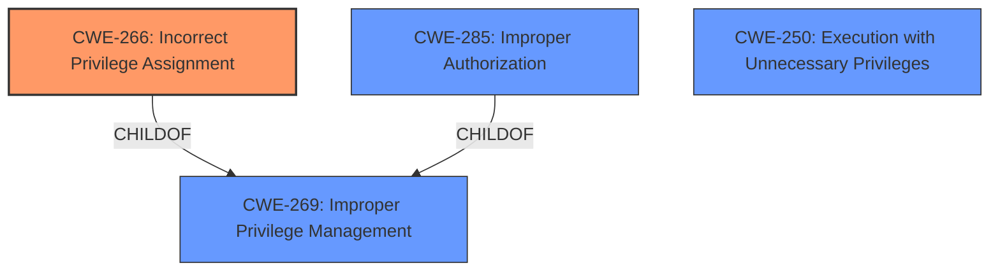

# Analysis Report for CVE-2025-1425

# Vulnerability Analysis Report: CVE-2025-1425

## Description

A **Sudo privilege misconfiguration** vulnerability in PocketBook InkPad Color 3 on Linux, ARM allows attackers to read file contents on the device.This issue affects InkPad Color 3 U743k3.6.8.3671.

## Vulnerability Description Key Phrases

- **Rootcause:** Sudo privilege misconfiguration
- **Impact:** read file contents on the device
- **Attacker:** attackers
- **Product:** PocketBook InkPad Color 3
- **Version:** U743k3.6.8.3671
- **Component:** Linux ARM

## Analysis (with Relationship Data)

# Summary
| CWE ID | CWE Name | Confidence | CWE Abstraction Level | CWE Vulnerability Mapping Label | CWE-Vulnerability Mapping Notes |
|---|---|---|---|---|---|
| CWE-266 | Incorrect Privilege Assignment | 1 | Base | Primary CWE | Allowed |
| CWE-250 | Execution with Unnecessary Privileges | 0.7 | Base | Secondary Candidate | Allowed |
| CWE-863 | Incorrect Authorization | 0.5 | Class | Secondary Candidate | Allowed-with-Review |

## Evidence and Confidence

*   **Confidence Score:** 0.8
*   **Evidence Strength:** HIGH

## Relationship Analysis
The primary relationship influencing the decision is the parent-child relationship between CWE-269 (Improper Privilege Management), CWE-285 (Improper Authorization), and CWE-266 (Incorrect Privilege Assignment). While CWE-269 and CWE-285 were considered due to the high-level nature of the vulnerability description, CWE-266 was ultimately chosen for its specificity as the **rootcause** is a **privilege misconfiguration**. CWE-250 (Execution with Unnecessary Privileges) is also considered as the root cause could be running ntpdate with elevated privileges, but the evidence points more strongly to a misconfiguration.



## Vulnerability Chain
The vulnerability chain starts with a **Sudo privilege misconfiguration** (CWE-266) which allows an attacker to read file contents on the device.

Root Cause: CWE-266 (Incorrect Privilege Assignment) - A misconfiguration in the sudo configuration allows any user to execute the `ntpdate` command with root privileges.
Impact: Attackers can open an interactive shell and read all files on the device.

## Summary of Analysis
The initial assessment identified the **rootcause** as a **Sudo privilege misconfiguration**, leading to the ability to read file contents. The analysis then focused on identifying the most specific CWE to represent this. The evidence from the CVE Reference Links Content Summary section clearly states: "A misconfiguration in the sudo configuration on the e-reader allows any user to execute the `ntpdate` command with root privileges." This strongly supports CWE-266 (Incorrect Privilege Assignment) as the **rootcause**.

The MITRE mapping guidance on Privileges vs Permissions was very helpful in narrowing down the potential CWEs. It clearly distinguishes between privileges and permissions, and the vulnerability description explicitly mentions a "privilege misconfiguration", which aligns with CWE-266.

CWE-250 (Execution with Unnecessary Privileges) was considered because the `ntpdate` command might be running with elevated privileges that are not necessary. However, the **rootcause** is the misconfiguration of the sudo privileges allowing unauthorized execution, making CWE-266 more appropriate.

CWE-863 (Incorrect Authorization) was considered as a higher level classification, but the specificity of the **privilege misconfiguration** and the ability to execute a command with root privileges makes CWE-266 a more accurate and detailed mapping.

The selected CWEs are at the optimal level of specificity because CWE-266 directly reflects the **rootcause** described in the vulnerability: a misconfigured sudo privilege. This is more precise than higher-level CWEs like CWE-269 (Improper Privilege Management) or CWE-285 (Improper Authorization), and more accurately captures the nature of the weakness than CWE-250 (Execution with Unnecessary Privileges).


## CWE Relationship Analysis

Current CWEs represent these abstraction levels: .


### Vulnerability Chain Analysis

**Chain starting from CWE-863:**
- 863 (Incorrect Authorization) - ROOT


**Chain starting from CWE-269:**
- 269 (Improper Privilege Management) - ROOT


### CWE Relationship Diagram

```mermaid
graph TD
    classDef primary fill:#f96,stroke:#333,stroke-width:2px
    classDef secondary fill:#69f,stroke:#333
    classDef tertiary fill:#9e9,stroke:#333
```


*Report generated on 2025-07-14 07:20:11*
