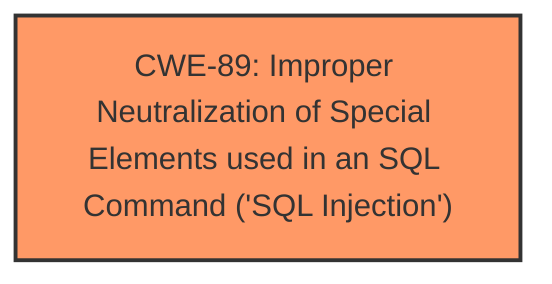

# Analysis for CVE-2025-1537

# Summary

| CWE ID | CWE Name | Confidence | CWE Abstraction Level | CWE Vulnerability Mapping Label | CWE-Vulnerability Mapping Notes |
|---|---|---|---|---|---|
| CWE-89 | Improper Neutralization of Special Elements used in an SQL Command ('SQL Injection') | 1.0 | Base | Allowed | Primary CWE |

## Evidence and Confidence

*   **Confidence Score:** 1.0
*   **Evidence Strength:** HIGH

## Relationship Analysis
The primary relationship that influenced my decision was the direct match of the vulnerability description to **CWE-89**, which is a Base level CWE. There aren't any other child or parent relationships to consider given the strong evidence for this CWE.

## Vulnerability Chain
The vulnerability chain consists of a single step: The application fails to neutralize special elements in user-supplied input before using that input in an SQL query, leading to **SQL Injection**.

## Summary of Analysis
The vulnerability description clearly states that the **weakness** is **SQL Injection** and that the argument `codexame` is used to perform the attack.

The most relevant CWE based on the description and retriever results is **CWE-89 Improper Neutralization of Special Elements used in an SQL Command ('SQL Injection')**.

The description states "manipulation of the argument codexame leads to **sql injection**". The retriever results also list **CWE-89** as the top candidate with a score of 1.0.

The other CWEs were rejected because they did not align as directly with the root cause of the vulnerability, which is the failure to neutralize special elements in SQL commands.
*   **CWE-79** is for Cross-site Scripting, which is a different type of injection.
*   **CWE-117** is for Improper Output Neutralization for Logs, which is not relevant to this vulnerability.
*   **CWE-1336** is for template engines, which is not mentioned in the description.
*   **CWE-434** is for Unrestricted Upload of File with Dangerous Type, and no files are uploaded in the description.

The selection of **CWE-89** is at the optimal level of specificity because it directly addresses the **root cause** of the vulnerability: **improper neutralization of special elements in SQL commands**.