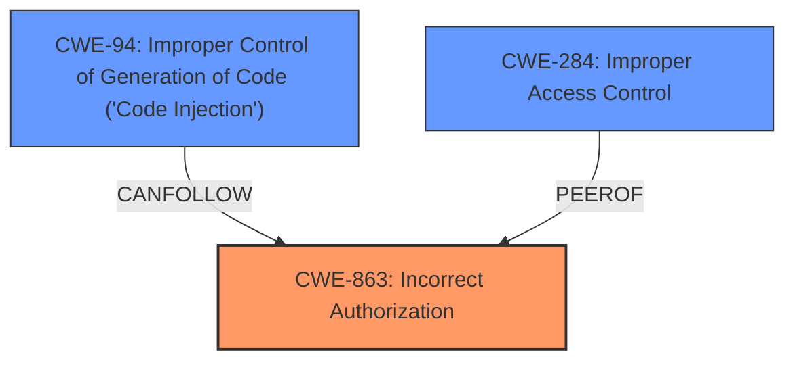

# Raw Analyzer Response for CVE-2025-1568

# Summary
| CWE ID | CWE Name | Confidence | CWE Abstraction Level | CWE Vulnerability Mapping Label | CWE-Vulnerability Mapping Notes |
|---|---|---|---|---|---|
| CWE-863 | Incorrect Authorization | 0.9 | Class | Primary | Allowed-with-Review |
| CWE-94 | Improper Control of Generation of Code ('Code Injection') | 0.6 | Base | Secondary | Allowed-with-Review |
| CWE-284 | Improper Access Control | 0.5 | Class | Secondary | Allowed-with-Review |

## Evidence and Confidence

*   **Confidence Score:** 0.8
*   **Evidence Strength:** HIGH

## Relationship Analysis
The primary CWE is CWE-863, Incorrect Authorization, which is a Class-level CWE. There is evidence in the description for both **insufficient access controls** and **misconfigurations** leading to the ability to inject malicious code. The relationship between CWE-863 and CWE-94 is that improper authorization (CWE-863) can lead to code injection (CWE-94). CWE-284, Improper Access Control is a peer of CWE-863. The choice of CWE-863 over CWE-284 is based on the description pointing to incorrect authorization checks rather than a complete lack of access control.

## Vulnerability Chain
The vulnerability chain starts with **misconfigurations in Gerrit's project.config** and **insufficient access controls** which leads to **incorrect authorization** (CWE-863). This allows an attacker to **inject malicious code** (CWE-94), potentially leading to **Remote Code Execution** and **Denial of Service**.

## Summary of Analysis
The analysis is based on the provided vulnerability description, which indicates that the **root cause** is related to both **insufficient access controls** and **misconfigurations** in Gerrit's project configuration. The **primary weakness** is **incorrect authorization**, allowing an attacker to inject malicious code, leading to remote code execution and denial of service.

The selection of CWE-863 is based on the evidence that the authorization checks are performed, but they are done incorrectly. The vulnerability description mentions "insufficient access controls" and "misconfigurations," suggesting that some form of access control is in place but is not properly configured.

CWE-94 is selected as a secondary CWE because the attacker is able to "inject malicious code." This suggests that the product does not properly neutralize special elements that could modify the syntax or behavior of the intended code segment.

CWE-284 was considered as a possible primary CWE since the vulnerability description mentions "**Access Control Vulnerability**". However, since the root cause appears to be related to how the authorization checks are performed rather than a complete lack of access control, CWE-863 is considered more appropriate.

The chosen CWEs are at an appropriate level of specificity, as they accurately represent the root cause and the immediate impact of the vulnerability.

Relevant CWE Information:

# Enhanced Context (25 CWEs)
The following CWEs were identified as potentially relevant to this vulnerability:

## CWE-668: Exposure of Resource to Wrong Sphere
**Abstraction Level**: Class
**Similarity Score**: 0.77
**Source**: dense

**Description**:
The product exposes a resource to the wrong control sphere, providing unintended actors with inappropriate access to the resource.

**Mapping Guidance**:
- Usage: Discouraged
- Rationale: CWE-668 is high-level and is often misused as a catch-all when lower-level CWE IDs might be applicable. It is sometimes used for low-information vulnerability reports [REF-1287]. It is a level-1 Class (i.e., a child of a Pillar). It is not useful for trend analysis.

*CWE-668 was not selected because it is too high level, and more specific CWEs are available.*

## CWE-451: User Interface (UI) Misrepresentation of Critical Information
**Abstraction Level**: Class
**Similarity Score**: 0.77
**Source**: dense

**Description**:
The user interface (UI) does not properly represent critical information to the user, allowing the information - or its source - to be obscured or spoofed. This is often a component in phishing attacks.

**Mapping Guidance**:
- Usage: Allowed-with-Review
- Rationale: This CWE entry is a Class and might have Base-level children that would be more appropriate

*CWE-451 was not selected because the vulnerability description does not contain any evidence of UI misrepresentation.*

## CWE-345: Insufficient Verification of Data Authenticity
**Abstraction Level**: Class
**Similarity Score**: 0.76
**Source**: dense

**Description**:
The product does not sufficiently verify the origin or authenticity of data, in a way that causes it to accept invalid data.

**Mapping Guidance**:
- Usage: Discouraged
- Rationale: This CWE entry is a level-1 Class (i.e., a child of a Pillar). It might have lower-level children that would be more appropriate

*CWE-345 was not selected because the vulnerability description does not contain any evidence of data authenticity issues.*

## CWE-212: Improper Removal of Sensitive Information Before Storage or Transfer
**Abstraction Level**: Base
**Similarity Score**: 0.76
**Source**: dense

**Description**:
The product stores, transfers, or shares a resource that contains sensitive information, but it does not properly remove that information before the product makes the resource available to unauthorized actors.

**Mapping Guidance**:
- Usage: Allowed
- Rationale: This CWE entry is at the Base level of abstraction, which is a preferred level of abstraction for mapping to the root causes of vulnerabilities.

*CWE-212 was not selected because the vulnerability description does not contain any evidence of sensitive information handling issues.*

## CWE-696: Incorrect Behavior Order
**Abstraction Level**: Class
**Similarity Score**: 0.75
**Source**: dense

**Description**:
The product performs multiple related behaviors, but the behaviors are performed in the wrong order in ways which may produce resultant weaknesses.

**Mapping Guidance**:
- Usage: Allowed-with-Review
- Rationale: This CWE entry is a Class and might have Base-level children that would be more appropriate

*CWE-696 was not selected because the vulnerability description does not contain any evidence of incorrect behavior order.*

## CWE-74: Improper Neutralization of Special Elements in Output Used by a Downstream Component ('Injection')
**Abstraction Level**: Class
**Similarity Score**: 0.75
**Source**: dense

**Description**:
The product constructs all or part of a command, data structure, or record using externally-influenced input from an upstream component, but it does not neutralize or incorrectly neutralizes special elements that could modify how it is parsed or interpreted when it is sent to a downstream component.

**Mapping Guidance**:
- Usage: Discouraged
- Rationale: CWE-74 is high-level and often misused when lower-level weaknesses are more appropriate.

*CWE-74 was not selected because it is too high level, but the resulting code injection made CWE-94 a better choice.*

## CWE-138: Improper Neutralization of Special Elements
**Abstraction Level**: Class
**Similarity Score**: 0.75
**Source**: dense

**Description**:
The product receives input from an upstream component, but it does not neutralize or incorrectly neutralizes special elements that could be interpreted as control elements or syntactic markers when they are sent to a downstream component.

**Mapping Guidance**:
- Usage: Discouraged
- Rationale: This CWE entry is a level-1 Class (i.e., a child of a Pillar). It might have lower-level children that would be more appropriate

*CWE-138 was not selected because CWE-94 is more directly related to code injection.*

## CWE-497: Exposure of Sensitive System Information to an Unauthorized Control Sphere
**Abstraction Level**: Base
**Similarity Score**: 0.75
**Source**: dense

**Description**:
The product does not properly prevent sensitive system-level information from being accessed by unauthorized actors who do not have the same level of access to the underlying system as the product does.

**Mapping Guidance**:
- Usage: Allowed
- Rationale: This CWE entry is at the Base level of abstraction, which is a preferred level of abstraction for mapping to the root causes of vulnerabilities.

*CWE-497 was not selected because the vulnerability description does not contain any evidence of sensitive system information exposure.*