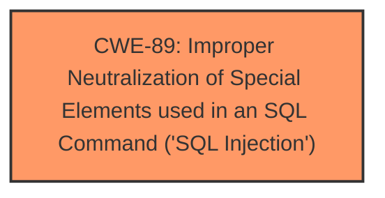

# Analysis Report for CVE-2025-1581

# Vulnerability Analysis Report: CVE-2025-1581

## Description

A vulnerability was found in PHPGurukul Online Nurse Hiring System 1.0. It has been declared as critical. Affected by this vulnerability is an unknown functionality of the file /book-nurse.php?bookid=1. The manipulation of the argument contactname leads to **sql injection**. The attack can be launched remotely. The exploit has been disclosed to the public and may be used.

## Vulnerability Description Key Phrases

- **Weakness:** sql injection
- **Vector:** manipulation of the argument contactname
- **Product:** PHPGurukul Online Nurse Hiring System
- **Version:** 1.0
- **Component:** /book-nurse.php?bookid=1

## Analysis (with Relationship Data)

# Summary
| CWE ID | CWE Name | Confidence | CWE Abstraction Level | CWE Vulnerability Mapping Label | CWE-Vulnerability Mapping Notes |
|---|---|---|---|---|---|
| CWE-89 | Improper Neutralization of Special Elements used in an SQL Command ('SQL Injection') | 1.0 | Base | Allowed | Primary CWE |

## Evidence and Confidence

*   **Confidence Score:** 1.0
*   **Evidence Strength:** HIGH

## Relationship Analysis
The primary relationship that influenced the decision was the direct match of the vulnerability description to the characteristics of CWE-89. There were no other relationships that significantly altered the classification, as the description clearly pointed to an SQL Injection vulnerability. The abstraction level is Base, which is the preferred level.



## Vulnerability Chain
The vulnerability chain consists of a single CWE:
1.  CWE-89: Improper Neutralization of Special Elements used in an SQL Command ('SQL Injection')

This is the root cause. The contactname argument is not properly sanitized, leading to SQL injection.

## Summary of Analysis
The analysis is based on the vulnerability description which states "**sql injection**" due to the "manipulation of the argument contactname".

The Retriever Results also listed CWE-89 as the top result, reinforcing the initial assessment.

The final decision is based on the direct evidence of SQL injection in the vulnerability description, aligning perfectly with CWE-89. The other CWEs were considered but deemed less relevant as they represent different types of vulnerabilities or are too abstract. CWE-89 is at the optimal level of specificity (Base).

Relevant CWE Information:

# Enhanced Context (25 CWEs)
The following CWEs were identified as potentially relevant to this vulnerability:

## CWE-89: Improper Neutralization of Special Elements used in an SQL Command ('SQL Injection')
**Abstraction Level**: Base
**Similarity Score**: 0.77
**Source**: dense

**Description**:
The product constructs all or part of an SQL command using externally-influenced input from an upstream component, but it does not neutralize or incorrectly neutralizes special elements that could modify the intended SQL command when it is sent to a downstream component. Without sufficient removal or quoting of SQL syntax in user-controllable inputs, the generated SQL query can cause those inputs to be interpreted as SQL instead of ordinary user data.

**Mapping Guidance**:
- Usage: Allowed
- Rationale: This CWE entry is at the Base level of abstraction, which is a preferred level of abstraction for mapping to the root causes of vulnerabilities.


## CWE Relationship Analysis

Current CWEs represent these abstraction levels: .


### Vulnerability Chain Analysis

**Chain starting from CWE-89:**
- 89 (Improper Neutralization of Special Elements used in an SQL Command ('SQL Injection')) - ROOT


### CWE Relationship Diagram

```mermaid
graph TD
    classDef primary fill:#f96,stroke:#333,stroke-width:2px
    classDef secondary fill:#69f,stroke:#333
    classDef tertiary fill:#9e9,stroke:#333
```


*Report generated on 2025-07-14 07:28:53*
