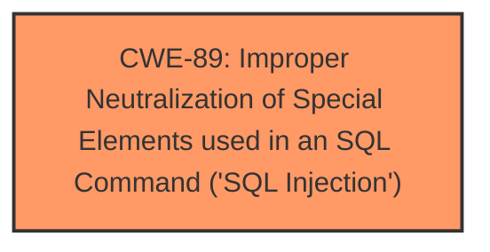

# Analysis for CVE-2025-1582

# Summary
| CWE ID | CWE Name | Confidence | CWE Abstraction Level | CWE Vulnerability Mapping Label | CWE-Vulnerability Mapping Notes |
|---|---|---|---|---|---|
| CWE-89 | Improper Neutralization of Special Elements used in an SQL Command ('SQL Injection') | 1.0 | Base | Allowed | Primary CWE |

## Evidence and Confidence

*   **Confidence Score:** 1.0
*   **Evidence Strength:** HIGH

## Relationship Analysis
The primary relationship to consider is the direct match of the vulnerability description to the definition of CWE-89. There are no other relationships that strengthen or weaken this selection.

## Vulnerability Chain
The vulnerability chain is simple:
1.  **Root Cause:** CWE-89 - Improper Neutralization of Special Elements used in an SQL Command ('SQL Injection')

## Summary of Analysis
The vulnerability description clearly states that the manipulation of the argument `viewid` leads to **sql injection** in `/admin/all-request.php`. The primary weakness is **improper neutralization of special elements used in an SQL command**, which directly corresponds to CWE-89.

The evidence is: "The manipulation of the argument viewid leads to **sql injection**".

The retriever results also list CWE-89 as the top candidate with a score of 1.0.

The selection is at the optimal level of specificity, as CWE-89 is a Base-level CWE and directly describes the weakness.

Relevant CWE Information:

# Enhanced Context (25 CWEs)
The following CWEs were identified as potentially relevant to this vulnerability:

## CWE-89: Improper Neutralization of Special Elements used in an SQL Command ('SQL Injection')
**Abstraction Level**: Base
**Similarity Score**: 0.78
**Source**: dense

**Description**:
The product constructs all or part of an SQL command using externally-influenced input from an upstream component, but it does not neutralize or incorrectly neutralizes special elements that could modify the intended SQL command when it is sent to a downstream component. Without sufficient removal or quoting of SQL syntax in user-controllable inputs, the generated SQL query can cause those inputs to be interpreted as SQL instead of ordinary user data.

**Mapping Guidance**:
- Usage: Allowed
- Rationale: This CWE entry is at the Base level of abstraction, which is a preferred level of abstraction for mapping to the root causes of vulnerabilities.

## CWE-434: Unrestricted Upload of File with Dangerous Type
The other CWEs listed do not directly apply to the described vulnerability. CWE-434, CWE-79, and others relate to different types of weaknesses like file uploads or cross-site scripting, which are not mentioned in the vulnerability description.