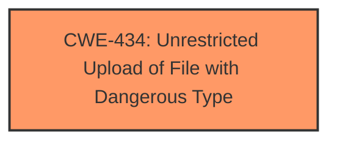

# Raw Analyzer Response for CVE-2025-1590

# Summary
| CWE ID | CWE Name | Confidence | CWE Abstraction Level | CWE Vulnerability Mapping Label | CWE-Vulnerability Mapping Notes |
|---|---|---|---|---|---|
| CWE-434 | Unrestricted Upload of File with Dangerous Type | 1.0 | Base | Allowed | Primary CWE |

## Evidence and Confidence

*   **Confidence Score:** 1.0
*   **Evidence Strength:** HIGH

## Relationship Analysis
The primary relationship considered was the direct match of the vulnerability description to the CWE description. There were no parent-child or chain relationships that significantly influenced the decision, as the provided information directly points to **unrestricted upload** functionality.

## Vulnerability Chain
The vulnerability chain is straightforward:

1.  **Root Cause:** **Unrestricted Upload** due to **lack of proper file type validation**.
2.  **Impact:** Potential execution of malicious code or other security breaches depending on the files uploaded and how they are processed.

## Summary of Analysis
The vulnerability description clearly states "**unrestricted upload**" as the weakness. The Retriever Results also list CWE-434 as a top candidate.

The evidence from the Vulnerability Description Key Phrases section shows:
-   **weakness:** **unrestricted upload**

This directly aligns with CWE-434, which describes a product allowing the upload or transfer of dangerous file types that are automatically processed within its environment. The high confidence is due to this direct match.

Other CWEs were considered, but none matched the root cause as directly as CWE-434. For example, while CWE-79 (Cross-site Scripting) or CWE-89 (SQL Injection) could be potential impacts depending on how the uploaded file is handled, they do not represent the initial **weakness** of the **unrestricted upload**.

Relevant CWE Information:

# Enhanced Context (25 CWEs)
The following CWEs were identified as potentially relevant to this vulnerability:

## CWE-434: Unrestricted Upload of File with Dangerous Type
**Abstraction Level**: Base
**Similarity Score**: 0.82
**Source**: dense

**Description**:
The product allows the upload or transfer of dangerous file types that are automatically processed within its environment.

**Mapping Guidance**:
- Usage: Allowed
- Rationale: This CWE entry is at the Base level of abstraction, which is a preferred level of abstraction for mapping to the root causes of vulnerabilities.