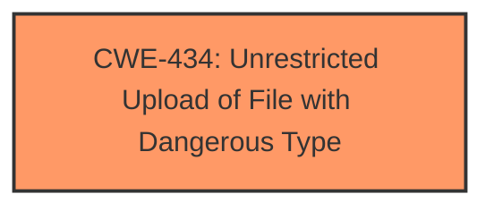

# Analysis for CVE-2025-1593

# Summary
| CWE ID | CWE Name | Confidence | CWE Abstraction Level | CWE Vulnerability Mapping Label | CWE-Vulnerability Mapping Notes |
|---|---|---|---|---|---|
| CWE-434 | Unrestricted Upload of File with Dangerous Type | 1.0 | Base | Allowed | Primary CWE |

## Evidence and Confidence

*   **Confidence Score:** 1.0
*   **Evidence Strength:** HIGH

## Relationship Analysis
The primary identified weakness is CWE-434, which stands alone as the root cause in this scenario. There are CANFOLLOW relationships from CWE-434 to other CWEs like CWE-73, CWE-184, and CWE-183, these describe potential subsequent vulnerabilities that could arise if the uploaded file is mishandled after the **unrestricted upload**, but these are not directly indicated in the provided description. The other CWEs are not relevant.

## Vulnerability Chain
The vulnerability chain starts with the **unrestricted upload** which is the **root cause**, represented by CWE-434. The absence of checks on the type of file being uploaded allows for potentially dangerous files to be introduced into the system.

## Summary of Analysis
The analysis is based on the provided vulnerability description, which clearly states that the vulnerability involves an **unrestricted upload**. The vulnerability description key phrase also contains the **weakness** of **unrestricted upload**, pointing directly to CWE-434.

The retriever results also list CWE-434 as the top candidate CWE.

The description states: "This affects an unknown part of the file /_hr_soft/assets/uploadImage/Profile/ of the component Profile Picture Handler. The manipulation leads to **unrestricted upload**. It is possible to initiate the attack remotely."

Based on this evidence, CWE-434 is the most appropriate and specific CWE for this vulnerability and is at the optimal level of specificity.

Relevant CWE Information:

# Enhanced Context (25 CWEs)
The following CWEs were identified as potentially relevant to this vulnerability:

## CWE-434: Unrestricted Upload of File with Dangerous Type
**Abstraction Level**: Base
**Similarity Score**: 0.83
**Source**: dense

**Description**:
The product allows the upload or transfer of dangerous file types that are automatically processed within its environment.

**Mapping Guidance**:
- Usage: Allowed
- Rationale: This CWE entry is at the Base level of abstraction, which is a preferred level of abstraction for mapping to the root causes of vulnerabilities.