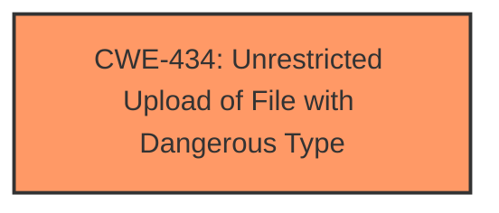

# Analysis Report for CVE-2025-1598

# Vulnerability Analysis Report: CVE-2025-1598

## Description

A vulnerability was found in SourceCodester Best Church Management Software 1.0. It has been declared as critical. Affected by this vulnerability is an unknown functionality of the file /admin/app/asset_crud.php. The manipulation of the argument photo1 leads to **unrestricted upload**. The attack can be launched remotely. The exploit has been disclosed to the public and may be used. The vendor was contacted early about this disclosure but did not respond in any way.

## Vulnerability Description Key Phrases

- **Weakness:** unrestricted upload
- **Product:** SourceCodester Best Church Management Software
- **Version:** 1.0
- **Component:** /admin/app/asset_crud.php

## Analysis (with Relationship Data)

# Summary
| CWE ID | CWE Name | Confidence | CWE Abstraction Level | CWE Vulnerability Mapping Label | CWE-Vulnerability Mapping Notes |
|---|---|---|---|---|---|
| CWE-434 | Unrestricted Upload of File with Dangerous Type | 1.0 | Base | Allowed | Primary CWE |

## Evidence and Confidence

*   **Confidence Score:** 1.0
*   **Evidence Strength:** HIGH

## Relationship Analysis
The primary relationship that influenced my decision was the direct match between the vulnerability description and the definition of CWE-434. The lack of any mention of sanitization or input validation failures leading to code execution or similar led to excluding CWE-94, CWE-79, and CWE-89.



## Vulnerability Chain
The vulnerability chain starts with the **unrestricted upload** (**weakness**) of a file. The final impact would be remote code execution if a malicious file is crafted and uploaded.

## Summary of Analysis
The vulnerability description clearly states that the vulnerability is related to **unrestricted upload**. The file `/admin/app/asset_crud.php` allows manipulation of the argument `photo1`, leading to **unrestricted upload**.
The retriever results also listed CWE-434 as one of the top matches.
Therefore, based on the evidence, CWE-434 is the most appropriate CWE for this vulnerability.

Relevant CWE Information:

# Enhanced Context (25 CWEs)
The following CWEs were identified as potentially relevant to this vulnerability:

## CWE-434: Unrestricted Upload of File with Dangerous Type
**Abstraction Level**: Base
**Similarity Score**: 0.82
**Source**: dense

**Description**:
The product allows the upload or transfer of dangerous file types that are automatically processed within its environment.

**Mapping Guidance**:
- Usage: Allowed
- Rationale: This CWE entry is at the Base level of abstraction, which is a preferred level of abstraction for mapping to the root causes of vulnerabilities.

## CWE-434: Unrestricted Upload of File with Dangerous Type
**Abstraction Level**: Base
**Similarity Score**: 588.03
**Source**: sparse

**Description**:
The product allows the upload or transfer of dangerous file types that are automatically processed within its environment.

**Mapping Guidance**:
- Usage: Allowed
- Rationale: This CWE entry is at the Base level of abstraction, which is a preferred level of abstraction for mapping to the root causes of vulnerabilities.


## CWE Relationship Analysis

Current CWEs represent these abstraction levels: .


### Vulnerability Chain Analysis

**Chain starting from CWE-89:**
- 89 (Improper Neutralization of Special Elements used in an SQL Command ('SQL Injection')) - ROOT


**Chain starting from CWE-79:**
- 79 (Improper Neutralization of Input During Web Page Generation ('Cross-site Scripting')) - ROOT


### CWE Relationship Diagram

```mermaid
graph TD
    classDef primary fill:#f96,stroke:#333,stroke-width:2px
    classDef secondary fill:#69f,stroke:#333
    classDef tertiary fill:#9e9,stroke:#333
```


*Report generated on 2025-07-14 07:31:18*
