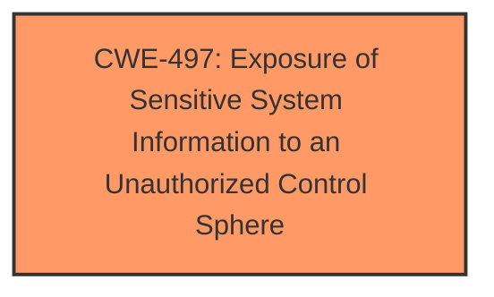

# Analysis for CVE-2025-1606

# Summary
| CWE ID | CWE Name | Confidence | CWE Abstraction Level | CWE Vulnerability Mapping Label | CWE-Vulnerability Mapping Notes |
|---|---|---|---|---|---|
| CWE-497 | Exposure of Sensitive System Information to an Unauthorized Control Sphere | 0.7 | Base | Allowed | Primary CWE |

## Evidence and Confidence

*   **Confidence Score:** 0.7
*   **Evidence Strength:** LOW

## Relationship Analysis
The selected CWE is a base CWE, and there is no further analysis to be performed using relationships.

## Vulnerability Chain
The vulnerability chain is simple: **Exposure of Sensitive System Information** leads to information disclosure.

## Summary of Analysis
The vulnerability description indicates an **impact** of information disclosure due to a vulnerability in the /admin/backup/backups.php file of the Best Employee Management System. The key phrase "information disclosure" is the strongest indicator.

Given the limited information, I'm choosing CWE-497: Exposure of Sensitive System Information to an Unauthorized Control Sphere as the primary CWE. This is because the vulnerability description states that manipulation leads to information disclosure. This aligns with CWE-497's description, "The product does not properly prevent sensitive system-level information from being accessed by unauthorized actors who do not have the same level of access to the underlying system as the product does."

The confidence is relatively low (0.7) because the description is vague and lacks specific details about how the information disclosure occurs. There is also no "CVE Reference Links Content Summary" to confirm the rootcause.

Other CWEs Considered:

*   CWE-89 (SQL Injection), CWE-79 (Cross-Site Scripting), CWE-434 (Unrestricted Upload of File with Dangerous Type), CWE-352 (Cross-Site Request Forgery): These CWEs are related to web application vulnerabilities, but they do not directly describe the **impact** of information disclosure.
*   CWE-425 (Direct Request ('Forced Browsing')): This could be a contributing factor, but the primary **impact** is information disclosure, making CWE-497 more relevant.