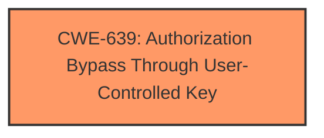

# Analysis for CVE-2025-1607

# Summary
| CWE ID | CWE Name | Confidence | CWE Abstraction Level | CWE Vulnerability Mapping Label | CWE-Vulnerability Mapping Notes |
|---|---|---|---|---|---|
| CWE-639 | Authorization Bypass Through User-Controlled Key | 1.0 | Base | Allowed | Primary CWE |

## Evidence and Confidence

*   **Confidence Score:** 1.0
*   **Evidence Strength:** HIGH

## Relationship Analysis
The primary CWE identified is CWE-639 (Authorization Bypass Through User-Controlled Key). No parent-child or chain relationships are applicable in this specific case. This CWE directly addresses the **authorization bypass** due to **manipulation of the 'id' argument**, making it the most relevant and specific choice.

## Vulnerability Chain
The vulnerability chain consists of a single point:

1.  **Root Cause:** CWE-639 (Authorization Bypass Through User-Controlled Key) - The application's authorization mechanism **fails to prevent unauthorized access** when the 'id' parameter is manipulated.

## Summary of Analysis
The analysis is based on the provided evidence, specifically the vulnerability description stating that **manipulation of the `id` argument leads to authorization bypass** in `/admin/salary_slip.php`. This directly corresponds to CWE-639 (Authorization Bypass Through User-Controlled Key), where a user can gain access to another user's data by modifying the key value.

The retriever results highlight CWE-639 as a strong candidate with a high dense score. The provided guidance on Authentication vs. Authorization further supports this selection, emphasizing that **authorization bypass** issues, where role checks are missing or flawed, map well to CWE-639.

The selected CWE is at the optimal level of specificity (Base), as it directly addresses the **root cause** of the vulnerability.

Other CWEs Considered but Not Used:

*   CWE-306 (Missing Authentication for Critical Function): This was considered but deemed less appropriate because the vulnerability description focuses on **authorization bypass**, implying that some form of authentication might be present, but the **authorization** logic is flawed.
*   CWE-862 (Missing Authorization): While relevant, CWE-639 is more specific as it highlights that the bypass occurs due to a user-controlled key, providing a more precise classification.
*   CWE-863 (Incorrect Authorization): Similar to CWE-862, CWE-639 is chosen over this because it specifies the mechanism of the bypass.
*   CWE-79 (Improper Neutralization of Input During Web Page Generation ('Cross-site Scripting')): Not relevant as the description doesn't indicate an XSS issue.
*   CWE-89 (Improper Neutralization of Special Elements used in an SQL Command ('SQL Injection')): Not relevant as the description doesn't indicate an SQL Injection issue.
*   CWE-434 (Unrestricted Upload of File with Dangerous Type): Not relevant as the description doesn't indicate a file upload issue.
*   CWE-266 (Incorrect Privilege Assignment): Not relevant as the description doesn't indicate an incorrect privilege assignment issue.
*   CWE-352 (Cross-Site Request Forgery (CSRF)): Not relevant as the description doesn't indicate a CSRF issue.
*   CWE-1336 (Improper Neutralization of Special Elements Used in a Template Engine): Not relevant as the description doesn't indicate an issue with template engine.
*   CWE-117 (Improper Output Neutralization for Logs): Not relevant as the description doesn't indicate an issue with logging.
*   CWE-73 (External Control of File Name or Path): Not relevant as the description doesn't indicate an issue with file name or path.