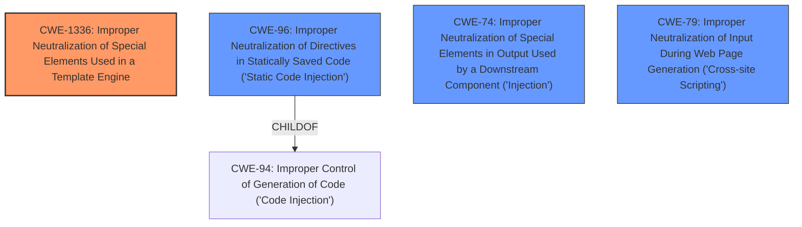

# Analysis for CVE-2025-1611

# Summary
| CWE ID | CWE Name | Confidence | CWE Abstraction Level | CWE Vulnerability Mapping Label | CWE-Vulnerability Mapping Notes |
|---|---|---|---|---|---|
| CWE-1336 | Improper Neutralization of Special Elements Used in a Template Engine | 0.8 | Base | Allowed | Primary CWE |
| CWE-96 | Improper Neutralization of Directives in Statically Saved Code ('Static Code Injection') | 0.6 | Base | Allowed | Secondary Candidate |
| CWE-79 | Improper Neutralization of Input During Web Page Generation ('Cross-site Scripting') | 0.5 | Base | Allowed | Secondary Candidate |
| CWE-74 | Improper Neutralization of Special Elements in Output Used by a Downstream Component ('Injection') | 0.4 | Class | Discouraged | Secondary Candidate |

## Evidence and Confidence

*   **Confidence Score:** 0.7
*   **Evidence Strength:** MEDIUM

## Relationship Analysis
The primary CWE, CWE-1336, represents the **improper neutralization** of special elements used in a template engine, which aligns with the vulnerability description mentioning injection within the Template Handler component. CWE-96, a child of CWE-94 (Improper Control of Generation of Code), is considered because the neutralized code is statically saved. CWE-79 is also considered because the affected component is web-based. CWE-74, a high-level "Injection" class, is considered but discouraged in favor of more specific weaknesses.

## Vulnerability Chain
The vulnerability chain starts with the **improper neutralization** of special elements in the template engine (CWE-1336). An attacker can manipulate the template input, leading to injection. If the injected code is saved statically, it may lead to static code injection (CWE-96). If the output is served on a web page, it can lead to XSS (CWE-79).

## Summary of Analysis
The analysis is primarily based on the vulnerability description that mentions "injection" in the "Template Handler" component. The retriever results also suggest CWE-1336, CWE-79, and CWE-89.

The selection of CWE-1336 as the primary CWE is based on the specific mention of "Template Handler" in the description. This indicates a vulnerability related to how the application processes template input.

CWE-96 is a potential secondary CWE because it deals with code that is statically saved. The vulnerability description does not explicitly say that the code is statically saved, but it's a possibility given the nature of template handlers.

CWE-79 is a potential secondary CWE because the application is web-based, and templates are often used to generate web pages. Thus the injected code can lead to Cross-Site Scripting.

CWE-74 is too general and has been discouraged, thus it is only mentioned as a tertiary option.

The confidence score is 0.7 because while the description is clear about the injection in the template handler, the details about how the injection is achieved and whether the injected code is statically saved or leads to XSS are not provided.

Relevant CWE Information:

# Enhanced Context (25 CWEs)
The following CWEs were identified as potentially relevant to this vulnerability:

## CWE-1336: Improper Neutralization of Special Elements Used in a Template Engine
**Abstraction Level**: Base
**Similarity Score**: 0.75
**Source**: dense

**Description**:
The product uses a template engine to insert or process externally-influenced input, but it does not neutralize or incorrectly neutralizes special elements or syntax that can be interpreted as template expressions or other code directives when processed by the engine.

**Mapping Guidance**:
- Usage: Allowed
- Rationale: This CWE entry is at the Base level of abstraction, which is a preferred level of abstraction for mapping to the root causes of vulnerabilities.

## CWE-96: Improper Neutralization of Directives in Statically Saved Code ('Static Code Injection')
**Abstraction Level**: Base
**Similarity Score**: 0.73
**Source**: dense

**Description**:
The product receives input from an upstream component, but it does not neutralize or incorrectly neutralizes code syntax before inserting the input into an executable resource, such as a library, configuration file, or template.

**Mapping Guidance**:
- Usage: Allowed
- Rationale: This CWE entry is at the Base level of abstraction, which is a preferred level of abstraction for mapping to the root causes of vulnerabilities.

## CWE-79: Improper Neutralization of Input During Web Page Generation ('Cross-site Scripting')
**Abstraction Level**: Base
**Similarity Score**: 0.75
**Source**: dense

**Description**:
The product does not neutralize or incorrectly neutralizes user-controllable input before it is placed in output that is used as a web page that is served to other users.

**Mapping Guidance**:
- Usage: Allowed
- Rationale: This CWE entry is at the Base level of abstraction, which is a preferred level of abstraction for mapping to the root causes of vulnerabilities.

## CWE-74: Improper Neutralization of Special Elements in Output Used by a Downstream Component ('Injection')
**Abstraction Level**: Class
**Similarity Score**: 0.73
**Source**: dense

**Description**:
The product constructs all or part of a command, data structure, or record using externally-influenced input from an upstream component, but it does not neutralize or incorrectly neutralizes special elements that could modify how it is parsed or interpreted when it is sent to a downstream component.

**Mapping Guidance**:
- Usage: Discouraged
- Rationale: CWE-74 is high-level and often misused when lower-level weaknesses are more appropriate.