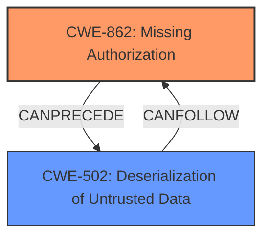

# Enhanced Analysis for CVE-2025-1657

# Summary
| CWE ID | CWE Name | Confidence | CWE Abstraction Level | CWE Vulnerability Mapping Label | CWE-Vulnerability Mapping Notes |
|---|---|---|---|---|---|
| CWE-862 | Missing Authorization | 0.9 | Class | Allowed-with-Review | Primary CWE. The code doesn't check if the user has permission to perform an action. |
| CWE-502 | Deserialization of Untrusted Data | 0.7 | Base | Allowed | Secondary. PHP Objects can be injected and may be unserialized leading to this. |

## Evidence and Confidence

*   **Confidence Score:** 0.8
*   **Evidence Strength:** MEDIUM

## Relationship Analysis
The primary weakness is the **missing authorization** check (CWE-862). This **allows attackers to inject PHP Objects**, which can then be **deserialized** (CWE-502), leading to potential code execution or other malicious outcomes.



## Vulnerability Chain
1.  **Missing Authorization (CWE-862):** The application **fails to check** if the authenticated user has the necessary permissions to perform the requested action (stm_listing_ajax AJAX action). This is the root cause.
2.  **PHP Object Injection:** Because of the **missing capability check**, an attacker can **inject malicious PHP objects** by updating post meta data.
3.  **Deserialization of Untrusted Data (CWE-502):** The injected PHP objects may be unserialized by the application, potentially leading to code execution.

## Summary of Analysis
The primary CWE is CWE-862 (**Missing Authorization**), because the vulnerability stems from the fact that there is **no check to verify** if the authenticated user has the necessary permissions to perform the requested action. The vulnerability description clearly states a "**missing capability check**".

The secondary CWE is CWE-502 (**Deserialization of Untrusted Data**), because the impact includes "**PHP Object Injection** that may be unserialized." The **lack of authorization** allows the attacker to **inject malicious PHP objects**, which can be **deserialized**, potentially leading to arbitrary code execution.

CWE-862 is a Class-level CWE, and per the mapping guidance, we should look for more specific Base-level children, but there isn't one that fits the **missing capability check**.

CWE-502 is a Base-level CWE and accurately describes the impact of the vulnerability.

The evidence for these mappings comes directly from the vulnerability description.


## CWE Relationship Analysis

Current CWEs represent these abstraction levels: .


### Vulnerability Chain Analysis

**Chain starting from CWE-502:**
- 502 (Deserialization of Untrusted Data) - ROOT


**Chain starting from CWE-862:**
- 862 (Missing Authorization) - ROOT


### CWE Relationship Diagram

```mermaid
graph TD
    classDef primary fill:#f96,stroke:#333,stroke-width:2px
    classDef secondary fill:#69f,stroke:#333
    classDef tertiary fill:#9e9,stroke:#333
```