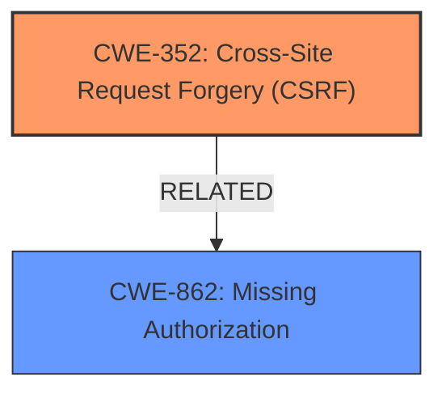

# Raw Analyzer Response for CVE-2025-1705

# Summary
| CWE ID | CWE Name | Confidence | CWE Abstraction Level | CWE Vulnerability Mapping Label | CWE-Vulnerability Mapping Notes |
|---|---|---|---|---|---|
| CWE-352 | Cross-Site Request Forgery (CSRF) | 1.0 | Compound | Primary | Allowed |
| CWE-862 | Missing Authorization | 0.7 | Class | Secondary Candidate | Allowed-with-Review |

## Evidence and Confidence

*   **Confidence Score:** 0.9
*   **Evidence Strength:** HIGH

## Relationship Analysis
The primary weakness is identified as CWE-352 (Cross-Site Request Forgery (CSRF)), a compound weakness. The vulnerability description highlights **missing or incorrect nonce validation**, which directly contributes to CSRF. CWE-862 (Missing Authorization) is considered as a secondary candidate since the **missing nonce validation** can be viewed as a form of **missing authorization**. CWE-352 is a compound of multiple weaknesses that occur simultaneously.

## Vulnerability Chain
The vulnerability chain starts with the **missing or incorrect nonce validation** in the td_ajax_get_views AJAX action, leading to a Cross-Site Request Forgery (CSRF) vulnerability, which allows unauthenticated attackers to inject malicious web scripts if they can trick an administrator into clicking a link.

## Summary of Analysis
The primary assessment is based on the explicit mention of **Cross-Site Request Forgery** as a **weakness** and the root cause being **missing or incorrect nonce validation**. The vulnerability description clearly states the vulnerable component (td_ajax_get_views AJAX action) and the impact (injecting malicious web scripts).

The retriever results also list CWE-352 as a potential match. Given the explicit mention of CSRF in the vulnerability description, this seems to be the most appropriate primary CWE.

CWE-862 (Missing Authorization) is considered because **missing nonce validation** can be viewed as a form of **missing authorization**. The absence of proper nonce validation allows unauthorized requests to be processed, effectively bypassing authorization checks.

The selected CWEs are at the optimal level of specificity. CWE-352 directly addresses the identified vulnerability, while CWE-862 provides additional context regarding the authorization aspect of the weakness.

Relevant CWE Information:

# Enhanced Context (25 CWEs)
The following CWEs were identified as potentially relevant to this vulnerability:

## CWE-352: Cross-Site Request Forgery (CSRF)
**Abstraction Level**: Compound
**Similarity Score**: 0.74
**Source**: dense

**Description**:
The web application does not, or can not, sufficiently verify whether a well-formed, valid, consistent request was intentionally provided by the user who submitted the request.

**Mapping Guidance**:
- Usage: Allowed
- Rationale: This is a well-known Composite of multiple weaknesses that must all occur simultaneously, although it is attack-oriented in nature.

**Technical Explanation:**

CWE-352 [Cross-Site Request Forgery (CSRF)] is a compound weakness where the application fails to verify if a request was intentionally provided by the user. In this case, the **missing or incorrect nonce validation** allows attackers to forge requests, leading to CSRF. The security implication is that attackers can perform actions on behalf of the administrator without their consent, such as injecting malicious web scripts. This CWE is the primary weakness as it directly reflects the vulnerability described.

## CWE-862: Missing Authorization
**Abstraction Level**: Class
**Similarity Score**: 0.443
**Source**: sparse

**Description**:
The product does not perform any authorization check when an actor attempts to access a resource or perform an action.

**Mapping Guidance**:
- Usage: Allowed-with-Review
- Rationale: This is a Class, so it requires review to ensure that a more specific Base CWE is not available.

**Technical Explanation:**

CWE-862 [Missing Authorization] occurs when the application does not perform any authorization checks before allowing access to a resource or action. In this vulnerability, the **missing or incorrect nonce validation** can be seen as a form of **missing authorization**. By not validating the nonce, the application fails to verify that the request is coming from an authorized user. This can lead to unauthorized access and actions. It is a secondary weakness because it supports the primary CWE-352 (CSRF).

## Other CWEs Considered:

- **CWE-79 [Improper Neutralization of Input During Web Page Generation ('Cross-site Scripting')]**: While the impact is the injection of malicious web scripts, the root cause is CSRF, not XSS. Therefore, CWE-79 is not the primary weakness.
- **CWE-89 [Improper Neutralization of Special Elements used in an SQL Command ('SQL Injection')]**: This CWE is not relevant as the vulnerability does not involve SQL injection.
- **CWE-138 [Improper Neutralization of Special Elements]**: This CWE is too generic and doesn't accurately reflect the specific weakness of CSRF.
- **CWE-96 [Improper Neutralization of Directives in Statically Saved Code ('Static Code Injection')]**: The injection is not into statically saved code.
- **CWE-425 [Direct Request ('Forced Browsing')]**: This is not the primary issue, as the CSRF involves tricking a user into performing an action.