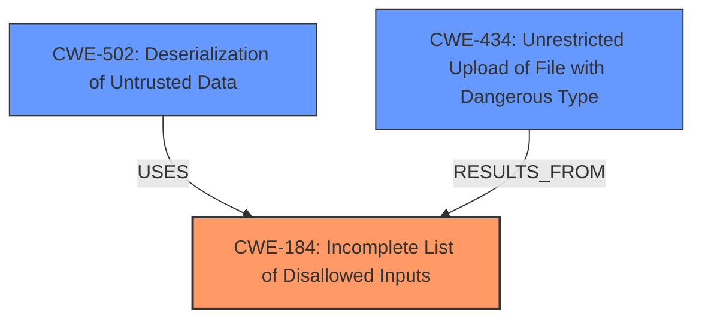

# Raw Analyzer Response for CVE-2025-1716

# Summary
| CWE ID | CWE Name | Confidence | CWE Abstraction Level | CWE Vulnerability Mapping Label | CWE-Vulnerability Mapping Notes |
|---|---|---|---|---|---|
| CWE-184 | Incomplete List of Disallowed Inputs | 0.9 | Base | Allowed | Primary CWE: The root cause is that `picklescan` does not treat `pip` as an unsafe global, which is an example of an incomplete list of disallowed inputs. |
| CWE-502 | Deserialization of Untrusted Data | 0.7 | Base | Allowed | Secondary Candidate: The vulnerability uses deserialization of untrusted data as the attack vector, although this is not the root cause. |
| CWE-434 | Unrestricted Upload of File with Dangerous Type | 0.5 | Base | Allowed | Secondary Candidate: This is related to the malicious PyPI package being uploaded. |

## Evidence and Confidence

*   **Confidence Score:** 0.8
*   **Evidence Strength:** HIGH

## Relationship Analysis
The primary relationship is that CWE-184 is the root cause, as it describes the incomplete list of disallowed inputs, which in this case is the `pip` module. CWE-502 is a related weakness as it describes the deserialization of untrusted data. CWE-434 is related because the vulnerability results in the upload of a malicious file.

## Vulnerability Chain
The chain of events is:
1.  **CWE-184:** `picklescan` has an **incomplete list of disallowed inputs** (specifically, `pip` is not considered unsafe).
2.  Attacker crafts a malicious pickle file using pip.main() to install a malicious PyPI package.
3.  **CWE-502:** The `picklescan` deserializes the **untrusted data** (the malicious pickle file).
4.  **CWE-434:** Leads to **unrestricted upload of file with dangerous type** when the malicious PyPI package is installed.
5.  Arbitrary code execution on the system.

## Summary of Analysis
The primary weakness is CWE-184, as the root cause is the incomplete list of disallowed inputs. The vulnerability description key phrases highlights "**picklescan before 0.0.21 does not treat pip as an unsafe global**" and "**pip is not a restricted global**" as key indicators. The CVE reference links content summary also states "The vulnerability stems from `picklescan` not treating `pip` as an unsafe global.". The retriever results also listed CWE-184 as a candidate.
CWE-502 is a related vulnerability because the attack vector involves deserialization of untrusted data. CWE-434 could be considered because the attack results in the upload of a malicious file.
The final selection of CWEs is based on the evidence provided in the vulnerability description and the CVE reference links content summary. The selected CWEs are at the optimal level of specificity, as they accurately represent the root cause and the related weaknesses.

Relevant CWE Information:

# Enhanced Context (25 CWEs)
The following CWEs were identified as potentially relevant to this vulnerability:

## CWE-184: Incomplete List of Disallowed Inputs
**Abstraction Level**: Base
**Similarity Score**: 0.71
**Source**: dense

**Description**:
The product implements a protection mechanism that relies on a list of inputs (or properties of inputs) that are not allowed by policy or otherwise require other action to neutralize before additional processing takes place, but the list is incomplete.

**Mapping Guidance**:
- Usage: Allowed
- Rationale: This CWE entry is at the Base level of abstraction, which is a preferred level of abstraction for mapping to the root causes of vulnerabilities.