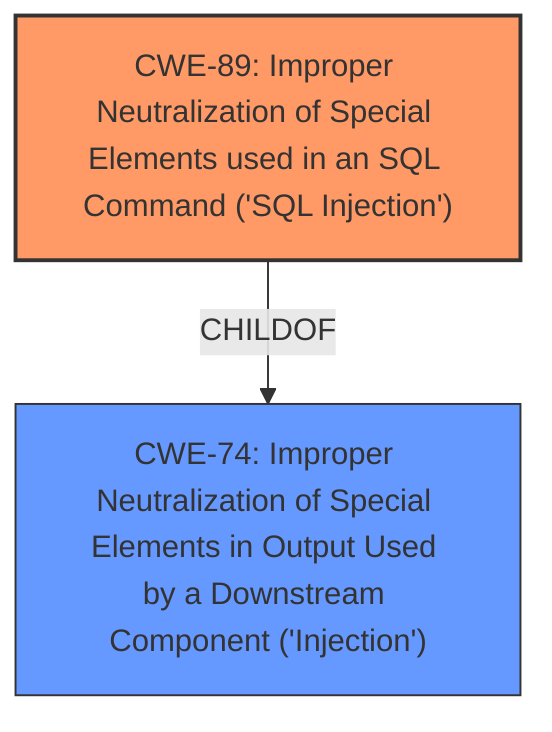

# Analysis Report for CVE-2025-1726

# Vulnerability Analysis Report: CVE-2025-1726

## Description

There is a **SQL injection** issue in Esri ArcGIS Monitor versions 2023.0 through 2024.x on Windows and Linux that allows a remote, authenticated attacker with low privileges to improperly read limited database schema information by passing crafted queries. While it is possible to enumerate some internal database identifiers, the impact to the confidentiality vector is LOW because any sensitive data returned in a response is encrypted. There is no evidence of impact to the integrity or availability vectors. This issue is addressed in ArcGIS Monitor 2024.1.

## Vulnerability Description Key Phrases

- **Weakness:** SQL injection
- **Impact:** ['improperly read limited database schema information', 'enumerate some internal database identifiers', 'availability', 'integrity']
- **Vector:** passing crafted queries
- **Attacker:** ['authenticated attacker with low privileges', 'remote']
- **Product:** Esri ArcGIS Monitor
- **Version:** versions 2023.0 through 2024.x

## Analysis (with Relationship Data)

# Summary
| CWE ID | CWE Name | Confidence | CWE Abstraction Level | CWE Vulnerability Mapping Label | CWE-Vulnerability Mapping Notes |
|---|---|---|---|---|---|
| CWE-89 | Improper Neutralization of Special Elements used in an SQL Command ('SQL Injection') | 1.0 | Base | Allowed | Primary CWE: This is the root cause of the vulnerability, as the application fails to properly neutralize special elements in an SQL command.|

## Evidence and Confidence

*   **Confidence Score:** 1.0
*   **Evidence Strength:** HIGH

## Relationship Analysis
The primary CWE is CWE-89, which is a base-level CWE. It has a parent CWE of CWE-74 (Improper Neutralization of Special Elements in Output Used by a Downstream Component ('Injection')), indicating that SQL injection is a specific type of injection. There are no other relationships that significantly influence the selection, as the description clearly points to an SQL injection vulnerability.



## Vulnerability Chain
The vulnerability chain starts with the **SQL injection** (CWE-89). An authenticated attacker crafts malicious SQL queries, which the application fails to neutralize. This leads to the attacker being able to improperly read limited database schema information.

## Summary of Analysis
The analysis is based on the provided vulnerability description, which clearly states the presence of a **SQL injection** vulnerability. The key phrase "allows a remote, authenticated attacker with low privileges to improperly read limited database schema information by passing crafted queries" directly indicates the nature of the vulnerability.

The primary CWE is CWE-89 (Improper Neutralization of Special Elements used in an SQL Command ('SQL Injection')), which is at the optimal level of specificity (Base). The retriever results also strongly support this classification, with CWE-89 being the top result with a score of 1.0.

Relevant CWE Information:

# Enhanced Context (25 CWEs)
The following CWEs were identified as potentially relevant to this vulnerability:

## CWE-89: Improper Neutralization of Special Elements used in an SQL Command ('SQL Injection')

CWE-89: Improper Neutralization of Special Elements used in an SQL Command ('SQL Injection')

**Vulnerability Description Key Phrases**
- **weakness:** **SQL injection**

The vulnerability description mentions a **SQL injection** issue, making CWE-89 the most accurate classification.


## CWE Relationship Analysis

Current CWEs represent these abstraction levels: .


### Vulnerability Chain Analysis

**Chain starting from CWE-89:**
- 89 (Improper Neutralization of Special Elements used in an SQL Command ('SQL Injection')) - ROOT


**Chain starting from CWE-74:**
- 74 (Improper Neutralization of Special Elements in Output Used by a Downstream Component ('Injection')) - ROOT


### CWE Relationship Diagram

```mermaid
graph TD
    classDef primary fill:#f96,stroke:#333,stroke-width:2px
    classDef secondary fill:#69f,stroke:#333
    classDef tertiary fill:#9e9,stroke:#333
```


*Report generated on 2025-07-14 07:40:19*
