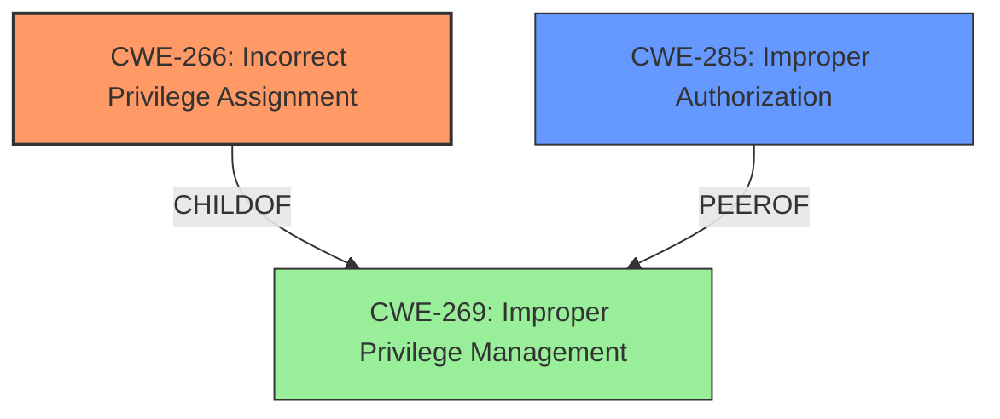

# Analysis for CVE-2025-1732

# Summary
| CWE ID | CWE Name | Confidence | CWE Abstraction Level | CWE Vulnerability Mapping Label | CWE-Vulnerability Mapping Notes |
|---|---|---|---|---|---|
| CWE-266 | Incorrect Privilege Assignment | 0.8 | Base | Allowed | Primary CWE. The vulnerability involves the **incorrect assignment of privileges** due to the ability to upload a crafted configuration file, leading to privilege escalation. |
| CWE-285 | Improper Authorization | 0.6 | Class | Discouraged | Secondary CWE. The system **does not perform** or **incorrectly performs an authorization check** when an actor attempts to access a resource or perform an action. |

## Evidence and Confidence

*   **Confidence Score:** 0.7
*   **Evidence Strength:** MEDIUM

## Relationship Analysis
The primary relationship that impacted the decision was the parent-child relationship. CWE-266 is a base-level CWE, while CWE-269 is a class-level CWE. The vulnerability description specifically points to an **incorrect privilege assignment**, making CWE-266 a more specific and appropriate choice. Additionally, CWE-285 was considered as a higher-level authorization issue, but the evidence better supports a privilege assignment flaw.

## Vulnerability Chain
The vulnerability chain starts with the **improper privilege management**, specifically an **incorrect privilege assignment** (CWE-266). This leads to the ability to upload a crafted configuration file, which then results in privilege escalation. The missing link is a lack of authorization checks on the configuration file upload or on the privileges within the crafted configuration file itself. This then relates to **improper authorization** (CWE-285) due to the ability for an authenticated local attacker to upload the crafted configuration and escalate privileges on a vulnerable device.

## Summary of Analysis
The initial analysis focused on identifying the root cause of the vulnerability, which the description clearly states as an **"improper privilege management vulnerability"**. However, "improper privilege management" is a broad term. Based on the evidence, the root cause is more specifically related to the **incorrect assignment of privileges**, as highlighted in the vulnerability description. The "Privileges vs Permissions Guidance" supports mapping privileges assigned to a user role to CWE-266. The ability to upload a crafted file and escalate privileges points to a flaw in authorization. The graph relationships and the "Privileges vs Permissions Guidance" helped refine the selection to CWE-266 as the primary cause and CWE-285 as a secondary candidate due to the **improper authorization** aspect of the vulnerability. The selected CWEs are at the optimal level of specificity because CWE-266 is a base-level CWE that directly addresses the root cause, while CWE-285 addresses the authorization issue that permitted privilege escalation.

Relevant CWE Information:

# Enhanced Context (25 CWEs)
The following CWEs were identified as potentially relevant to this vulnerability:

## CWE-266: Incorrect Privilege Assignment
**Abstraction Level**: Base
**Similarity Score**: 0.79
**Source**: dense

**Description**:
A product incorrectly assigns a privilege to a particular actor, creating an unintended sphere of control for that actor.

**Mapping Guidance**:
- Usage: Allowed
- Rationale: This CWE entry is at the Base level of abstraction, which is a preferred level of abstraction for mapping to the root causes of vulnerabilities.
## CWE-285: Improper Authorization
**Abstraction Level**: Class
**Similarity Score**: 1425.56
**Source**: sparse

**Description**:
The product does not perform or incorrectly performs an authorization check when an actor attempts to access a resource or perform an action.

**Mapping Guidance**:
- Usage: Discouraged
- Rationale: CWE-285 is high-level and lower-level CWEs can frequently be used instead. It is a level-1 Class (i.e., a child of a Pillar).