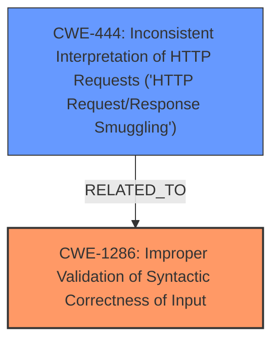

# Raw Analyzer Response for CVE-2025-1734

# Summary
| CWE ID | CWE Name | Confidence | CWE Abstraction Level | CWE Vulnerability Mapping Label | CWE-Vulnerability Mapping Notes |
|---|---|---|---|---|---|
| CWE-1286 | Improper Validation of Syntactic Correctness of Input | 0.9 | Base | Allowed | Primary CWE |
| CWE-444 | Inconsistent Interpretation of HTTP Requests ('HTTP Request/Response Smuggling') | 0.6 | Base | Allowed | Secondary Candidate |

## Evidence and Confidence

*   **Confidence Score:** 0.75
*   **Evidence Strength:** HIGH

## Relationship Analysis
The primary relationship that impacted my decision was the parent-child relationship. CWE-1286 focuses on the syntactic correctness of the input, while CWE-444 addresses inconsistencies in HTTP request interpretation. The vulnerability description and CVE details indicate a problem with the application **failing to validate the syntactic correctness of HTTP headers** leading to potential misinterpretation (smuggling). Thus, CWE-1286 is the more direct and fundamental weakness.

## Vulnerability Chain
The vulnerability chain starts with the **improper validation of HTTP headers** (CWE-1286), leading to the possibility of the application interpreting invalid headers. This can further result in request smuggling (CWE-444) or other application logic errors.

## Summary of Analysis
The initial analysis focused on identifying the root cause of the vulnerability. The description clearly states that "**headers missing a colon () are treated as valid headers**." This directly points to a validation issue.

The retriever results highlighted several potential CWEs, including CWE-113, CWE-201, CWE-138, CWE-1286, CWE-212, CWE-93, and CWE-444.

*   CWE-113 (Improper Neutralization of CRLF Sequences in HTTP Headers) was considered, but it's more about neutralizing CRLF sequences, which isn't the primary issue here.
*   CWE-201 (Insertion of Sensitive Information Into Sent Data) and CWE-212 (Improper Removal of Sensitive Information Before Storage or Transfer) are not relevant as the vulnerability does not involve sensitive information.
*   CWE-138 (Improper Neutralization of Special Elements) is too broad and doesn't capture the specific issue of validating header syntax.
*   CWE-93 (Improper Neutralization of CRLF Sequences ('CRLF Injection')) is similar to CWE-113 and not the primary issue.
*   CWE-444 (Inconsistent Interpretation of HTTP Requests ('HTTP Request/Response Smuggling')) is a potential consequence but not the root cause.

CWE-1286 (Improper Validation of Syntactic Correctness of Input) aligns perfectly with the **root cause**, as the application **fails to validate that the HTTP headers comply with the expected syntax** (i.e., having a colon). The GitHub security advisory explicitly mentions "Improper input validation of HTTP headers"

Therefore, CWE-1286 is the most appropriate primary CWE.

# Relevant CWE Information:

## CWE-1286: Improper Validation of Syntactic Correctness of Input
**Abstraction Level**: Base

**Description**:
The product receives input that is expected to be well-formed - i.e., to comply with a certain syntax - but it does not validate or incorrectly validates that the input complies with the syntax.

**Mapping Guidance**:
- Usage: Allowed
- Rationale: This CWE entry is at the Base level of abstraction, which is a preferred level of abstraction for mapping to the root causes of vulnerabilities.

## CWE-444: Inconsistent Interpretation of HTTP Requests ('HTTP Request/Response Smuggling')
**Abstraction Level**: Base

**Description**:
The product acts as an intermediary HTTP agent
         (such as a proxy or firewall) in the data flow between two
         entities such as a client and server, but it does not
         interpret malformed HTTP requests or responses in ways that
         are consistent with how the messages will be processed by
         those entities that are at the ultimate destination.

**Mapping Guidance**:
- Usage: Allowed
- Rationale: This CWE entry is at the Base level of abstraction, which is a preferred level of abstraction for mapping to the root causes of vulnerabilities.