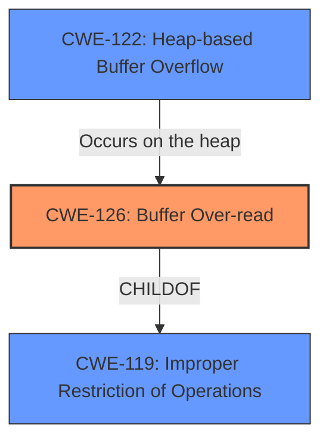

# Analysis for CVE-2025-1744

# Summary
| CWE ID | CWE Name | Confidence | CWE Abstraction Level | CWE Vulnerability Mapping Label | CWE-Vulnerability Mapping Notes |
|---|---|---|---|---|---|
| CWE-126 | Buffer Over-read | 1.0 | Variant | Allowed | Primary CWE |
| CWE-122 | Heap-based Buffer Overflow | 0.7 | Base | Allowed | Secondary Candidate |

## Evidence and Confidence

*   **Confidence Score:** 0.9
*   **Evidence Strength:** HIGH

## Relationship Analysis
The primary CWE is CWE-126, which is a variant of the base CWE-119 (Improper Restriction of Operations within the Bounds of a Memory Buffer). CWE-122 is a base CWE that describes a specific type of buffer overflow occurring in the heap, making it a good secondary candidate. CWE-126 directly addresses the **buffer over-read** aspect of the vulnerability, while CWE-122 highlights that it is heap-based.

## Vulnerability Chain
The vulnerability chain involves a **heap-based buffer over-read** or buffer overflow, ultimately leading to an out-of-bounds write.
1.  The root cause is an **improper restriction of operations** within the bounds of a heap-allocated buffer (potentially due to **incorrect calculation of buffer size**, an **off-by-one error**, or an **integer overflow**).
2.  This leads to a **buffer over-read** or **buffer overflow** condition.
3.  The impact is a potential out-of-bounds write, leading to arbitrary code execution or denial of service.

## Summary of Analysis
The analysis is based on the provided vulnerability description, focusing on the key phrases "**heap-based buffer over-read**" and "**heap-based buffer overflow**". The retriever results strongly suggest CWE-126 (Buffer Over-read) and CWE-122 (Heap-based Buffer Overflow).

The description explicitly states "**heap-based buffer over-read** or buffer overflow," making CWE-126 the most precise classification for the **over-read** aspect and CWE-122 highlighting it is **heap-based**.

CWE-126 is at the Variant level, which is preferred for specificity. CWE-122 provides additional context by specifying the memory region (heap).

Other CWEs considered but not used:

*   CWE-193 (Off-by-one Error): While an off-by-one error could contribute to a buffer over-read or overflow, the description does not explicitly mention it.
*   CWE-190 (Integer Overflow or Wraparound): Similar to CWE-193, an integer overflow could lead to an incorrect buffer size calculation, but it is not explicitly stated in the description.
*   CWE-131 (Incorrect Calculation of Buffer Size): Although this could be the root cause, the description focuses on the manifestation (over-read/overflow) rather than the calculation error itself.
*   CWE-125 (Out-of-bounds Read): Similar to CWE-126, but CWE-126 is more specific.
*   CWE-119 (Improper Restriction of Operations within the Bounds of a Memory Buffer): This is a parent of CWE-126, and while relevant, CWE-126 provides more specific details.
*   CWE-805 (Buffer Access with Incorrect Length Value): This could be a contributing factor, but the description highlights the over-read/overflow, making CWE-126/CWE-122 more appropriate.
* CWE-788: Access of Memory Location After End of Buffer - overlaps with CWE-126 and CWE-125
* CWE-805: Buffer Access with Incorrect Length Value - possible but lacks direct evidence.
* CWE-129: Improper Validation of Array Index - unlikely as this vulnerability has heap-based implications rather than array-based.
* CWE-824: Access of Uninitialized Pointer - Possible root cause, but no direct evidence.
* CWE-703: Improper Check or Handling of Exceptional Conditions - Too abstract, not specific enough.
* CWE-191: Integer Underflow (Wrap or Wraparound) - Possible root cause, but no direct evidence.
* CWE-682: Incorrect Calculation - Too abstract, not specific enough.
* CWE-839: Numeric Range Comparison Without Minimum Check - does not apply.
* CWE-1339: Insufficient Precision or Accuracy of a Real Number - does not apply.
* CWE-128: Wrap-around Error - does not apply.
* CWE-825: Expired Pointer Dereference - Possible root cause, but no direct evidence.
* CWE-823: Use of Out-of-range Pointer Offset - Possible root cause, but no direct evidence.