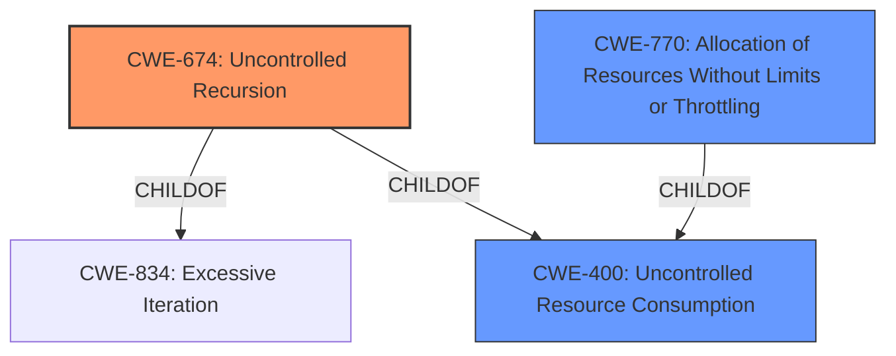

# Analysis Report for CVE-2025-1752

# Vulnerability Analysis Report: CVE-2025-1752

## Description

A **Denial of Service (DoS) vulnerability** has been identified in the KnowledgeBaseWebReader class of the run-llama/llama_index project, affecting version ~ latest(v0.12.15). The vulnerability arises due to inappropriate secure coding measures, specifically the lack of proper implementation of the max_depth parameter in the get_article_urls function. This allows an attacker to exhaust Pythons recursion limit through repeated function calls, leading to resource consumption and ultimately crashing the Python process.

## Vulnerability Description Key Phrases

- **Rootcause:** lack of proper implementation of max_depth parameter
- **Weakness:** Denial of Service (DoS) vulnerability
- **Impact:** resource consumption
- **Vector:** repeated function calls
- **Attacker:** attacker
- **Product:** run-llama/llama_index project
- **Version:** ~ latest(v0.12.15)
- **Component:** KnowledgeBaseWebReader class

## Analysis (with Relationship Data)

# Summary
| CWE ID | CWE Name | Confidence | CWE Abstraction Level | CWE Vulnerability Mapping Label | CWE-Vulnerability Mapping Notes |
|---|---|---|---|---|---|
| **CWE-674** | **Uncontrolled Recursion** | 0.9 | Class | Primary | Allowed-with-Review |
| CWE-400 | Uncontrolled Resource Consumption | 0.7 | Class | Secondary Candidate | Discouraged |
| CWE-770 | Allocation of Resources Without Limits or Throttling | 0.6 | Base | Secondary Candidate | Allowed |

## Evidence and Confidence

*   **Confidence Score:** 0.9
*   **Evidence Strength:** HIGH

## Relationship Analysis
The primary CWE selected is CWE-674 (Uncontrolled Recursion), which is a Class-level CWE. While it would be ideal to have a more specific Base-level CWE, the description aligns well with the concept of uncontrolled recursion leading to resource exhaustion. CWE-674 is a child of CWE-834 (Excessive Iteration) and CWE-400 (Uncontrolled Resource Consumption). CWE-400 is also a parent of CWE-770 (Allocation of Resources Without Limits or Throttling).



## Vulnerability Chain
The vulnerability chain starts with the **lack of proper implementation of the max_depth parameter** in the `get_article_urls` function, leading to **Uncontrolled Recursion (CWE-674)**. This then results in **resource consumption** and ultimately a **Denial of Service (DoS)**. CWE-674 leads to CWE-400 (Uncontrolled Resource Consumption).

## Summary of Analysis
The analysis is based on the provided vulnerability description and supporting evidence from the CVE reference links. The **root cause** is the **lack of proper implementation of the max_depth parameter**, which allows uncontrolled recursion. This aligns well with CWE-674 (Uncontrolled Recursion).

The retriever results also suggest CWE-674 as a potential candidate, further supporting the decision. While CWE-400 (Uncontrolled Resource Consumption) is a related CWE, it represents the impact rather than the root cause. CWE-770 (Allocation of Resources Without Limits or Throttling) is also a possible CWE, but it is less specific than CWE-674 in this context.

The selected CWE is at the Class level of abstraction. While a more specific Base-level CWE would be ideal, CWE-674 accurately represents the weakness based on the available evidence. I am overriding the general mapping guidance to use the Class level CWE.

Relevant CWE Information:

# Enhanced Context (25 CWEs)
The following CWEs were identified as potentially relevant to this vulnerability:

## CWE-407: Inefficient Algorithmic Complexity
**Abstraction Level**: Class
**Similarity Score**: 0.71
**Source**: dense

**Description**:
An algorithm in a product has an inefficient worst-case computational complexity that may be detrimental to system performance and can be triggered by an attacker, typically using crafted manipulations that ensure that the worst case is being reached.

**Mapping Guidance**:
- Usage: Allowed-with-Review
- Rationale: This CWE entry is a Class and might have Base-level children that would be more appropriate

**Not used:** While algorithmic inefficiency might contribute, the core issue is the lack of recursion control.

## CWE-674: Uncontrolled Recursion
**Abstraction Level**: Class
**Similarity Score**: 0.70
**Source**: dense

**Description**:
The product does not properly control the amount of recursion that takes place,  consuming excessive resources, such as allocated memory or the program stack.

**Mapping Guidance**:
- Usage: Allowed-with-Review
- Rationale: This CWE entry is a Class and might have Base-level children that would be more appropriate

**Used:** Directly matches the vulnerability where the recursion depth is not limited.

## CWE-835: Loop with Unreachable Exit Condition ('Infinite Loop')
**Abstraction Level**: Base
**Similarity Score**: 0.70
**Source**: dense

**Description**:
The product contains an iteration or loop with an exit condition that cannot be reached, i.e., an infinite loop.

**Mapping Guidance**:
- Usage: Allowed
- Rationale: This CWE entry is at the Base level of abstraction, which is a preferred level of abstraction for mapping to the root causes of vulnerabilities.

**Not used:** Although uncontrolled recursion can lead to an infinite loop, the core weakness is the lack of control over the recursion depth.

## CWE-789: Memory Allocation with Excessive Size Value
**Abstraction Level**: Variant
**Similarity Score**: 0.70
**Source**: dense

**Description**:
The product allocates memory based on an untrusted, large size value, but it does not ensure that the size is within expected limits, allowing arbitrary amounts of memory to be allocated.

**Mapping Guidance**:
- Usage: Allowed
- Rationale: This CWE entry is at the Variant level of abstraction, which is a preferred level of abstraction for mapping to the root causes of vulnerabilities.

**Not used:** Memory allocation is an indirect effect of the recursion, not the primary cause.

## CWE-617: Reachable Assertion
**Abstraction Level**: Base
**Similarity Score**: 0.69
**Source**: dense

**Description**:
The product contains an assert() or similar statement that can be triggered by an attacker, which leads to an application exit or other behavior that is more severe than necessary.

**Mapping Guidance**:
- Usage: Allowed
- Rationale: This CWE entry is at the Base level of abstraction, which is a preferred level of abstraction for mapping to the root causes of vulnerabilities.

**Not used:** Irrelevant to the vulnerability.

## CWE-1286: Improper Validation of Syntactic Correctness of Input
**Abstraction Level**: Base
**Similarity Score**: 0.69
**Source**: dense

**Description**:
The product receives input that is expected to be well-formed - i.e., to comply with a certain syntax - but it does not validate or incorrectly validates that the input complies with the syntax.

**Mapping Guidance**:
- Usage: Allowed
- Rationale: This CWE entry is at the Base level of abstraction, which is a preferred level of abstraction for mapping to the root causes of vulnerabilities.

**Not used:** Input validation is not the primary issue.

## CWE-923: Improper Restriction of Communication Channel to Intended Endpoints
**Abstraction Level**: Class
**Similarity Score**: 0.68
**Source**: dense

**Description**:
The product establishes a communication channel to (or from) an endpoint for privileged or protected operations, but it does not properly ensure that it is communicating with the correct endpoint.

**Mapping Guidance**:
- Usage: Allowed-with-Review
- Rationale: This CWE entry is a Class and might have Base-level children that would be more appropriate

**Not used:** Irrelevant to the vulnerability.

## CWE-193: Off-by-one Error
**Abstraction Level**: Base
**Similarity Score**: 0.68
**Source**: dense

**Description**:
A product calculates or uses an incorrect maximum or minimum value that is 1 more, or 1 less, than the correct value.

**Mapping Guidance**:
- Usage: Allowed
- Rationale: This CWE entry is at the Base level of abstraction, which is a preferred level of abstraction for mapping to the root causes of vulnerabilities.

**Not used:** Irrelevant to the vulnerability.

## CWE-472: External Control of Assumed-Immutable Web Parameter
**Abstraction Level**: Base
**Similarity Score**: 0.68
**Source**: dense

**Description**:
The web application does not sufficiently verify inputs that are assumed to be immutable but are actually externally controllable, such as hidden form fields.

**Mapping Guidance**:
- Usage: Allowed
- Rationale: This CWE entry is at the Base level of abstraction, which is a preferred level of abstraction for mapping to the root causes of vulnerabilities.

**Not used:** Irrelevant to the vulnerability.

## CWE-639: Authorization Bypass Through User-Controlled Key
**Abstraction Level**: Base
**Similarity Score**: 0.68
**Source**: dense

**Description**:
The system's authorization functionality does not prevent one user from gaining access to another user's data or record by modifying the


## CWE Relationship Analysis

Current CWEs represent these abstraction levels: .


### Vulnerability Chain Analysis

**Chain starting from CWE-400:**
- 400 (Uncontrolled Resource Consumption) - ROOT


**Chain starting from CWE-407:**
- 407 (Inefficient Algorithmic Complexity) - ROOT


### CWE Relationship Diagram

```mermaid
graph TD
    classDef primary fill:#f96,stroke:#333,stroke-width:2px
    classDef secondary fill:#69f,stroke:#333
    classDef tertiary fill:#9e9,stroke:#333
```


*Report generated on 2025-07-14 07:42:28*
