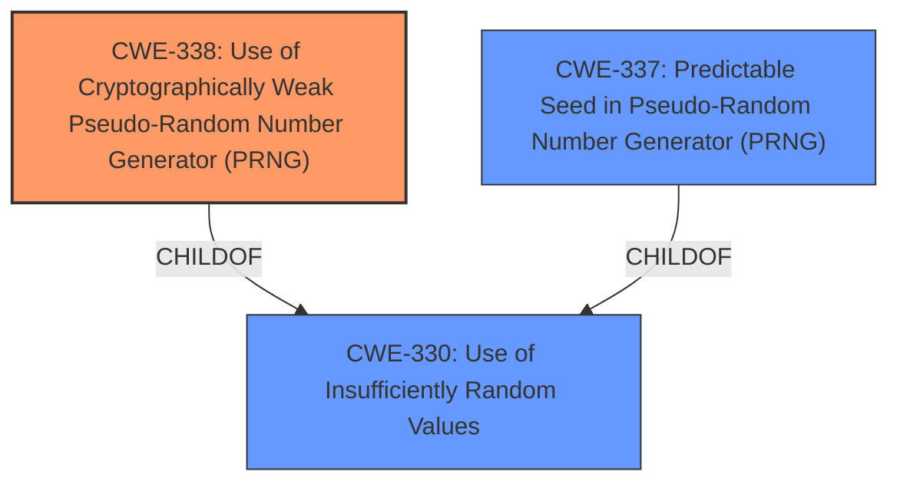

# Analysis for CVE-2025-1805

# Summary
| CWE ID | CWE Name | Confidence | CWE Abstraction Level | CWE Vulnerability Mapping Label | CWE-Vulnerability Mapping Notes |
|---|---|---|---|---|---|
| CWE-338 | Use of Cryptographically Weak Pseudo-Random Number Generator (PRNG) | 1.0 | Base | Allowed | Primary CWE |
| CWE-330 | Use of Insufficiently Random Values | 0.7 | Class | Discouraged | Secondary Candidate |
| CWE-337 | Predictable Seed in Pseudo-Random Number Generator (PRNG) | 0.6 | Variant | Allowed | Secondary Candidate |

## Evidence and Confidence

*   **Confidence Score:** 0.9
*   **Evidence Strength:** HIGH

## Relationship Analysis
The primary weakness identified is the use of a cryptographically weak PRNG (CWE-338). This is a child of the more general CWE-330, Use of Insufficiently Random Values. CWE-337, Predictable Seed in Pseudo-Random Number Generator (PRNG), is a more specific variant that could be applicable if the seed predictability were explicitly stated. I have chosen CWE-338 as the best fit because it directly addresses the weakness.

## Vulnerability Chain
The vulnerability chain starts with the use of the **insecure rand() function** (CWE-338). This leads to the generation of predictable salts, which can compromise cryptographic operations. There is no explicit mention of impact, but it can be inferred the impact would be the compromise of security-sensitive operations that depend on strong randomness.

## Summary of Analysis
The analysis is primarily based on the provided vulnerability description and the findings in the "CVE Reference Links Content Summary." The key phrase "**insecure rand() function**" directly points to a weakness in random number generation. The summary confirms that `rand` is not suitable for security-sensitive applications due to its predictability.

CWE-338 is chosen as the primary CWE because it accurately describes the use of a cryptographically weak PRNG. It's a base-level CWE, which is the preferred level of abstraction.

CWE-330 was considered but is more general. CWE-337 was also considered, but the description doesn't explicitly mention a predictable seed.
CWE-760 (Use of a One-Way Hash with a Predictable Salt) was considered because salts are being generated, but it's too specific since the vulnerability is in the random number generation itself.

# Relevant CWE Information:

## CWE-338: Use of Cryptographically Weak Pseudo-Random Number Generator (PRNG)
**Abstraction Level**: Base
**Similarity Score**: 0.79
**Source**: dense

**Description**:
The product uses a Pseudo-Random Number Generator (PRNG) in a security context, but the PRNG's algorithm is not cryptographically strong.

**Mapping Guidance**:
- Usage: Allowed
- Rationale: This CWE entry is at the Base level of abstraction, which is a preferred level of abstraction for mapping to the root causes of vulnerabilities.

CWE-338 is the best fit because the vulnerability description clearly indicates the use of an **insecure rand() function**, which falls under the definition of a cryptographically weak PRNG.

## CWE-330: Use of Insufficiently Random Values
**Abstraction Level**: Class
**Similarity Score**: 0.76
**Source**: dense

**Description**:
The product uses insufficiently random numbers or values in a security context that depends on unpredictable numbers.

**Mapping Guidance**:
- Usage: Discouraged
- Rationale: This CWE entry is a level-1 Class (i.e., a child of a Pillar). It might have lower-level children that would be more appropriate

CWE-330 is a broader category, and while applicable, CWE-338 is more specific to the weakness.

## CWE-337: Predictable Seed in Pseudo-Random Number Generator (PRNG)
**Abstraction Level**: Variant
**Similarity Score**: 0.73
**Source**: dense

**Description**:
A Pseudo-Random Number Generator (PRNG) is initialized from a predictable seed, such as the process ID or system time.

**Mapping Guidance**:
- Usage: Allowed
- Rationale: This CWE entry is at the Variant level of abstraction, which is a preferred level of abstraction for mapping to the root causes of vulnerabilities.

CWE-337 could be applicable if the `rand()` function's seed was explicitly mentioned as predictable, but the description focuses on the PRNG itself being weak.