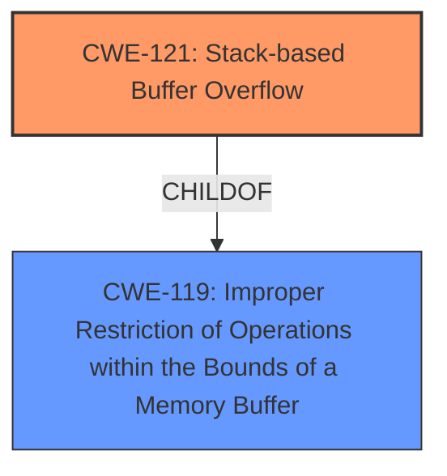

# Analysis Report for CVE-2025-1814

# Vulnerability Analysis Report: CVE-2025-1814

## Description

A vulnerability, which was classified as critical, has been found in Tenda AC6 15.03.05.16. Affected by this issue is some unknown functionality of the file /goform/WifiExtraSet. The manipulation of the argument wpapsk_crypto leads to **stack-based buffer overflow**. The attack may be launched remotely. The exploit has been disclosed to the public and may be used.

## Vulnerability Description Key Phrases

- **Weakness:** stack-based buffer overflow
- **Vector:** manipulation of wpapsk_crypto argument
- **Product:** Tenda AC6
- **Version:** 15.03.05.16
- **Component:** /goform/WifiExtraSet

## Analysis (with Relationship Data)

# Summary
| CWE ID | CWE Name | Confidence | CWE Abstraction Level | CWE Vulnerability Mapping Label | CWE-Vulnerability Mapping Notes |
|---|---|---|---|---|---|
| CWE-121 | Stack-based Buffer Overflow | 1.0 | Variant | Allowed | Primary CWE |

## Evidence and Confidence

*   **Confidence Score:** 1.0
*   **Evidence Strength:** HIGH

## Relationship Analysis
The primary relationship influencing this decision is the hierarchical relationship between CWE-119 (Improper Restriction of Operations within the Bounds of a Memory Buffer), a Class-level CWE, and CWE-121 (Stack-based Buffer Overflow), a Variant-level CWE. CWE-121 is a specific type of buffer overflow that occurs on the stack. Since the vulnerability description explicitly states a "stack-based buffer overflow", it is more appropriate to select the variant, CWE-121, over the more general class, CWE-119.



## Vulnerability Chain
The vulnerability chain consists of the following:
1.  **Root Cause:** CWE-121 (Stack-based Buffer Overflow) due to manipulation of the `wpapsk_crypto` argument.
2.  **Impact:** Remote code execution (implied by the "critical" severity and public exploit).

## Summary of Analysis
The vulnerability description clearly states a "stack-based buffer overflow" occurs due to manipulation of the `wpapsk_crypto` argument in the `/goform/WifiExtraSet` file of the Tenda AC6 router. The most specific and accurate CWE for this vulnerability is CWE-121 (Stack-based Buffer Overflow). The retriever results also list CWE-121 as a candidate. The "Vulnerability Description Key Phrases" section explicitly identifies the **weakness** as "**stack-based buffer overflow**".

CWE-119 (Improper Restriction of Operations within the Bounds of a Memory Buffer) was considered, as it is a parent of CWE-121, but it is less specific. Because the description explicitly mentions "stack-based," CWE-121 is the better choice.

Other CWEs, such as those related to integer overflows, SQL injection, and cross-site scripting, were considered but deemed irrelevant because they do not align with the specific nature of a stack-based buffer overflow vulnerability.

# Enhanced Context (25 CWEs)
The following CWEs were identified as potentially relevant to this vulnerability:

## CWE-121: Stack-based Buffer Overflow
**Abstraction Level**: Variant
**Similarity Score**: 0.74
**Source**: dense

**Description**:
A stack-based buffer overflow condition is a condition where the buffer being overwritten is allocated on the stack (i.e., is a local variable or, rarely, a parameter to a function).

**Mapping Guidance**:
- Usage: Allowed
- Rationale: This CWE entry is at the Variant level of abstraction, which is a preferred level of abstraction for mapping to the root causes of vulnerabilities.

## CWE-119: Improper Restriction of Operations within the Bounds of a Memory Buffer
**Abstraction Level**: Class
**Similarity Score**: 0.80
**Source**: alternate_terms

**Description**:
The software performs an operation that attempts to read or write data past the boundaries of the associated buffer.

**Mapping Guidance**:
- Usage: Discouraged
- Rationale: This CWE entry is at the Class level of abstraction, which is less preferred than more specific Base or Variant levels.

## CWE-190: Integer Overflow or Wraparound
**Abstraction Level**: Base
**Similarity Score**: 0.80
**Source**: alternate_terms

**Description**:
The product performs a calculation that can produce an integer overflow or wraparound when the logic assumes that the resulting value will always be larger than the original value.

**Mapping Guidance**:
- Usage: Allowed
- Rationale: This CWE entry is at the Base level of abstraction, which is a preferred level of abstraction for mapping to the root causes of vulnerabilities.


## CWE Relationship Analysis

Current CWEs represent these abstraction levels: .


### Vulnerability Chain Analysis

**Chain starting from CWE-190:**
- 190 (Integer Overflow or Wraparound) - ROOT


**Chain starting from CWE-119:**
- 119 (Improper Restriction of Operations within the Bounds of a Memory Buffer) - ROOT


### CWE Relationship Diagram

```mermaid
graph TD
    classDef primary fill:#f96,stroke:#333,stroke-width:2px
    classDef secondary fill:#69f,stroke:#333
    classDef tertiary fill:#9e9,stroke:#333
```


*Report generated on 2025-07-14 07:48:21*
