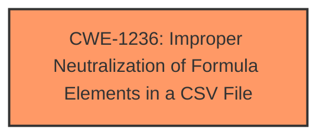

# Enhanced Analysis for CVE-2025-1836

# Summary
| CWE ID    | CWE Name                                                                 | Confidence | CWE Abstraction Level | CWE Vulnerability Mapping Label | CWE-Vulnerability Mapping Notes |
| --------- | ------------------------------------------------------------------------ | ---------- | --------------------- | ------------------------------- | ------------------------------- |
| CWE-1236  | Improper Neutralization of Formula Elements in a CSV File                 | 1          | Base                  | Primary                         | Allowed                        |

## Evidence and Confidence

*   **Confidence Score:** 1
*   **Evidence Strength:** HIGH

## Relationship Analysis
The primary relationship considered was the direct match of the vulnerability description to CWE-1236, which describes **improper neutralization of formula elements in a CSV file**. There are no parent-child or chain relationships that influence the selection in this case. The abstraction level is Base, which is the preferred level.



## Vulnerability Chain
The vulnerability chain is straightforward:

1.  **Root Cause:** **CSV Injection** due to **improper neutralization**.
2.  **Impact:** Allows remote attackers to inject malicious formulas into CSV files.

## Summary of Analysis
The vulnerability description clearly states "**csv injection**" as the **weakness**. The vulnerability involves manipulating the "Service Name" argument to achieve this. The retriever results also list CWE-1236, Improper Neutralization of Formula Elements in a CSV File, as the top candidate. Given this direct match and the base level of abstraction, CWE-1236 is the most appropriate CWE.

Relevant CWE Information:

# Enhanced Context (25 CWEs)

## CWE-1236: Improper Neutralization of Formula Elements in a CSV File
**Abstraction Level**: Base
**Similarity Score**: 0.78
**Source**: dense

**Description**:
The product saves user-provided information into a Comma-Separated Value (CSV) file, but it does not neutralize or incorrectly neutralizes special elements that could be interpreted as a command when the file is opened by a spreadsheet product.

**Mapping Guidance**:
- Usage: Allowed
- Rationale: This CWE entry is at the Base level of abstraction, which is a preferred level of abstraction for mapping to the root causes of vulnerabilities.

This vulnerability matches this CWE perfectly.

**CWE-79**, **CWE-89**, **CWE-93**, **CWE-95** were considered because they all involve **improper neutralization**, but they are not specific to CSV injection. **CWE-434** is about unrestricted file uploads, which is not the case here. **CWE-73** involves external control of file names or paths, but the core issue here is the **injection** of formulas into the CSV file, not control over the file path. **CWE-1336** is about improper neutralization in template engines, which is not relevant to this vulnerability.


## CWE Relationship Analysis

Current CWEs represent these abstraction levels: .


### Vulnerability Chain Analysis

**Chain starting from CWE-89:**
- 89 (Improper Neutralization of Special Elements used in an SQL Command ('SQL Injection')) - ROOT


**Chain starting from CWE-93:**
- 93 (Improper Neutralization of CRLF Sequences ('CRLF Injection')) - ROOT


### CWE Relationship Diagram

```mermaid
graph TD
    classDef primary fill:#f96,stroke:#333,stroke-width:2px
    classDef secondary fill:#69f,stroke:#333
    classDef tertiary fill:#9e9,stroke:#333
```